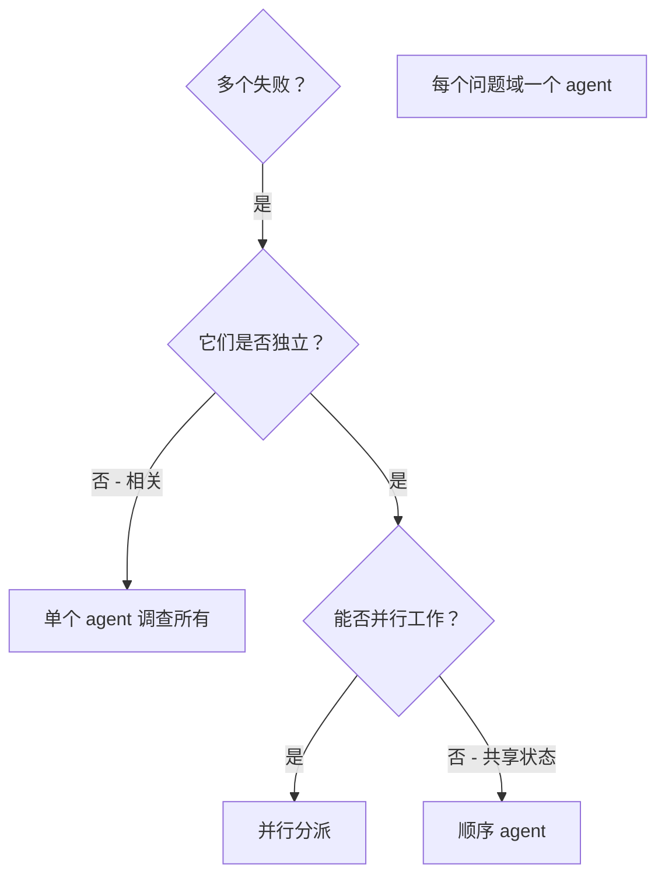

# Dispatching Parallel Agents

## 概述

你将任务委托给具有隔离上下文的专业 agent。通过精心构建它们的指令和上下文，你确保它们专注于任务并成功完成。它们不应继承你的会话上下文或历史——你精确构建它们所需的内容。这也为你自己的协调工作保留了上下文。

当你有多个不相关的失败（不同的测试文件、不同的子系统、不同的 bug）时，按顺序调查它们会浪费时间。每个调查都是独立的，可以并行进行。

**核心原则：** 每个独立问题域分派一个 agent。让它们并发工作。

## 何时使用



**使用场景：**
- 3 个以上测试文件因不同根因失败
- 多个子系统独立损坏
- 每个问题可以在没有其他人上下文的情况下理解
- 调查之间没有共享状态

**不使用场景：**
- 失败相关（修复一个可能修复其他）
- 需要理解完整系统状态
- Agent 会相互干扰

## 模式

### 1. 识别独立域

按损坏的内容对失败分组：
- 文件 A 测试：工具批准流程
- 文件 B 测试：批量完成行为
- 文件 C 测试：中止功能

每个域都是独立的——修复工具批准不会影响中止测试。

### 2. 创建聚焦的 Agent 任务

每个 agent 获得：
- **具体范围：** 一个测试文件或子系统
- **明确目标：** 让这些测试通过
- **约束：** 不要更改其他代码
- **预期输出：** 你发现和修复的内容摘要

### 3. 并行分派

在同一响应中发出所有三个 subagent 分派——它们并行运行：

```text
Subagent (general-purpose): "修复 agent-tool-abort.test.ts 失败"
Subagent (general-purpose): "修复 batch-completion-behavior.test.ts 失败"
Subagent (general-purpose): "修复 tool-approval-race-conditions.test.ts 失败"
# 三个 agent 并发运行。
```

一个响应中的多个分派调用 = 并行执行。每个响应一个 = 顺序执行。

### 4. 审查和集成

当 agent 返回时：
- 阅读每个摘要
- 验证修复不冲突
- 运行完整测试套件
- 集成所有变更

## Agent Prompt 结构

好的 agent prompt 是：
1. **聚焦** - 一个清晰的问题域
2. **自包含** - 理解问题所需的所有上下文
3. **输出明确** - agent 应该返回什么？

```markdown
修复 src/agents/agent-tool-abort.test.ts 中的 3 个失败测试：

1. "should abort tool with partial output capture" - 期望消息中包含 'interrupted at'
2. "should handle mixed completed and aborted tools" - 快速工具被中止而非完成
3. "should properly track pendingToolCount" - 期望 3 个结果但得到 0 个

这些是时序/race condition 问题。你的任务：

1. 阅读测试文件并理解每个测试验证什么
2. 识别根因 - 是时序问题还是实际 bug？
3. 通过以下方式修复：
   - 用基于事件的等待替代任意超时
   - 如果发现中止实现中的 bug 则修复
   - 如果测试行为已变更则调整测试期望

不要仅仅增加超时时间 - 找到真正的问题。

返回：你发现的问题和你修复的内容的摘要。
```

## 常见错误

**❌ 太宽泛：** "修复所有测试" - agent 迷失方向
**✅ 具体：** "修复 agent-tool-abort.test.ts" - 聚焦的范围

**❌ 没有上下文：** "修复 race condition" - agent 不知道在哪里
**✅ 有上下文：** 粘贴错误信息和测试名称

**❌ 没有约束：** Agent 可能重构所有内容
**✅ 有约束：** "不要更改生产代码"或"只修复测试"

**❌ 输出模糊：** "修复它" - 你不知道改了什么
**✅ 输出明确：** "返回根因和变更的摘要"

## 何时不使用

**相关失败：** 修复一个可能修复其他 - 先一起调查
**需要完整上下文：** 理解需要看到整个系统
**探索性调试：** 你还不知道什么坏了
**共享状态：** Agent 会相互干扰（编辑相同文件、使用相同资源）

## 会话中的真实示例

**场景：** 大型重构后 3 个文件中有 6 个测试失败

**失败：**
- agent-tool-abort.test.ts：3 个失败（时序问题）
- batch-completion-behavior.test.ts：2 个失败（工具未执行）
- tool-approval-race-conditions.test.ts：1 个失败（执行计数 = 0）

**决策：** 独立域——中止逻辑与批量完成与 race condition 分开

**分派：**
```
Agent 1 → 修复 agent-tool-abort.test.ts
Agent 2 → 修复 batch-completion-behavior.test.ts
Agent 3 → 修复 tool-approval-race-conditions.test.ts
```

**结果：**
- Agent 1：用基于事件的等待替换了超时
- Agent 2：修复了事件结构 bug（threadId 在错误的位置）
- Agent 3：添加了等待异步工具执行完成

**集成：** 所有修复独立，无冲突，完整套件通过

**节省的时间：** 3 个问题并行解决 vs 顺序解决

## 关键优势

1. **并行化** - 多个调查同时进行
2. **聚焦** - 每个 agent 范围狭窄，需要跟踪的上下文更少
3. **独立性** - Agent 不相互干扰
4. **速度** - 在 1 个问题的时间内解决 3 个问题

## 验证

Agent 返回后：
1. **审查每个摘要** - 理解改了什么
2. **检查冲突** - Agent 是否编辑了相同代码？
3. **运行完整套件** - 验证所有修复协同工作
4. **抽查** - Agent 可能犯系统性错误

## 实际影响

来自调试会话（2025-10-03）：
- 3 个文件中有 6 个失败
- 3 个 agent 并行分派
- 所有调查并发完成
- 所有修复成功集成
- Agent 变更之间零冲突
