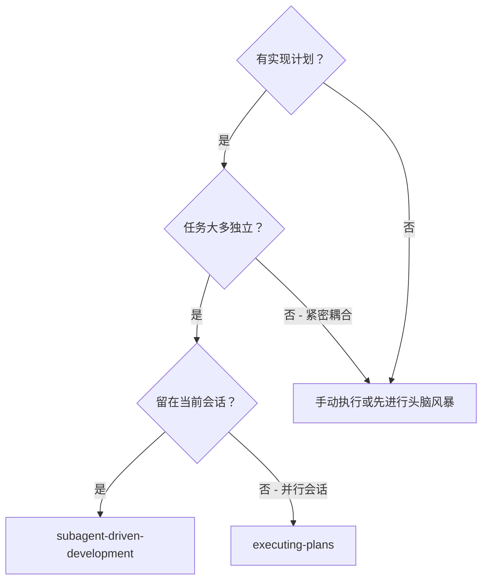
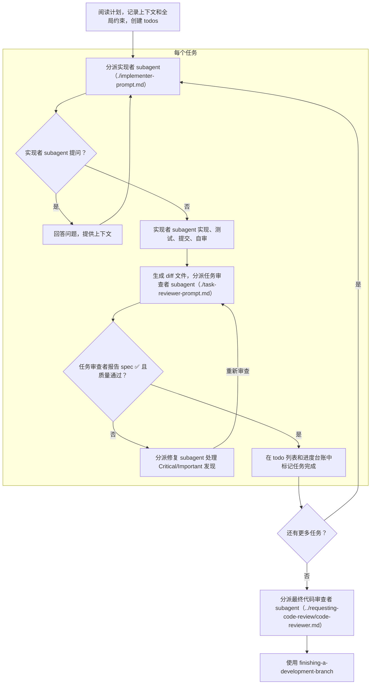

# Subagent-Driven Development

通过为每个任务分派一个新的实现者 subagent 来执行计划，每个任务完成后进行任务审查（spec 符合性 + 代码质量），最后进行一次全面的整个 branch 审查。

**为什么使用 subagent：** 你将任务委托给具有隔离上下文的专业 agent。通过精心构建它们的指令和上下文，你确保它们专注于任务并成功完成。它们不应继承你的会话上下文或历史——你精确构建它们所需的内容。这也为你自己的协调工作保留了上下文。

**核心原则：** 每个任务一个新 subagent + 任务审查（spec + 质量） + 全面最终审查 = 高质量、快速迭代

**叙述：** 在工具调用之间，最多叙述一行简短的话——
台账和工具结果承载记录。

**持续执行：** 不要在任务之间暂停与你的人类伙伴确认。不间断地执行计划中的所有任务。唯一停止的理由是：你无法解决的 BLOCKED 状态、真正阻碍进展的歧义，或所有任务已完成。"要继续吗？"的提示和进度摘要浪费他们的时间——他们要求你执行计划，那就执行。

## 何时使用



**与 Executing Plans（并行会话）对比：**
- 同一会话（无上下文切换）
- 每个任务新 subagent（无上下文污染）
- 每个任务后审查（spec 符合性 + 代码质量），最后进行全面审查
- 更快迭代（任务间无 human-in-loop）

## 流程



## 计划预检

在分派 Task 1 之前，扫描计划一次以检查冲突：

- 相互矛盾或与计划 Global Constraints 冲突的任务
- 计划明确要求但审查标准视为缺陷的任何内容
  （一个不 assert 任何内容的测试、逐字重复的逻辑块）

将你发现的所有问题作为一个批量问题呈现给你的
人类伙伴——每个发现旁边附上要求它的计划文本，询问哪个
优先——在执行开始之前，而不是在执行中每发现一个就中断一次。如果
扫描结果干净，无需说明直接继续。审查循环仍然是
仅从实现中浮现的冲突的安全网。

## Model Selection

使用能胜任每个角色的最低能力 model 以节省成本并提高速度。

**机械实现任务**（独立函数、明确 spec、1-2 个文件）：使用快速、便宜的 model。当计划定义良好时，大多数实现任务都是机械性的。

**集成和判断任务**（多文件协调、模式匹配、调试）：使用标准 model。

**架构和设计任务**：使用最强大的可用 model。
最终的整个 branch 审查就是其中之一——在最强大的可用 model 上分派它，而不是会话默认的。

**审查任务**：选择具有相同判断力的 model，根据
diff 的大小、复杂度和风险进行缩放。一个小的机械 diff 不需要
最强大的 model；一个微妙的 concurrency 变更则需要。

**分派 subagent 时始终明确指定 model。** 省略的
model 会继承你会话的 model——通常是最强大且
最昂贵的——这会默默破坏本节的目的。

**轮次计数比 token 价格更重要。** 实际时间和上下文成本随着
subagent 采取的轮次而缩放，最便宜的 model 在多步骤工作上通常花费 2-3×
的轮次——总体成本更高。使用中档 model 作为
审查者和从文本描述工作的实现者的底线。
当任务的计划文本包含要编写的完整代码时，
实现就是转录加测试：为该实现者使用最便宜的层级。单文件机械修复也使用最便宜的层级。

**任务复杂度信号（实现任务）：**
- 涉及 1-2 个文件，有完整 spec → 便宜 model
- 涉及多个文件，有集成问题 → 标准 model
- 需要设计判断或广泛的 codebase 理解 → 最强大 model

## 处理实现者状态

实现者 subagent 报告四种状态之一。适当处理每种状态：

**DONE：** 生成审查包（`scripts/review-package BASE HEAD`，来自此 skill 的目录——它打印其写入的唯一文件路径；BASE 是你在分派实现者之前记录的 commit——永远不要使用 `HEAD~1`，它会默默丢弃多 commit 任务中除最后一个之外的所有 commit），然后将打印的路径传给任务审查者。

**DONE_WITH_CONCERNS：** 实现者完成了工作但标记了疑虑。在继续之前阅读疑虑。如果疑虑涉及正确性或范围，在审查前处理。如果只是观察（例如"这个文件越来越大"），记录下来并继续审查。

**NEEDS_CONTEXT：** 实现者需要未提供的信息。提供缺失的上下文并重新分派。

**BLOCKED：** 实现者无法完成任务。评估阻碍因素：
1. 如果是上下文问题，提供更多上下文并用相同 model 重新分派
2. 如果任务需要更多推理能力，用更强大的 model 重新分派
3. 如果任务太大，将其拆分为更小的部分
4. 如果计划本身有误，上报给人类

**永远不要**忽略升级请求或在没有变更的情况下强制同一 model 重试。如果实现者说它卡住了，就需要做出改变。

## 处理审查者 ⚠️ 项目

任务审查者可能报告"⚠️ Cannot verify from diff"项目——需求
存在于未修改的代码中或跨越多个任务。这些不会阻止审查的其余部分，但你必须在标记任务完成之前自己解决每一个：你持有审查者
缺乏的计划和跨任务上下文。如果你确认某个项目是真实的差距，将其视为未通过 spec 审查——将其发回给实现者并重新审查。

## 构建审查者 Prompt

每个任务的审查是任务范围的把关。全面审查在
最终的整个 branch 审查时进行一次。当你填写审查者模板时：

- 不要添加开放式指令，如"检查所有用法"或"运行 race test
  如果有用"，除非有具体的、针对任务的理由
- 不要要求审查者重新运行实现者已经在相同代码上运行过的测试——实现者的报告包含测试证据
- 不要为审查者预先判断发现——永远不要指示审查者
  忽略或不标记特定问题。如果你认为某个发现是
  误报，让审查者提出并在审查循环中裁决。如果你正在编写的 prompt 包含"不要标记"、"不要把 X
  当作缺陷"、"最多 Minor"或"计划选择了"——停下：你正在
  预先判断，通常是为了避免审查循环。
- 你交给审查者的全局约束块是它的注意力
  焦点。从计划的 Global Constraints 部分或 spec 中原样复制
  约束性需求：精确值、精确格式以及
  组件间声明的关系（"与 X 相同的布局"、"匹配
  Y"）。审查者的模板已经承载了过程规则（YAGNI、
  测试规范、审查方法）——约束块是针对 THIS
  项目的 spec 要求的。
- 将 diff 作为文件交给审查者：运行此 skill 的
  `scripts/review-package BASE HEAD` 并将审查者它打印的文件路径
  传给它（或者，不用 bash：`git log --oneline`、`git diff --stat`
  和 `git diff -U10` 获取范围的 diff，重定向到一个唯一命名的
  文件）。输出永远不会进入你自己的上下文，审查者在一次 Read
  调用中看到 commit 列表、统计摘要和带上下文的完整 diff。使用你在分派实现者之前记录的 BASE——
  永远不要使用 `HEAD~1`，它会默默截断多 commit 任务。
- 分派 prompt 描述一个任务，而不是会话的历史。不要
  将累积的先前任务摘要（"Tasks 1-3 之后的状态"）粘贴到
  后续分派中——一个真实会话的分派达到了 42k 字符，其中 99%
  是粘贴的历史。一个新 subagent 需要它的任务、它涉及的
  接口和全局约束。不需要其他任何东西。
- 为 Critical 和 Important 发现分派修复 subagent。将 Minor
  发现记录在进度台账中，并指向最终的
  整个 branch 审查该列表，以便它可以分类哪些必须在
  merge 前修复。没人看的汇总就是默默的丢弃。
- 标记为 plan-mandated 的发现——或与计划文本要求冲突的
  任何发现——是人类的决定，与任何计划
  矛盾一样：呈现发现和计划文本，询问哪个
  优先。不要因为计划要求就驳回发现，也不要
  在未询问的情况下分派与计划矛盾的修复。
- 最终的整个 branch 审查也得到一个包：运行
  `scripts/review-package MERGE_BASE HEAD`（MERGE_BASE = branch
  开始的 commit，例如 `git merge-base main HEAD`）并在最终审查分派中包含
  打印的路径，这样最终审查者读取
  一个文件而不是用 git 命令重新推导 branch diff。
- 每个修复分派都携带实现者契约：修复 subagent
  重新运行覆盖其变更的测试并报告结果。在分派中命名
  覆盖测试文件——一行修复不需要
  整个套件。在重新分派审查者之前，确认修复报告
  包含覆盖测试、运行的命令和输出；三者齐全后分派
  重新审查。
- 如果最终的整个 branch 审查返回发现，分派一个修复
  subagent 并附带完整的发现列表——而不是每个发现一个修复者。
  每个发现的修复者各自重建上下文并重新运行套件；一个真实
  会话的最终审查修复浪潮花费超过了其所有任务的总和。

## 文件交接

你粘贴到分派 prompt 中的所有内容——以及 subagent
返回打印的所有内容——在会话的其余时间内都驻留在你的上下文中
并在每个后续回合重新读取。将工件作为文件交接：

- **任务简报：** 在分派实现者之前，运行此 skill 的
  `scripts/task-brief PLAN_FILE N`——它将任务的完整文本提取到一个
  唯一命名的文件并打印路径。编写分派使
  简报成为需求的唯一来源。你的分派应
  包含：(1) 一行关于此任务在项目中的位置；(2)
  简报路径，介绍为"先读这个——这是你的需求，
  其中的确切值要逐字使用"；(3) 来自早期任务的接口和决策
  简报无法知道的；(4) 你对
  简报中注意到的任何歧义的解决；(5) 报告文件路径和
  报告契约。确切值（数字、magic string、签名、测试
  用例）只出现在简报中。
- **报告文件：** 按简报命名实现者的报告文件
  （简报 `…/task-N-brief.md` → 报告 `…/task-N-report.md`）并将其放在
  分派 prompt 中。实现者在那里写完整报告并
  只返回状态、commit、单行测试摘要和疑虑。
- **审查者输入：** 任务审查者获得三个路径——相同的简报
  文件、报告文件和审查包——加上约束任务的
  全局约束。
- 修复分派将其修复报告（带测试结果）追加到同一
  报告文件并返回简短摘要；重新审查读取更新后的文件。

## 持久进度

对话记忆在压缩后不会保留。在真实会话中，
失去位置的控制器会重新分派整个已完成的任务
序列——这是观察到的最昂贵的单一失败。在
台账文件中跟踪进度，而不仅仅是在 todo 中。

- 在 skill 启动时，检查台账：
  `cat "$(git rev-parse --show-toplevel)/.superpowers/sdd/progress.md"`。其中列为
  完成的任务是 DONE——不要重新分派它们；从第一个未
  标记为完成的任务恢复。
- 当任务的审查返回干净时，在与你的其他簿记
  相同的消息中向台账追加一行：
  `Task N: complete (commits <base7>..<head7>, review clean)`。
- 台账是你的恢复地图：它命名的 commit 存在于 git 中，即使
  你的上下文不再记得创建它们。压缩后，
  信任台账和 `git log` 而不是你自己的记忆。
- `git clean -fdx` 会破坏台账（它是 git-ignored 的临时文件）；如果
  发生这种情况，从 `git log` 恢复。

## Prompt 模板

- [implementer-prompt.md](implementer-prompt.md) - 分派实现者 subagent
- [task-reviewer-prompt.md](task-reviewer-prompt.md) - 分派任务审查者 subagent（spec 符合性 + 代码质量）
- 最终的整个 branch 审查：使用 requesting-code-review 的 [code-reviewer.md](../requesting-code-review/code-reviewer.md)

## 工作流示例

```
你：我正在使用 Subagent-Driven Development 来执行此计划。

[阅读一次计划文件：docs/plans/feature-plan.md]
[为所有任务创建 todos]

任务 1：Hook 安装脚本

[为任务 1 运行 task-brief；分派实现者并附带简报 + 报告路径 + 上下文]

实现者："在开始之前——hook 应该安装在用户级别还是系统级别？"

你："用户级别（~/.config/superpowers/hooks/）"

实现者："收到。正在实现..."
[稍后] 实现者：
  - 实现了 install-hook 命令
  - 添加了测试，5/5 通过
  - 自审：发现我遗漏了 --force 标志，已添加
  - 已提交

[运行 review-package，分派任务审查者并附带打印的路径]
任务审查者：Spec ✅ - 所有需求已满足，没有多余内容。
  优点：测试覆盖良好，代码干净。问题：无。任务质量：通过。

[标记任务 1 完成]

任务 2：恢复模式

[为任务 2 运行 task-brief；分派实现者并附带简报 + 报告路径 + 上下文]

实现者：[没有问题，直接进行]
实现者：
  - 添加了验证/修复模式
  - 8/8 测试通过
  - 自审：一切正常
  - 已提交

[运行 review-package，分派任务审查者并附带打印的路径]
任务审查者：Spec ❌：
  - 缺失：进度报告（spec 要求"每 100 项报告一次"）
  - 多余：添加了 --json 标志（未要求）
  问题（Important）：魔术数字（100）

[分派修复 subagent 并附带所有发现]
修复者：移除了 --json 标志，添加了进度报告，提取了 PROGRESS_INTERVAL 常量

[任务审查者再次审查]
任务审查者：Spec ✅。任务质量：通过。

[标记任务 2 完成]

...

[所有任务完成后]
[分派最终代码审查者]
最终审查者：所有需求已满足，可以 merge

完成！
```

## 优势

**与手动执行对比：**
- Subagent 自然地遵循 TDD
- 每个任务新上下文（无混淆）
- 并行安全（subagent 不相互干扰）
- Subagent 可以提问（工作前和工作中）

**与 Executing Plans 对比：**
- 同一会话（无交接）
- 持续进展（无等待）
- 审查检查点自动化

**效率提升：**
- 控制器精确管理所需的上下文；大量工件
  作为文件移动，而不是粘贴文本
- Subagent 预先获得完整信息
- 问题在工作开始前浮现（而不是之后）

**质量关卡：**
- 自审在交接前捕获问题
- 任务审查承载两个判定：spec 符合性和代码质量
- 审查循环确保修复真正有效
- Spec 符合性防止过度/不足构建
- 代码质量确保实现构建良好

**成本：**
- 更多 subagent 调用（每个任务实现者 + 审查者）
- 控制器做更多准备工作（预先提取所有任务）
- 审查循环增加迭代
- 但能早期发现问题（比后期调试更便宜）

## 危险信号

**永远不要：**
- 在没有用户明确同意的情况下在 main/master branch 上开始实现
- 跳过任务审查，或接受缺少任一判定的报告（spec 符合性和任务质量都是必需的）
- 带着未修复的问题继续
- 并行分派多个实现 subagent（会冲突）
- 让 subagent 读取整个计划文件（交给它任务简报——
  `scripts/task-brief`——代替）
- 跳过场景设定上下文（subagent 需要理解任务的位置）
- 忽略 subagent 的问题（在让它们继续之前回答）
- 在 spec 符合性上接受"差不多"（审查者发现 spec 问题 = 未完成）
- 跳过审查循环（审查者发现问题 = 实现者修复 = 再次审查）
- 让实现者自审替代实际审查（两者都需要）
- 告诉审查者不要标记什么，或在分派 prompt 中预先评定发现的严重程度
  （"最多当作 Minor"）——计划的示例代码是
  起点，不是其弱点是有意选择的证据
- 分派没有 diff 文件的任务审查者——先生成它
  （`scripts/review-package BASE HEAD`）并在 prompt 中命名打印的路径
- 在审查有未解决的 Critical/Important 问题时进入下一个任务
- 重新分派进度台账已标记为完成的任务——在任何压缩或恢复后检查
  台账（和 `git log`）

**如果 subagent 提问：**
- 清晰完整地回答
- 必要时提供额外上下文
- 不要催促它们进入实现

**如果审查者发现问题：**
- 实现者（同一 subagent）修复它们
- 审查者再次审查
- 重复直到通过
- 不要跳过重新审查

**如果 subagent 任务失败：**
- 分派修复 subagent 并附带具体指示
- 不要尝试手动修复（上下文污染）

## 集成

**必需的工作流 skill：**
- **using-git-worktrees** - 确保隔离的工作区（创建一个或验证现有的）
- **writing-plans** - 创建此 skill 执行的计划
- **requesting-code-review** - 最终整个 branch 审查的代码审查模板
- **finishing-a-development-branch** - 所有任务完成后完成开发

**Subagent 应使用：**
- **test-driven-development** - Subagent 为每个任务遵循 TDD

**替代工作流：**
- **executing-plans** - 用于并行会话而不是同会话执行
