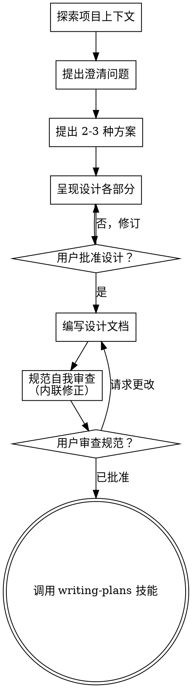

# 将想法头脑风暴为设计

通过自然的协作对话，帮助将想法转化为完整的设计和规范。

首先了解当前项目上下文，然后逐个提问以完善想法。一旦理解了你正在构建的内容，就呈现设计并获取用户批准。

<HARD-GATE>
在呈现设计并获得用户批准之前，不得调用任何实现技能、编写任何代码、搭建任何项目或采取任何实现操作。这适用于每个项目，无论感知的简单程度如何。
</HARD-GATE>

## 反模式："这太简单了，不需要设计"

每个项目都要经过这个过程。待办事项列表、单函数工具、配置变更——全部都要。"简单"项目是未经验证的假设导致最多浪费工作的地方。设计可以很简短（真正简单的项目只需几句话），但你必须呈现它并获取批准。

## 检查清单

你必须为以下每一项创建任务，并按顺序完成：

1. **探索项目上下文** — 检查文件、文档、最近的提交
2. **按需提供可视化伴侣** — 不要提前提供。当某个问题用展示比用描述更清晰时，才在此时提供（作为独立消息）；获得批准后，其浏览器标签页会自动打开。如果从未出现可视化问题，则永远不要提供。参见下方的可视化伴侣部分。
3. **提出澄清问题** — 每次一个，理解目的/约束/成功标准
4. **提出 2-3 种方案** — 附带权衡和你的推荐
5. **呈现设计** — 各部分按复杂度缩放，每部分后获取用户批准
6. **编写设计文档** — 保存到 `docs/superpowers/specs/YYYY-MM-DD-<topic>-design.md` 并提交
7. **规范自我审查** — 快速内联检查占位符、矛盾、歧义、范围（见下方）
8. **用户审查书面规范** — 在继续之前请用户审查规范文件
9. **过渡到实现** — 调用 writing-plans 技能创建实现计划

## 流程

**终端状态是调用 writing-plans。** 不要调用 frontend-design、mcp-builder 或任何其他实现技能。头脑风暴后唯一调用的技能是 writing-plans。

## 过程

**理解想法：**

- 首先检查当前项目状态（文件、文档、最近的提交）
- 在提出详细问题之前，先评估范围：如果请求描述了多个独立的子系统（例如，"构建一个包含聊天、文件存储、计费和分析的平台"），立即标记。不要在需要首先分解的项目的细节上浪费问题。
- 如果项目太大，无法用单个规范覆盖，帮助用户分解为子项目：哪些是独立的部分，它们如何关联，应该以什么顺序构建？然后通过正常的设计流程对第一个子项目进行头脑风暴。每个子项目获得自己的规范 → 计划 → 实现周期。
- 对于范围适当的项目，逐个提问以完善想法
- 尽可能优先使用多选题，但开放式问题也可以
- 每条消息只问一个问题——如果某个主题需要更多探索，将其分解为多个问题
- 专注于理解：目的、约束、成功标准

**探索方案：**

- 提出 2-3 种不同方案，附带权衡
- 以对话方式呈现选项，附带推荐和理由
- 以你推荐的选项为主导，并解释原因

**呈现设计：**

- 一旦你认为理解了要构建的内容，就呈现设计
- 每个部分按复杂度缩放：如果直接则只需几句话，如果微妙则最多 200-300 字
- 每个部分之后询问到目前为止是否正确
- 覆盖：架构、组件、数据流、错误处理、测试
- 如果某些内容不合理，随时准备返回并澄清

**隔离与清晰的设计：**

- 将系统分解为较小的单元，每个单元有一个明确的目的，通过定义良好的接口通信，并且可以独立理解和测试
- 对于每个单元，你应该能回答：它做什么，如何使用它，它依赖什么？
- 某人不阅读内部实现就能理解一个单元做什么吗？你可以更改内部实现而不破坏消费者吗？如果不能，边界需要调整。
- 更小、边界良好的单元也更容易让你处理——你能更好地对上下文中的代码进行推理，并且当文件聚焦时，你的编辑更可靠。当文件变得很大时，这通常是一个信号，表明它做了太多事情。

**在现有代码库中工作：**

- 在提出更改之前探索当前结构。遵循现有模式。
- 当现有代码存在影响工作的问题时（例如，一个变得太大的文件、不清晰的边界、混杂的职责），将有针对性的改进作为设计的一部分——就像优秀的开发者在处理代码时所做的那样。
- 不要提出无关的重构。保持专注于当前目标。

## 设计之后

**文档：**

- 将验证过的设计（规范）写入 `docs/superpowers/specs/YYYY-MM-DD-<topic>-design.md`
  - （用户对规范位置的偏好覆盖此默认值）
- 如果有 elements-of-style:writing-clearly-and-concisely 技能，请使用它
- 将设计文档提交到 git

**规范自我审查：**
编写规范文档后，以全新的视角审视它：

1. **占位符扫描：** 是否有任何 "TBD"、"TODO"、不完整的部分或模糊的需求？修正它们。
2. **内部一致性：** 是否有任何部分相互矛盾？架构是否匹配功能描述？
3. **范围检查：** 这足够聚焦于单个实现计划吗，还是需要分解？
4. **歧义检查：** 是否有任何需求可能被解读为两种不同的方式？如果是，选择一种并明确化。

内联修正任何问题。无需重新审查——修正后继续。

**用户审查关卡：**
规范审查循环通过后，在继续之前请用户审查书面规范：

> "规范已写入并提交到 `<path>`。请审查它，如果你想要在开始编写实现计划之前进行任何更改，请告诉我。"

等待用户的回复。如果他们请求更改，进行更改并重新运行规范审查循环。只有在用户批准后才继续。

**实现：**

- 调用 writing-plans 技能创建详细的实现计划
- 不要调用任何其他技能。writing-plans 是下一步。

## 关键原则

- **每次一个问题** - 不要用多个问题压垮人
- **优先多选题** - 比开放式问题更容易回答
- **无情地实践 YAGNI** - 从所有设计中移除不必要的功能
- **探索替代方案** - 在确定之前总是提出 2-3 种方案
- **增量验证** - 呈现设计，在继续之前获取批准
- **保持灵活** - 当某些内容不合理时返回并澄清

## 可视化伴侣

基于浏览器的伴侣，用于在头脑风暴期间展示模型、图表和可视化选项。作为工具可用——不是一种模式。接受伴侣意味着它可用于受益于可视化处理的问题；这并不意味着每个问题都通过浏览器。

**提供伴侣（按需）：** 不要提前提供。等待直到某个问题用展示比用讲述更清晰——真正的模型/布局/图表问题，而不仅仅是 UI 主题。第一次出现这种情况时，在那时提供，作为独立消息：
> "接下来的部分如果我能展示给你看可能会更容易——我可以在浏览器标签页中逐步展示模型、图表和对比。这仍然是新的功能，可能消耗较多 token。需要我这样做吗？我会为你打开它。"

**此提议必须是独立消息。** 只有提议——没有澄清问题、摘要或其他内容。等待用户的回复。如果他们接受，使用 `--open` 启动服务器，使他们的浏览器自动打开到第一个屏幕。如果他们拒绝，继续纯文本模式，除非他们再提起，否则不要再提议。

**每个问题的决策：** 即使用户接受了，对每个问题也要决定是用浏览器还是终端。检验标准：**用户通过看到它比阅读它理解得更好吗？**

- **使用浏览器** 处理本质上是视觉的内容——模型、线框图、布局对比、架构图、并排视觉设计
- **使用终端** 处理文本内容——需求问题、概念选择、权衡列表、A/B/C/D 文本选项、范围决策

关于 UI 主题的问题不自动是可视化问题。"在这个上下文中'个性'是什么意思？"是概念性问题——使用终端。"哪个向导布局更好？"是可视化问题——使用浏览器。

如果他们同意使用伴侣，在执行之前阅读详细指南：
`skills/brainstorming/visual-companion.md`
