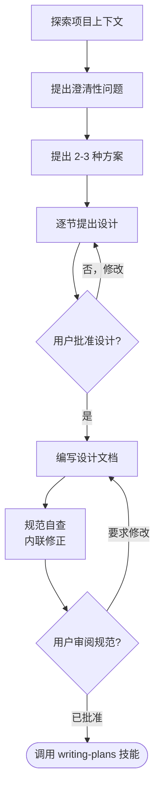

# 通过头脑风暴将想法转化为设计

通过自然的协作对话，帮助将想法转化为完整的设计和规范。

首先了解当前项目上下文，然后逐个提问以完善想法。一旦理解了你正在构建的内容，提出设计方案并获得用户批准。

<HARD-GATE>
在提出设计方案并获得用户批准之前，不要调用任何实现技能、编写任何代码、搭建任何项目或采取任何实现行动。无论项目看起来多么简单，此规则适用于每一个项目。
</HARD-GATE>

## 反模式："这太简单了，不需要设计"

每个项目都要经过这个流程。一个待办事项列表、一个单功能工具、一个配置更改——全部都要。"简单"的项目正是未经审视的假设导致最多浪费工作的地方。设计可以很短（对于真正简单的项目只需几句话），但你必须提出设计方案并获得批准。

## 检查清单

你必须为以下每项创建任务，并按顺序完成：

1. **探索项目上下文**——检查文件、文档、最近的提交记录
2. **适时提供可视化伴侣**——不要在一开始就提供。当某个问题用展示比描述更清晰时，才在合适的时机提供（单独一条消息）；获得批准后，其浏览器标签页会为你打开。如果始终没有出现可视化相关的需求，则永远不要提供。请参阅下文可视化伴侣部分。
3. **提出澄清性问题**——每次一个，理解目的/约束/成功标准
4. **提出 2-3 种方案**——附带权衡分析和推荐
5. **提出设计方案**——按各部分复杂度分节呈现，每节完成后获得用户批准
6. **编写设计文档**——保存到 `docs/superpowers/specs/YYYY-MM-DD-<topic>-design.md` 并提交
7. **规范自查**——快速内联检查占位符、矛盾之处、模糊点和范围（见下文）
8. **用户审阅书面规范**——在继续之前请用户审阅规范文件
9. **转入实现阶段**——调用 writing-plans 技能创建实现计划

## 流程

**最终状态是调用 writing-plans。** 不要调用 frontend-design、mcp-builder 或任何其他实现技能。头脑风暴之后唯一调用的技能是 writing-plans。

## 流程细节

**理解想法：**

- 首先检查当前项目状态（文件、文档、最近的提交记录）
- 在提出详细问题之前评估范围：如果请求描述了多个独立子系统（例如"构建一个包含聊天、文件存储、计费和分析的平台"），立即指出这一点。不要花费问题来细化一个需要先分解的项目的细节。
- 如果项目对于单个规范来说太大，帮助用户分解为子项目：有哪些独立的部分，它们如何关联，应该按什么顺序构建？然后通过正常的头脑风暴设计流程来处理第一个子项目。每个子项目都有其自己的 规范 → 计划 → 实现 周期。
- 对于范围适当的项目，逐个提出问题以完善想法
- 尽可能优先使用选择题，但开放式问题也可以
- 每条消息只问一个问题——如果一个主题需要更多探索，将其分解为多个问题
- 关注理解：目的、约束、成功标准

**探索方案：**

- 提出 2-3 种不同方案并附带权衡分析
- 以对话方式呈现选项，附上你的推荐和理由
- 首先介绍你推荐的方案并解释原因

**提出设计方案：**

- 一旦你认为自己理解了正在构建的内容，就提出设计方案
- 根据各部分复杂度调整篇幅：如果简单直接，只需几句话；如果有细微差别，最多 200-300 词
- 每节之后询问到目前为止是否正确
- 涵盖：架构、组件、数据流、错误处理、测试
- 如果某些内容不合理，随时准备返回澄清

**为隔离性和清晰度而设计：**

- 将系统拆分为更小的单元，每个单元都有一个明确的用途，通过良好定义的接口进行通信，并且可以独立理解和测试
- 对于每个单元，你应该能够回答：它做什么，如何使用它，它依赖什么？
- 别人能否在不阅读其内部实现的情况下理解一个单元的功能？能否在不破坏消费者的情况下更改内部实现？如果不能，边界需要改进。
- 更小、边界良好的单元也更容易让你操作——你对能够一次性在上下文中把握的代码推理得更好，并且当文件聚焦时，你的编辑更可靠。当文件变得很大时，这通常是一个信号，表明它承担了过多的职责。

**在现有代码库中工作：**

- 在提出更改之前探索当前结构。遵循现有模式。
- 如果现有代码存在影响工作的问题（例如文件变得太大、边界不清晰、职责纠缠），将有针对性的改进作为设计的一部分——就像优秀的开发人员改进他们正在处理的代码一样。
- 不要提出无关的重构。保持聚焦于当前目标所需的内容。

## 设计完成之后

**文档：**

- 将经过验证的设计（规范）写入 `docs/superpowers/specs/YYYY-MM-DD-<topic>-design.md`
  - （用户对规范位置的偏好会覆盖此默认值）
- 如果可用，使用 elements-of-style:writing-clearly-and-concisely 技能
- 将设计文档提交到 git

**规范自查：**
编写规范文档后，以全新的眼光审视它：

1. **占位符扫描：** 是否有任何 "TBD"、"TODO"、不完整的部分或模糊的需求？修正它们。
2. **内部一致性：** 是否有任何部分相互矛盾？架构是否与功能描述匹配？
3. **范围检查：** 这对于单个实现计划来说是否足够聚焦，还是需要分解？
4. **歧义检查：** 是否有任何需求可以有两种不同的解释？如果有，选择一种并明确说明。

内联修正任何问题。无需重新审阅——只需修正并继续。

**用户审阅关卡：**
在规范审阅循环通过后，在继续之前请用户审阅书面规范：

> "规范已写入并提交到 `<path>`。请审阅它，如果需要任何更改，请告诉我，我们再开始编写实现计划。"

等待用户的回复。如果他们要求更改，进行更改并重新运行规范审阅循环。只有在用户批准后才继续。

**实现：**

- 调用 writing-plans 技能创建详细的实现计划
- 不要调用任何其他技能。writing-plans 是下一步。

## 关键原则

- **每次一个问题**——不要用多个问题淹没对方
- **优先使用选择题**——可能时比开放式问题更容易回答
- **无情地应用 YAGNI**——从所有设计中移除不必要的功能
- **探索替代方案**——在确定之前始终提出 2-3 种方案
- **增量验证**——提出设计，获得批准后再继续
- **保持灵活**——当某些内容不合理时返回澄清

## 可视化伴侣

一个基于浏览器的伴侣工具，用于在头脑风暴期间展示模型、图表和可视化选项。作为一种工具使用——而不是一种模式。接受伴侣意味着它可用于那些更适合可视化处理的问题；这并不意味着每个问题都要通过浏览器处理。

**提供伴侣（适时提供）：** 不要在一开始就提供。等到某个问题真的用展示比用文字描述更清晰时——一个真正的模型/布局/图表问题，而不仅仅是 UI 主题。第一次出现这种情况时，在那个时候提供，作为单独的一条消息：
> "接下来的部分如果我用展示的方式可能会更容易——我可以在浏览器标签页中随着进展提供模型、图表和对比。这个功能还是比较新的，可能会消耗较多 token。需要吗？我会为你打开它。"

**此提议必须是独立的一条消息。** 只有提议——不要附上澄清性问题、总结或其他内容。等待用户的回复。如果他们接受，使用 `--open` 启动服务器，这样他们的浏览器会自动打开第一个页面。如果他们拒绝，继续纯文本模式，除非他们再次提起，否则不要再提供。

**逐题决策：** 即使用户接受了，也要针对每个问题决定使用浏览器还是终端。测试标准：**用户通过看比通过读能更好地理解这个内容吗？**

- **使用浏览器** 处理本质上是视觉化的内容——UI 模型、线框图、布局对比、架构图、并排视觉设计
- **使用终端** 处理文本内容——需求问题、概念选择、权衡列表、A/B/C/D 文字选项、范围决策

关于 UI 主题的问题并不自动意味着它是视觉化问题。"在这个上下文中 'personality' 是什么意思？" 是概念性问题——使用终端。"哪种向导布局更好？" 是视觉化问题——使用浏览器。

如果他们同意使用伴侣，在继续之前阅读详细指南：
`skills/brainstorming/visual-companion.md`
