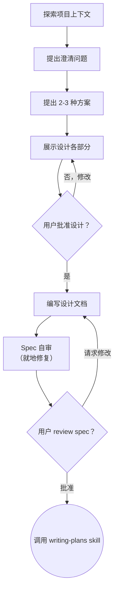

# 将想法转化为设计

通过自然的协作对话，帮助将想法转化为完整的设计和 spec。

首先了解当前项目上下文，然后逐一提问以完善想法。一旦理解了要构建什么，展示设计并获得用户批准。

<HARD-GATE>
在你展示设计并获得用户批准之前，不要调用任何实现 skill、编写任何代码、搭建任何项目框架或采取任何实现行动。这适用于每个项目，无论其感知上多简单。
</HARD-GATE>

## 反模式："这太简单了，不需要设计"

每个项目都要经过此流程。一个 todo 列表、一个单函数工具、一个配置变更——全部都要。"简单"项目正是未经审视的假设导致最多浪费工作的地方。设计可以很短（对于真正简单的项目只需几句话），但你必须展示它并获得批准。

## 检查清单

你必须为以下每项创建任务并按顺序完成：

1. **探索项目上下文** — 检查文件、文档、最近的 commit
2. **适时提供 visual companion** — 不是在一开始。当某个问题用展示比描述更清晰时，在那时提供（作为独立消息）；批准后为其打开浏览器标签。如果没有出现需要可视化的问题，则永远不提供。参见下方 Visual Companion 部分。
3. **提出澄清问题** — 逐一提问，理解目的/约束/成功标准
4. **提出 2-3 种方案** — 附带权衡和你的推荐
5. **展示设计** — 按复杂度分段展示，每段后获取用户批准
6. **编写设计文档** — 保存到 `docs/superpowers/specs/YYYY-MM-DD-<topic>-design.md` 并 commit
7. **Spec 自审** — 快速内联检查占位符、矛盾、歧义、范围（见下方）
8. **用户 review 书面 spec** — 在继续之前请用户 review spec 文件
9. **过渡到实现** — 调用 writing-plans skill 创建实现 plan

## 流程图

**终止状态是调用 writing-plans。** 不要调用 frontend-design、mcp-builder 或任何其他实现 skill。brainstorming 之后唯一调用的 skill 是 writing-plans。

## 流程

**理解想法：**

- 首先查看当前项目状态（文件、文档、最近的 commit）
- 在提出详细问题之前，评估范围：如果请求描述了多个独立子系统（例如"构建一个包含聊天、文件存储、计费和分析的平台"），立即标记。不要花时间去细化一个需要先分解的项目的细节。
- 如果项目太大，无法用单个 spec 涵盖，帮助用户分解为子项目：独立的部分是什么，它们如何关联，应该按什么顺序构建？然后通过正常设计流程 brainstorm 第一个子项目。每个子项目有自己的 spec → plan → 实现周期。
- 对于范围适当的项目，逐一提问以完善想法
- 尽可能使用选择题，但开放式问题也可以
- 每条消息只问一个问题——如果某个主题需要更多探索，将其拆分为多个问题
- 重点理解：目的、约束、成功标准

**探索方案：**

- 提出 2-3 种不同方案及其权衡
- 以对话方式展示选项，附带你的推荐和理由
- 先展示推荐选项并解释原因

**展示设计：**

- 一旦你认为理解了要构建什么，展示设计
- 每个部分按其复杂度调整篇幅：如果直接了当则几句话，如果有细微差别则最多 200-300 字
- 每部分之后询问到目前为止是否正确
- 涵盖：架构、组件、数据流、错误处理、测试
- 准备好回头澄清不清楚的地方

**为隔离和清晰而设计：**

- 将系统拆分为更小的单元，每个单元有一个明确目的，通过明确定义的接口通信，并可以独立理解和测试
- 对于每个单元，你应该能回答：它做什么，如何使用它，它依赖什么？
- 有人能在不阅读内部实现的情况下理解一个单元做什么吗？你能在不破坏消费者的情况下更改内部实现吗？如果不能，边界需要改进。
- 更小、边界清晰的单元也更容易让你处理——你在可以一次性放入上下文的代码上推理效果更好，当文件专注时你的编辑更可靠。当文件变大时，这通常意味着它做了太多事。

**在现有代码库中工作：**

- 在提出变更之前先探索当前结构。遵循已有模式。
- 如果现有代码存在影响工作的问题（例如文件过大、边界不清、职责纠缠），将针对性改进纳入设计——就像优秀的开发者改善其工作代码一样。
- 不要提议无关的重构。保持专注于服务当前目标的内容。

## 设计完成后

**文档：**

- 将验证过的设计（spec）写入 `docs/superpowers/specs/YYYY-MM-DD-<topic>-design.md`
  - （用户对 spec 位置的偏好会覆盖此默认值）
- 如果可用，使用 elements-of-style:writing-clearly-and-concisely skill
- 将设计文档 commit 到 git

**Spec 自审：**
编写 spec 文档后，以全新视角审视：

1. **占位符扫描：** 有"TBD"、"TODO"、不完整部分或模糊需求吗？修复它们。
2. **内部一致性：** 各部分之间是否有矛盾？架构是否与功能描述匹配？
3. **范围检查：** 这是否足够聚焦以用于单个实现 plan，还是需要分解？
4. **歧义检查：** 任何需求是否可能有两种解读？如果是，选择一种并明确表述。

就地修复任何问题。无需重新 review——修复后继续。

**用户 Review Gate：**
Spec review 循环通过后，请用户在继续之前 review 书面 spec：

> "Spec 已编写并 commit 到 `<path>`。请 review 它，如果在我们开始编写实现 plan 之前你想做任何修改，请告诉我。"

等待用户回复。如果他们请求修改，进行修改并重新运行 spec review 循环。只有在用户批准后才继续。

**实现：**

- 调用 writing-plans skill 创建详细的实现 plan
- 不要调用任何其他 skill。writing-plans 是下一步。

## 关键原则

- **一次一个问题** - 不要用多个问题淹没用户
- **优先选择题** - 可能时比开放式问题更容易回答
- **严格 YAGNI** - 从所有设计中移除不必要的功能
- **探索替代方案** - 确定之前始终提出 2-3 种方案
- **增量验证** - 展示设计，获得批准后再继续
- **保持灵活** - 不清楚时回头澄清

## Visual Companion

一个基于浏览器的 companion，用于在 brainstorming 期间展示 mockup、图表和可视化选项。作为工具可用——而非模式。接受 companion 意味着它可用于受益于可视化处理的问题；并不意味着每个问题都通过浏览器。

**提供 companion（适时）：** 不要一开始就提供。等到某个问题用展示比描述更清晰时——一个真正的 mockup / 布局 / 图表问题，而不仅仅是一个 UI *话题*。第一次出现这种情况时，作为独立消息提供：
> "接下来的部分如果我展示给你看可能更直观——我可以在浏览器标签中为你准备 mockup、图表和对比。它还比较新，可能会消耗较多 token。要我这样做吗？我会为你打开它。"

**此提供必须是独立消息。** 只有提供——不包含澄清问题、总结或其他内容。等待用户回复。如果他们接受，使用 `--open` 启动服务器，这样他们的浏览器会自动打开到第一个画面。如果他们拒绝，继续纯文本模式，除非他们主动提起，否则不再提供。

**逐问题决策：** 即使用户接受了 companion，也要为每个问题决定使用浏览器还是终端。判断标准：**用户通过看到它比阅读它理解得更好吗？**

- **使用浏览器** 用于本身就是视觉的内容——mockup、线框图、布局对比、架构图、并排视觉设计
- **使用终端** 用于文本内容——需求问题、概念选择、权衡列表、A/B/C/D 文本选项、范围决策

关于 UI 话题的问题不自动成为可视化问题。"在这个上下文中 personality 是什么意思？"是概念问题——使用终端。"哪个向导布局更好？"是可视化问题——使用浏览器。

如果他们同意使用 companion，在继续之前阅读详细指南：
`skills/brainstorming/visual-companion.md`
