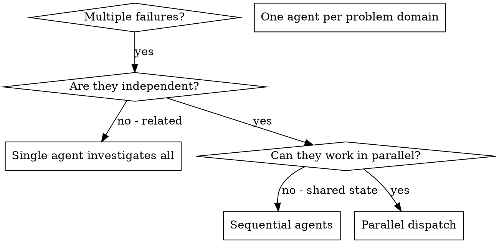

# 派发并行 Agent

## 概述

你将任务委派给具有隔离上下文的专用 agent。通过精确构建它们的指令和上下文，确保它们保持专注并成功完成任务。它们不应继承你会话的上下文或历史——你只构建它们所需的内容。这也保留了你自己的上下文用于协调工作。

当你遇到多个不相关的失败（不同的测试文件、不同的子系统、不同的 bug）时，顺序调查会浪费时间。每个调查是独立的，可以并行进行。

**核心原则：** 每个独立的问题域派发一个 agent。让它们并发工作。

## 何时使用



**适用于：**
- 3 个以上测试文件因不同根因而失败
- 多个子系统独立故障
- 每个问题可以在无需其他上下文的情况下理解
- 调查之间没有共享状态

**不适用于：**
- 失败是相关的（修复一个可能修复其他）
- 需要理解完整的系统状态
- agent 会相互干扰

## 模式

### 1. 识别独立领域

按故障内容将失败分组：
- 文件 A 测试：工具审批流程
- 文件 B 测试：批处理完成行为
- 文件 C 测试：中止功能

每个领域是独立的——修复工具审批不会影响中止测试。

### 2. 创建聚焦的 Agent 任务

每个 agent 获得：
- **具体范围：** 一个测试文件或子系统
- **明确目标：** 使这些测试通过
- **约束：** 不更改其他代码
- **期望输出：** 你的发现和修复的总结

### 3. 并行派发

在同一条响应中发出所有 subagent 派发——它们并行运行：

```text
Subagent (general-purpose): "Fix agent-tool-abort.test.ts failures"
Subagent (general-purpose): "Fix batch-completion-behavior.test.ts failures"
Subagent (general-purpose): "Fix tool-approval-race-conditions.test.ts failures"
# All three run concurrently.
```

一条响应中的多个派发调用 = 并行执行。每条响应一个 = 顺序执行。

### 4. 审查与集成

当 agent 返回时：
- 阅读每个总结
- 验证修复不冲突
- 运行完整测试套件
- 集成所有更改

## Agent 提示结构

好的 agent 提示是：
1. **聚焦**——一个清晰的问题领域
2. **自包含**——理解问题所需的所有上下文
3. **输出明确**——agent 应该返回什么？

```markdown
Fix the 3 failing tests in src/agents/agent-tool-abort.test.ts:

1. "should abort tool with partial output capture" - expects 'interrupted at' in message
2. "should handle mixed completed and aborted tools" - fast tool aborted instead of completed
3. "should properly track pendingToolCount" - expects 3 results but gets 0

These are timing/race condition issues. Your task:

1. Read the test file and understand what each test verifies
2. Identify root cause - timing issues or actual bugs?
3. Fix by:
   - Replacing arbitrary timeouts with event-based waiting
   - Fixing bugs in abort implementation if found
   - Adjusting test expectations if testing changed behavior

Do NOT just increase timeouts - find the real issue.

Return: Summary of what you found and what you fixed.
```

## 常见错误

- **❌ 范围太广：** "Fix all the tests"——agent 会迷失方向
- **✅ 具体：** "Fix agent-tool-abort.test.ts"——聚焦的范围

- **❌ 无上下文：** "Fix the race condition"——agent 不知道在哪
- **✅ 上下文：** 粘贴错误消息和测试名称

- **❌ 无约束：** agent 可能重构所有内容
- **✅ 约束：** "不更改生产代码"或"只修复测试"

- **❌ 输出模糊：** "Fix it"——你不知道改了什么
- **✅ 明确：** "返回根因和更改的总结"

## 何时不应使用

- **相关失败：** 修复一个可能修复其他——先一起调查
- **需要完整上下文：** 理解需要看到整个系统
- **探索性调试：** 你还不知道问题出在哪
- **共享状态：** agent 会相互干扰（编辑相同的文件、使用相同的资源）

## 来自会话的真实案例

**场景：** 重大重构后 3 个文件共有 6 个测试失败

**失败列表：**
- agent-tool-abort.test.ts：3 个失败（时序问题）
- batch-completion-behavior.test.ts：2 个失败（工具未执行）
- tool-approval-race-conditions.test.ts：1 个失败（执行计数 = 0）

**决策：** 独立领域——中止逻辑、批处理完成、竞态条件互不相关

**派发：**
```
Agent 1 → Fix agent-tool-abort.test.ts
Agent 2 → Fix batch-completion-behavior.test.ts
Agent 3 → Fix tool-approval-race-conditions.test.ts
```

**结果：**
- Agent 1：用时基于事件的等待替代超时
- Agent 2：修复了事件结构 bug（threadId 位置错误）
- Agent 3：添加了等待异步工具执行完成的逻辑

**集成：** 所有修复独立，无冲突，完整套件通过

**节省时间：** 3 个问题并行解决而非顺序解决

## 主要优势

1. **并行化**——多个调查同时进行
2. **聚焦**——每个 agent 范围狭窄，需要跟踪的上下文更少
3. **独立性**——agent 不会相互干扰
4. **速度**——3 个问题在 1 个的时间内解决

## 验证

agent 返回后：
1. **审查每个总结**——理解更改了什么
2. **检查冲突**——agent 是否编辑了相同的代码？
3. **运行完整套件**——验证所有修复一起工作
4. **抽查**——agent 可能犯系统性错误

## 实际影响

来自调试会话（2025-10-03）：
- 3 个文件共 6 个失败
- 并行派发 3 个 agent
- 所有调查同时完成
- 所有修复成功集成
- agent 更改之间零冲突
