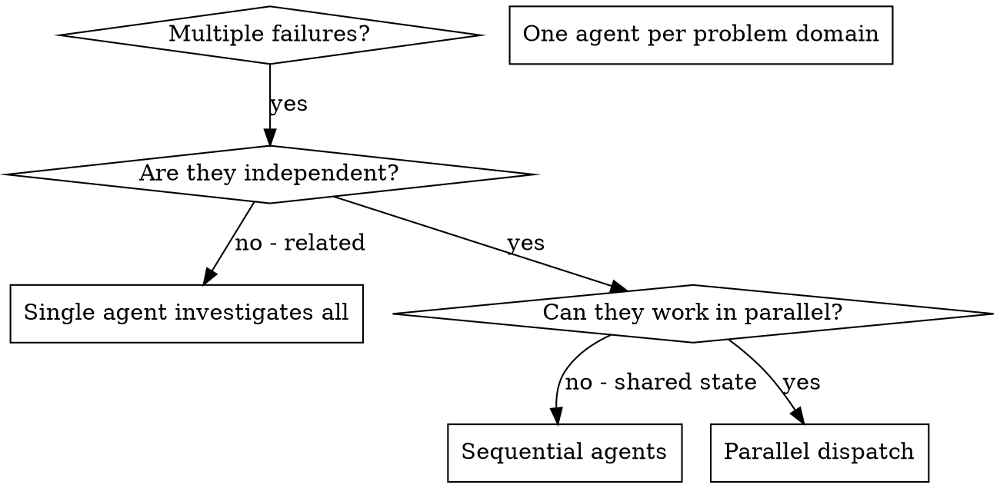

# 调度并行 Agent（Dispatching Parallel Agents）

## 概述

当你有多个不相关的失败（不同测试文件、不同子系统、不同 bug）时，按顺序调查会浪费时间。每个调查都是独立的，可以并行进行。

**核心原则：** 每个独立问题域分派一个 agent。让它们并发工作。

## 何时使用



**适用场景：**
- 3 个以上测试文件因不同根因失败
- 多个子系统独立损坏
- 每个问题无需其他问题的上下文即可理解
- 调查之间不存在共享状态

**不适用场景：**
- 失败相互关联（修复一个可能修复其他）
- 需要了解完整的系统状态
- Agent 之间会相互干扰

## 模式

### 1. 识别独立域

按损坏内容对失败分组：
- 文件 A 测试：工具审批流程
- 文件 B 测试：批次完成行为
- 文件 C 测试：中止功能

每个域都是独立的——修复工具审批不会影响中止测试。

### 2. 创建聚焦的 Agent 任务

每个 agent 获得：
- **明确范围：** 一个测试文件或子系统
- **清晰目标：** 让这些测试通过
- **约束条件：** 不要修改其他代码
- **预期输出：** 发现和修复内容的摘要

### 3. 并行调度

```typescript
// In Claude Code / AI environment
Task("Fix agent-tool-abort.test.ts failures")
Task("Fix batch-completion-behavior.test.ts failures")
Task("Fix tool-approval-race-conditions.test.ts failures")
// All three run concurrently
```

### 4. 审查与集成

当 agent 返回时：
- 阅读每个摘要
- 验证修复之间没有冲突
- 运行完整测试套件
- 集成所有更改

## Agent 提示词结构

好的 agent 提示词具备以下特点：
1. **聚焦** - 一个明确的问题域
2. **自包含** - 包含理解问题所需的所有上下文
3. **输出明确** - agent 应该返回什么？

```markdown
Fix the 3 failing tests in src/agents/agent-tool-abort.test.ts:

1. "should abort tool with partial output capture" - expects 'interrupted at' in message
2. "should handle mixed completed and aborted tools" - fast tool aborted instead of completed
3. "should properly track pendingToolCount" - expects 3 results but gets 0

These are timing/race condition issues. Your task:

1. Read the test file and understand what each test verifies
2. Identify root cause - timing issues or actual bugs?
3. Fix by:
   - Replacing arbitrary timeouts with event-based waiting
   - Fixing bugs in abort implementation if found
   - Adjusting test expectations if testing changed behavior

Do NOT just increase timeouts - find the real issue.

Return: Summary of what you found and what you fixed.
```

## 常见错误

**❌ 范围过广：** "Fix all the tests" - agent 会迷失方向
**✅ 具体明确：** "Fix agent-tool-abort.test.ts" - 聚焦的范围

**❌ 缺少上下文：** "Fix the race condition" - agent 不知道在哪里
**✅ 提供上下文：** 粘贴错误信息和测试名称

**❌ 缺少约束：** Agent 可能会重构所有代码
**✅ 设定约束：** "Do NOT change production code" 或 "Fix tests only"

**❌ 输出模糊：** "Fix it" - 你不知道改了什么
**✅ 输出明确：** "Return summary of root cause and changes"

## 何时不应使用

**关联的失败：** 修复一个可能修复其他——先一起调查
**需要完整上下文：** 理解问题需要看到整个系统
**探索性调试：** 你还不知道哪里出了问题
**共享状态：** Agent 会相互干扰（编辑相同文件、使用相同资源）

## 会话中的真实案例

**场景：** 大规模重构后，3 个文件出现 6 个测试失败

**失败详情：**
- agent-tool-abort.test.ts：3 个失败（时序问题）
- batch-completion-behavior.test.ts：2 个失败（工具未执行）
- tool-approval-race-conditions.test.ts：1 个失败（执行计数 = 0）

**决策：** 独立域——中止逻辑、批次完成、竞态条件各自独立

**调度：**
```
Agent 1 → Fix agent-tool-abort.test.ts
Agent 2 → Fix batch-completion-behavior.test.ts
Agent 3 → Fix tool-approval-race-conditions.test.ts
```

**结果：**
- Agent 1：用基于事件的等待替换了任意超时
- Agent 2：修复了事件结构 bug（threadId 位置错误）
- Agent 3：添加了等待异步工具执行完成的逻辑

**集成：** 所有修复相互独立，无冲突，完整套件通过

**节省的时间：** 3 个问题并行解决 vs 顺序解决

## 关键优势

1. **并行化** - 多个调查同时进行
2. **聚焦** - 每个 agent 范围狭窄，需要跟踪的上下文更少
3. **独立性** - Agent 之间不会相互干扰
4. **速度** - 用解决 1 个问题的时间解决 3 个问题

## 验证

Agent 返回后：
1. **审查每个摘要** - 了解改了什么
2. **检查冲突** - Agent 是否编辑了相同代码？
3. **运行完整套件** - 验证所有修复协同工作
4. **抽查** - Agent 也可能犯系统性错误

## 实际效果

来自调试会话（2025-10-03）：
- 3 个文件共 6 个失败
- 并行调度 3 个 agent
- 所有调查并发完成
- 所有修复成功集成
- Agent 更改之间零冲突
