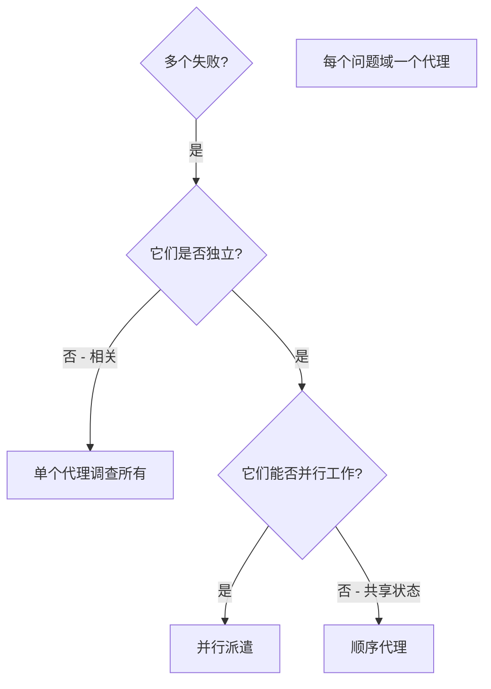

# 派遣并行代理

## 概述

你将任务委派给具有隔离上下文的专业化代理。通过精确构建它们的指令和上下文，确保它们保持专注并成功完成任务。它们绝不应继承你会话的上下文或历史——你精确构建它们所需的内容。这同时也为你自己保留上下文空间以进行协调工作。

当你有多个不相关的失败（不同测试文件、不同子系统、不同 bug），逐一调查是浪费时间。每次调查都是独立的，可以并行进行。

**核心原则：** 每个独立的问题域派遣一个代理。让它们并发工作。

## 何时使用



**适用场景：**
- 3 个以上测试文件因不同根因而失败
- 多个子系统独立出现问题
- 每个问题可以在不依赖其他上下文的情况下理解
- 调查之间没有共享状态

**不适用场景：**
- 失败是相关的（修复一个可能修复其他）
- 需要理解完整系统状态
- 代理之间会相互干扰

## 模式

### 1. 识别独立领域

按出问题的地方对失败进行分组：
- 文件 A 测试：工具审批流程
- 文件 B 测试：批量完成行为
- 文件 C 测试：中止功能

每个领域是独立的——修复工具审批不会影响中止测试。

### 2. 创建聚焦的代理任务

每个代理获得：
- **具体范围：** 一个测试文件或子系统
- **明确目标：** 让这些测试通过
- **约束：** 不要更改其他代码
- **预期输出：** 关于发现和修复内容的摘要

### 3. 并行派遣

在同一条回复中发出所有三个子代理派遣——它们并行运行：

```text
Subagent (general-purpose): "修复 agent-tool-abort.test.ts 的失败"
Subagent (general-purpose): "修复 batch-completion-behavior.test.ts 的失败"
Subagent (general-purpose): "修复 tool-approval-race-conditions.test.ts 的失败"
# 三个全部并发运行。
```

一条回复中的多个派遣调用 = 并行执行。每条回复一个 = 顺序执行。

### 4. 审阅和整合

当代理返回时：
- 阅读每个摘要
- 验证修复之间没有冲突
- 运行完整测试套件
- 整合所有更改

## 代理提示词结构

好的代理提示词是：
1. **聚焦**——一个明确的问题域
2. **自包含**——理解问题所需的所有上下文
3. **输出明确**——代理应返回什么？

```markdown
修复 src/agents/agent-tool-abort.test.ts 中的 3 个失败测试：

1. "should abort tool with partial output capture" - 期望消息中包含 'interrupted at'
2. "should handle mixed completed and aborted tools" - 快速工具被中止而非完成
3. "should properly track pendingToolCount" - 期望 3 个结果但得到 0

这些是时序/竞态条件问题。你的任务：

1. 阅读测试文件并理解每个测试验证什么
2. 识别根因——是时序问题还是实际 bug？
3. 通过以下方式修复：
   - 用基于事件的等待替换任意超时
   - 如果发现中止实现中的 bug，予以修复
   - 如果测试的是已更改的行为，调整测试预期

不要只是增加超时——找到真正的问题。

返回：关于你发现和修复内容的摘要。
```

## 常见错误

**❌ 过于宽泛：** "修复所有测试"——代理会迷失方向
**✅ 具体明确：** "修复 agent-tool-abort.test.ts"——聚焦的范围

**❌ 没有上下文：** "修复竞态条件"——代理不知道在哪里
**✅ 提供上下文：** 粘贴错误消息和测试名称

**❌ 没有约束：** 代理可能会重构所有内容
**✅ 明确约束：** "不要更改生产代码" 或 "只修复测试"

**❌ 输出模糊：** "修复它"——你不知道改了什么
**✅ 具体明确：** "返回根因和更改的摘要"

## 何时不应使用

**相关的失败：** 修复一个可能修复其他——先一起调查
**需要完整上下文：** 理解需要看到整个系统
**探索性调试：** 你还不知道哪里出了问题
**共享状态：** 代理会相互干扰（编辑相同文件、使用相同资源）

## 会话中的真实示例

**场景：** 大规模重构后 3 个文件中有 6 个测试失败

**失败：**
- agent-tool-abort.test.ts：3 个失败（时序问题）
- batch-completion-behavior.test.ts：2 个失败（工具未执行）
- tool-approval-race-conditions.test.ts：1 个失败（执行计数 = 0）

**决策：** 独立领域——中止逻辑与批量完成与竞态条件彼此分离

**派遣：**
```
代理 1 → 修复 agent-tool-abort.test.ts
代理 2 → 修复 batch-completion-behavior.test.ts
代理 3 → 修复 tool-approval-race-conditions.test.ts
```

**结果：**
- 代理 1：用基于事件的等待替换了超时
- 代理 2：修复了事件结构 bug（threadId 放错了位置）
- 代理 3：添加了对异步工具执行完成的等待

**整合：** 所有修复独立，无冲突，完整套件通过

**节省时间：** 3 个问题并行解决而非顺序解决

## 关键优势

1. **并行化**——多个调查同时进行
2. **聚焦**——每个代理有狭窄的范围，需要跟踪的上下文更少
3. **独立性**——代理之间互不干扰
4. **速度**——3 个问题在 1 个问题的时间内解决

## 验证

代理返回后：
1. **审阅每个摘要**——理解更改了什么
2. **检查冲突**——代理是否编辑了相同的代码？
3. **运行完整套件**——验证所有修复共同工作
4. **抽查**——代理可能会犯系统性错误

## 实际影响

来自调试会话（2025-10-03）：
- 3 个文件中有 6 个失败
- 3 个代理并行派遣
- 所有调查并发完成
- 所有修复成功整合
- 代理更改之间零冲突
