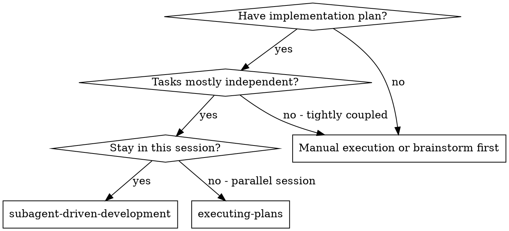
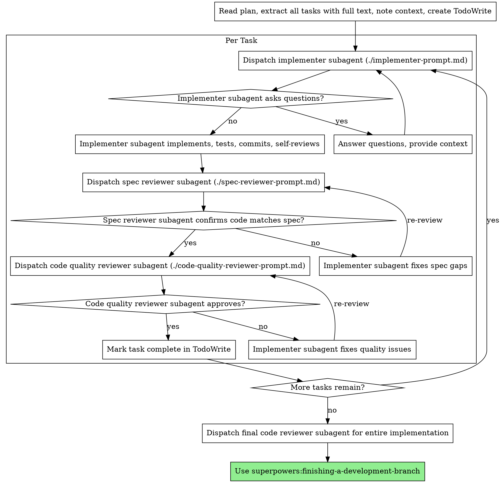

# Subagent-Driven Development（子代理驱动开发）

通过为每个任务分派一个全新的子代理来执行计划，每个任务完成后进行两阶段评审：先进行规格合规评审，再进行代码质量评审。

**核心原则：** 每个任务一个全新子代理 + 两阶段评审（规格合规 + 代码质量）= 高质量、快速迭代

## 何时使用



**与 Executing Plans（并行会话）的区别：**
- 同一会话（无上下文切换）
- 每个任务使用全新子代理（无上下文污染）
- 每个任务完成后进行两阶段评审：先规格合规，再代码质量
- 更快迭代（任务间无需人工介入）

## 流程



## 提示词模板

- `./implementer-prompt.md` - 分派实现者子代理
- `./spec-reviewer-prompt.md` - 分派规格合规评审子代理
- `./code-quality-reviewer-prompt.md` - 分派代码质量评审子代理

## 工作流示例

```
You: I'm using Subagent-Driven Development to execute this plan.

[读取计划文件一次：docs/plans/feature-plan.md]
[提取所有 5 个任务的完整文本和上下文]
[创建包含所有任务的 TodoWrite]

Task 1: Hook installation script

[获取 Task 1 的文本和上下文（已提取）]
[分派实现子代理，包含完整任务文本 + 上下文]

Implementer: "Before I begin - should the hook be installed at user or system level?"

You: "User level (~/.config/superpowers/hooks/)"

Implementer: "Got it. Implementing now..."
[稍后] Implementer:
  - Implemented install-hook command
  - Added tests, 5/5 passing
  - Self-review: Found I missed --force flag, added it
  - Committed

[分派规格合规评审子代理]
Spec reviewer: ✅ Spec compliant - all requirements met, nothing extra

[获取 git SHA，分派代码质量评审子代理]
Code reviewer: Strengths: Good test coverage, clean. Issues: None. Approved.

[标记 Task 1 完成]

Task 2: Recovery modes

[获取 Task 2 的文本和上下文（已提取）]
[分派实现子代理，包含完整任务文本 + 上下文]

Implementer: [No questions, proceeds]
Implementer:
  - Added verify/repair modes
  - 8/8 tests passing
  - Self-review: All good
  - Committed

[分派规格合规评审子代理]
Spec reviewer: ❌ Issues:
  - Missing: Progress reporting (spec says "report every 100 items")
  - Extra: Added --json flag (not requested)

[实现者修复问题]
Implementer: Removed --json flag, added progress reporting

[规格评审子代理再次评审]
Spec reviewer: ✅ Spec compliant now

[分派代码质量评审子代理]
Code reviewer: Strengths: Solid. Issues (Important): Magic number (100)

[实现者修复]
Implementer: Extracted PROGRESS_INTERVAL constant

[代码质量评审子代理再次评审]
Code reviewer: ✅ Approved

[标记 Task 2 完成]

...

[所有任务完成后]
[分派最终代码评审子代理]
Final reviewer: All requirements met, ready to merge

Done!
```

## 优势

**与手动执行相比：**
- 子代理自然地遵循 TDD
- 每个任务使用全新上下文（不会混淆）
- 可并行安全执行（子代理之间互不干扰）
- 子代理可以提问（工作开始前和工作中均可）

**与 Executing Plans 相比：**
- 同一会话（无需交接）
- 持续进展（无需等待）
- 评审检查点自动执行

**效率提升：**
- 无需读取文件的开销（控制器提供完整文本）
- 控制器精确策划所需的上下文
- 子代理一开始就获得完整信息
- 问题在工作开始前就被提出（而非工作完成后）

**质量关卡：**
- 自审在交接前发现问题
- 两阶段评审：规格合规，然后代码质量
- 评审循环确保修复确实有效
- 规格合规防止过度/不足开发
- 代码质量确保实现质量良好

**成本：**
- 更多子代理调用（每个任务需要实现者 + 2 个评审者）
- 控制器需要做更多准备工作（预先提取所有任务）
- 评审循环增加迭代次数
- 但能早期发现问题（比后期调试成本更低）

## 危险信号

**绝对不要：**
- 未经用户明确同意就在 main/master 分支上开始实现
- 跳过评审（规格合规或代码质量）
- 带着未修复的问题继续
- 并行分派多个实现子代理（会产生冲突）
- 让子代理自己读取计划文件（应提供完整文本）
- 跳过场景设定上下文（子代理需要理解任务在整体中的位置）
- 忽略子代理的问题（在让他们继续之前先回答）
- 接受规格合规中的"差不多就行"（规格评审发现问题 = 未完成）
- 跳过评审循环（评审发现问题 = 实现者修复 = 再次评审）
- 让实现者的自审替代正式评审（两者都需要）
- **在规格合规通过 ✅ 之前开始代码质量评审**（顺序错误）
- 在任一评审存在未解决问题时进入下一个任务

**如果子代理提问：**
- 清晰、完整地回答
- 必要时提供额外上下文
- 不要催促他们进入实现阶段

**如果评审者发现问题：**
- 实现者（同一子代理）修复问题
- 评审者再次评审
- 重复直到通过
- 不要跳过重新评审

**如果子代理任务失败：**
- 分派修复子代理，附带具体指令
- 不要手动修复（会污染上下文）

## 集成

**必需的工作流技能：**
- **superpowers:using-git-worktrees** - 必需：在开始前设置隔离工作区
- **superpowers:writing-plans** - 创建本技能所执行的计划
- **superpowers:requesting-code-review** - 评审子代理使用的代码评审模板
- **superpowers:finishing-a-development-branch** - 所有任务完成后收尾开发工作

**子代理应使用：**
- **superpowers:test-driven-development** - 子代理对每个任务遵循 TDD

**替代工作流：**
- **superpowers:executing-plans** - 用于并行会话，而非当前会话执行