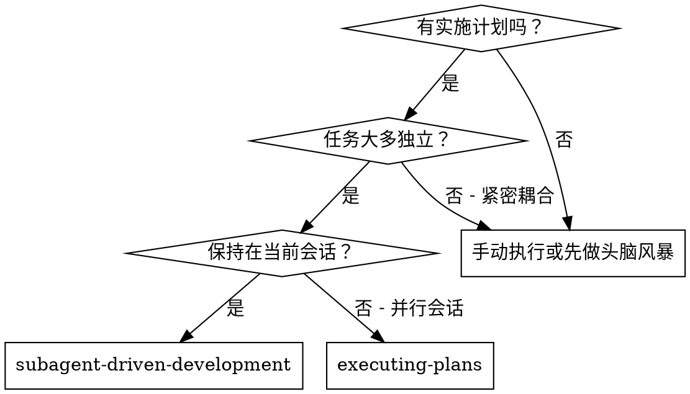
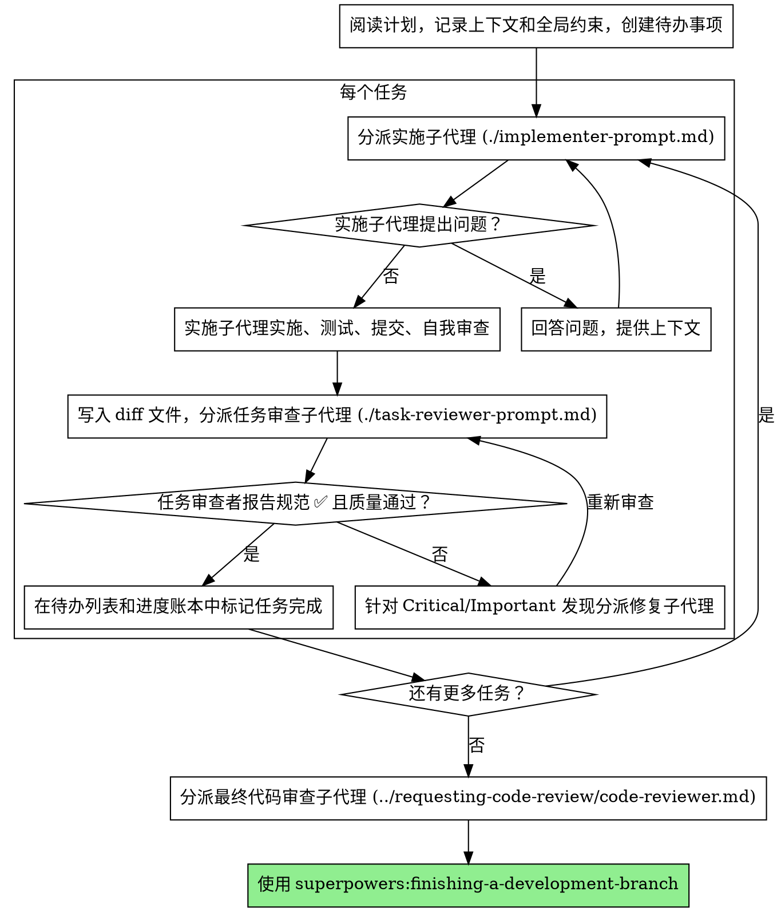

# 子代理驱动开发（Subagent-Driven Development）

通过为每个任务分派一个全新的实施子代理，每个任务后进行任务审查（规范合规性 + 代码质量），最后进行一次全面的全分支审查来执行计划。

**为什么使用子代理：** 你将任务委托给具有隔离上下文的专门代理。通过精确制定它们的指令和上下文，可确保它们专注于各自的任务并取得成功。它们不应继承你会话的上下文或历史记录——你只构建它们所需的内容。这也为你自己的协调工作保留了上下文。

**核心原则：** 每个任务使用全新子代理 + 任务审查（规范 + 质量） + 全面的最终审查 = 高质量、快速迭代

**叙述：** 在工具调用之间，最多叙述一行简短内容——账本和工具结果承载着记录。

**持续执行：** 不要在任务之间停下来与你的合作者核对。不停歇地执行计划中的所有任务。唯一需要停止的情况是：无法解决的 BLOCKED 状态、真正阻碍进展的模糊性，或者所有任务已完成。"我应该继续吗？"之类的提示和进度摘要浪费他们的时间——他们要求你执行计划，那就执行它。

## 何时使用



**对比执行计划（并行会话）：**
- 同一会话（无需切换上下文）
- 每个任务使用全新子代理（无上下文污染）
- 每个任务后进行审查（规范合规性 + 代码质量），最后进行广泛审查
- 更快迭代（任务之间无需人工参与）

## 流程



## 执行前计划审查

在分派任务 1 之前，快速扫描计划以发现冲突：

- 相互矛盾或与计划的全局约束冲突的任务
- 计划明确要求但审查标准视为缺陷的内容（无实际断言的测试、逐字重复的逻辑块）

将发现的所有问题一次性批量呈现给你的合作者——每个发现旁边标明规定它的计划文本，询问哪个为准——在执行开始之前，而不是在计划执行过程中每次发现都打断一次。如果扫描结果干净，则不做评论直接继续。审查循环仍然是为那些只有在实施中才会浮现的冲突准备的兜底机制。

## 模型选择

对每个角色使用能够胜任的最低能力模型，以节约成本并提高速度。

**机械性实施任务**（独立函数、明确规范、1-2 个文件）：使用快速、廉价的模型。当计划明确时，大多数实施任务都是机械性的。

**集成和判断任务**（多文件协调、模式匹配、调试）：使用标准模型。

**架构和设计任务**：使用最强大的可用模型。最终的全分支审查就是其中之一——应在最强大的可用模型上分派，而非会话默认模型。

**审查任务**：选择具有相同判断能力的模型，根据 diff 的大小、复杂度和风险进行扩展。一个小型机械性的 diff 不需要最强大的模型；一个微妙的并发变更则需要。

**分派子代理时始终显式指定模型。** 省略模型会继承你会话的模型——通常是最强大且最昂贵的——这无形中违背了本节的意图。

**轮次数量胜过 token 价格。** 等待时间和上下文成本与子代理所花费的轮次成正比，而最便宜的模型在多步骤工作中通常会花费 2-3 倍的轮次——导致总体成本更高。对于审查者和基于文字描述工作的实施者，至少使用中端模型作为底线。当任务的计划文本包含要编写的完整代码时，实施就是转录加测试：对此类实施者使用最便宜的模型。单文件机械性修复也使用最便宜的模型。

**任务复杂度信号（实施任务）：**
- 涉及 1-2 个文件且有完整规范 → 便宜模型
- 涉及多个文件且有集成考虑 → 标准模型
- 需要设计判断或对代码库有广泛理解 → 最强大的模型

## 处理实施者状态

实施子代理报告四种状态之一。适当地处理每种状态：

**DONE：** 生成审查包（`scripts/review-package BASE HEAD`，从此技能的目录运行——它会打印写入的唯一文件路径；BASE 是你在分派实施者之前记录的提交——绝不要使用 `HEAD~1`，这会悄无声息地丢弃多提交任务中除最后一个提交之外的所有提交），然后使用打印的路径分派任务审查者。

**DONE_WITH_CONCERNS：** 实施者已完成工作但标记了疑虑。在继续之前阅读这些疑虑。如果疑虑涉及正确性或范围，在审查之前解决它们。如果只是观察性意见（例如"这个文件正在变得很大"），记录它们并继续审查。

**NEEDS_CONTEXT：** 实施者需要未提供的信息。提供缺失的上下文并重新分派。

**BLOCKED：** 实施者无法完成任务。评估阻塞因素：
1. 如果是上下文问题，提供更多上下文并用相同模型重新分派
2. 如果任务需要更多推理，用更强大的模型重新分派
3. 如果任务太大，将其拆分为更小的部分
4. 如果计划本身有误，上报给人工合作者

**绝不要**忽略上报或在没有任何改变的情况下强制用相同模型重试。如果实施者说卡住了，就需要做出改变。

## 处理审查者 ⚠️ 项

任务审查者可能会报告"⚠️ 无法从 diff 验证"项——这些是存在于未变更代码中或跨越多个任务的需求。这些不会阻塞审查的其余部分，但你必须在标记任务完成之前自行解决每一个：你拥有审查者所缺乏的计划和跨任务上下文。如果你确认某个项确实是真正的缺失，将其视为失败的规范审查——发回给实施者并重新审查。

## 构建审查者提示

每个任务的审查是任务范围的门禁。广泛审查只进行一次，在最终的全分支审查时。当你填写审查者模板时：

- 不要添加开放式的指令，如"检查所有使用"或"如有用就运行竞态测试"，除非有具体的、针对任务的理由
- 不要要求审查者重新运行实施者已在相同代码上运行过的测试——实施者的报告承载着测试证据
- 不要替审查者预判发现——绝不要指示审查者忽略或不标记特定问题。如果你认为某个发现会是误报，让审查者提出它并在审查循环中裁决。如果你正在编写的提示包含"不要标记"、"不要将 X 视为缺陷"、"最多 Minor"或"计划选择了"——立即停止：你正在预判，通常是为了省去一次审查循环。
- 你交给审查者的全局约束块是它的关注透镜。原样复制计划中全局约束部分或规范中的约束性需求：精确的值、精确的格式，以及组件之间所述的关联关系（"与 X 相同的布局"、"匹配 Y"）。审查者的模板已承载流程规则（YAGNI、测试卫生、审查方法）——约束块是为了规定本项目的规范要求。
- 将 diff 作为文件交给审查者：运行此技能的 `scripts/review-package BASE HEAD`，并将它打印的文件路径传给审查者（或者，不使用 bash：对范围执行 `git log --oneline`、`git diff --stat` 和 `git diff -U10`，重定向到一个具有唯一名称的文件）。输出永远不会进入你自己的上下文，审查者通过一次 Read 调用就能看到提交列表、统计摘要和带上下文的完整 diff。使用你在分派实施者之前记录的 BASE——绝不要使用 `HEAD~1`，这会悄无声息地截断多提交任务。
- 分派提示描述的是一个任务，而不是会话的历史。不要将累积的先前任务摘要（"任务 1-3 后的状态"）粘贴到后续分派中——一个真实会话的分派曾达到 42k 字符，其中 99% 是粘贴的历史记录。一个全新的子代理需要它的任务、它涉及的接口和全局约束，其他什么都不需要。
- 为 Critical 和 Important 发现分派修复子代理。在处理过程中将 Minor 发现记录到进度账本中，并在最终的全分支审查中指向该列表，以便它可以分类哪些必须在合并前修复。没人读的汇总等于无声的丢弃。
- 标记为 plan-mandated（计划强制要求）的发现——或任何与计划文本要求冲突的发现——是人工合作者的决定，如同任何计划矛盾一样：呈现发现和计划文本，询问哪个为准。不要因为计划强制要求就驳回发现，也不要未经询问就分派一个与计划矛盾的修复。
- 最终全分支审查也会收到一个包：运行 `scripts/review-package MERGE_BASE HEAD`（MERGE_BASE = 分支的起始提交，例如 `git merge-base main HEAD`），并在最终审查分派中包含打印的路径，这样最终审查者只需读取一个文件，而不需要用 git 命令重新推导分支 diff。
- 每次修复分派都承载实施者契约：修复子代理重新运行涵盖其变更的测试并报告结果。在分派中指明涵盖的测试文件名——一行修复不需要整个测试套件。在重新分派审查者之前，确认修复报告包含涵盖的测试、运行的命令和输出；三者齐全后再分派重新审查。
- 如果最终全分支审查返回了发现，分派一个包含完整发现列表的修复子代理——而不是每个发现一个修复者。每个发现的修复者都会重建上下文并重新运行套件；一个真实会话的最终审查修复波次的成本超过了其所有任务的总和。

## 文件交接

你粘贴到分派提示中的所有内容——以及子代理打印回来的所有内容——都会在你的上下文中常驻整个会话，并在之后的每个轮次中被重新读取。将产出物以文件形式交接：

- **任务简报：** 在分派实施者之前，运行此技能的 `scripts/task-brief PLAN_FILE N`——它将任务的完整文本提取到一个具有唯一名称的文件中并打印路径。构建分派，使简报保持为需求的唯一来源。你的分派应包含：(1) 一行说明此任务在项目中的位置；(2) 简报路径，以"首先阅读此内容——它是你的需求，包含需要逐字使用的确切值"作为引导；(3) 简报无法知道的来自先前任务的接口和决策；(4) 你对简报中发现的任何模糊之处的解决方案；(5) 报告文件路径和报告契约。确切的值（数字、魔法字符串、签名、测试用例）只出现在简报中。
- **报告文件：** 以简报为名命名实施者的报告文件（简报 `…/task-N-brief.md` → 报告 `…/task-N-report.md`），并将其放入分派提示中。实施者在那里写入完整报告，只返回状态、提交、一行测试摘要和疑虑。
- **审查者输入：** 任务审查者获得三个路径——相同的简报文件、报告文件和审查包——加上约束该任务的全局约束。
- 修复分派将其修复报告（含测试结果）追加到同一报告文件并返回简短摘要；重新审查读取更新后的文件。

## 持久化进度

对话记忆无法在压缩后存活。在实际会话中，失去位置的控制器曾重新分派过整个已完成的任务序列——这是观察到的最昂贵的单一故障。在账本文件中跟踪进度，而不仅仅是待办列表。

- 在技能启动时，检查是否存在账本：
  `cat "$(git rev-parse --show-toplevel)/.superpowers/sdd/progress.md"`。其中列为已完成的任务即为 DONE——不要重新分派它们；从第一个未标记完成的任务处继续。
- 当任务的审查结果通过后，在与你的其他记录操作相同的消息中向账本追加一行：
  `Task N: complete (commits <base7>..<head7>, review clean)`。
- 账本是你的恢复地图：它命名的提交存在于 git 中，即使你的上下文已不再记得创建过它们。压缩后，信任账本和 `git log`，而不是你自己的记忆。
- `git clean -fdx` 会销毁账本（它是被 git 忽略的暂存文件）；如果发生这种情况，从 `git log` 恢复。

## 提示模板

- [implementer-prompt.md](implementer-prompt.md) - 分派实施子代理
- [task-reviewer-prompt.md](task-reviewer-prompt.md) - 分派任务审查子代理（规范合规性 + 代码质量）
- 最终全分支审查：使用 superpowers:requesting-code-review 的 [code-reviewer.md](../requesting-code-review/code-reviewer.md)

## 示例工作流程

```
你：我正在使用子代理驱动开发来执行此计划。

[读取计划文件一次：docs/superpowers/plans/feature-plan.md]
[为所有任务创建待办事项]

任务 1：钩子安装脚本

[为任务 1 运行 task-brief；使用简报 + 报告路径 + 上下文分派实施者]

实施者："开始之前——钩子应该安装在用户级别还是系统级别？"

你："用户级别 (~/.config/superpowers/hooks/)"

实施者："明白了。现在开始实施……"
[稍后] 实施者：
  - 实现了 install-hook 命令
  - 添加了测试，5/5 通过
  - 自我审查：发现遗漏了 --force 标志，已添加
  - 已提交

[运行 review-package，使用打印的路径分派任务审查者]
任务审查者：规范 ✅ - 所有需求已满足，没有多余内容。
  优势：良好的测试覆盖率，干净。问题：无。任务质量：通过。

[标记任务 1 完成]

任务 2：恢复模式

[为任务 2 运行 task-brief；使用简报 + 报告路径 + 上下文分派实施者]

实施者：[没有问题，继续]
实施者：
  - 添加了 verify/repair 模式
  - 8/8 测试通过
  - 自我审查：一切良好
  - 已提交

[运行 review-package，使用打印的路径分派任务审查者]
任务审查者：规范 ❌：
  - 缺失：进度报告（规范说"每 100 个项目报告一次"）
  - 多余：添加了 --json 标志（未请求）
  问题（Important）：魔法数字 (100)

[使用所有发现分派修复子代理]
修复者：移除了 --json 标志，添加了进度报告，提取了 PROGRESS_INTERVAL 常量

[任务审查者再次审查]
任务审查者：规范 ✅。任务质量：通过。

[标记任务 2 完成]

……

[所有任务完成后]
[分派最终代码审查者]
最终审查者：所有需求已满足，可以合并

完成！
```

## 优势

**对比手动执行：**
- 子代理自然遵循 TDD
- 每个任务使用全新上下文（不会混乱）
- 并行安全（子代理不会相互干扰）
- 子代理可以提问（在工作之前和期间）

**对比执行计划：**
- 同一会话（无需交接）
- 持续进度（无需等待）
- 审查检查点自动化

**效率提升：**
- 控制器精确管理所需的上下文；大量产出物以文件而非粘贴文本的方式传递
- 子代理预先获得完整信息
- 问题在工作开始之前就浮出水面（而非之后）

**质量门禁：**
- 自我审查在交接前发现问题
- 任务审查包含两个裁决：规范合规性和代码质量
- 审查循环确保修复确实有效
- 规范合规性防止过度或不足构建
- 代码质量确保实施构建良好

**成本：**
- 更多子代理调用（每个任务一个实施者 + 一个审查者）
- 控制器做更多准备工作（提前提取所有任务）
- 审查循环增加迭代
- 但能及早发现问题（比之后调试更便宜）

## 红线

**绝不要：**
- 在没有明确用户同意的情况下在 main/master 分支上开始实施
- 跳过任务审查，或接受缺少任一裁决的报告（规范合规性和任务质量两者都需要）
- 在问题未修复的情况下继续
- 并行分派多个实施子代理（会导致冲突）
- 让子代理阅读整个计划文件（而是交给它任务简报——`scripts/task-brief`）
- 跳过场景设定上下文（子代理需要理解任务的位置）
- 忽略子代理的问题（在让它们继续之前回答）
- 在规范合规性上接受"差不多"（审查者发现了规范问题 = 未完成）
- 跳过审查循环（审查者发现问题 = 实施者修复 = 再次审查）
- 让实施者的自我审查替代实际审查（两者都需要）
- 告诉审查者不要标记什么，或在分派提示中预先为发现的严重程度评级（"最多视为 Minor"）——计划中的示例代码是起点，而非其弱点是被有意选择的证据
- 在没有 diff 文件的情况下分派任务审查者——先生成它（`scripts/review-package BASE HEAD`）并在提示中指明打印的路径
- 当审查有未解决的 Critical/Important 问题时继续下一个任务
- 重新分派进度账本已标记完成的任务——在任何压缩或恢复后检查账本（和 `git log`）

**如果子代理提问：**
- 清晰完整地回答
- 如需要提供额外上下文
- 不要催促它们进入实施

**如果审查者发现问题：**
- 实施者（同一子代理）修复它们
- 审查者再次审查
- 重复直到通过
- 不要跳过重新审查

**如果子代理任务失败：**
- 使用具体指令分派修复子代理
- 不要尝试手动修复（会污染上下文）

## 集成

**必需的工作流技能：**
- **superpowers:using-git-worktrees** - 确保隔离的工作空间（创建一个或验证现有）
- **superpowers:writing-plans** - 创建此技能执行的计划
- **superpowers:requesting-code-review** - 最终全分支审查的代码审查模板
- **superpowers:finishing-a-development-branch** - 所有任务完成后完成开发

**子代理应使用：**
- **superpowers:test-driven-development** - 子代理为每个任务遵循 TDD

**替代工作流：**
- **superpowers:executing-plans** - 用于并行会话而非同一会话执行
