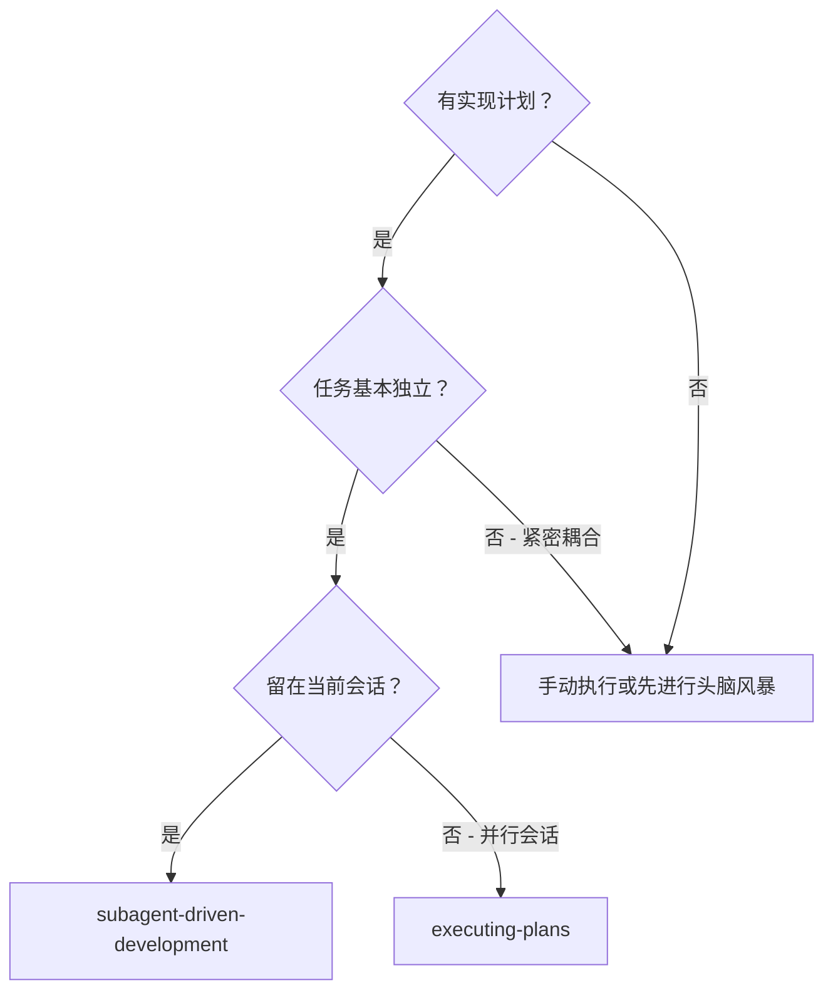
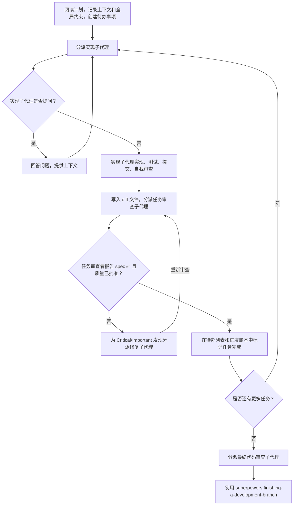

# 子代理驱动开发（Subagent-Driven Development）

为每个任务分派一个全新的实现子代理，每次分派后进行任务审查（spec 合规性 + 代码质量），最后进行一次整体分支审查。

**为何使用子代理：** 你将任务委派给具有隔离上下文的专门子代理。通过精确构建其指令和上下文，确保它们保持专注并成功完成任务。它们不应继承你当前会话的上下文或历史——你只构建它们确实需要的内容。这也为你自己的上下文保留了协调工作的空间。

**核心原则：** 每个任务一个全新子代理 + 任务审查（spec + 质量） + 最终整体审查 = 高质量、快速迭代

**叙述规范：** 在工具调用之间，最多用一行简短陈述——账本和工具结果承载记录。

**持续执行：** 不要在任务之间暂停与人工伙伴确认。连续执行计划中的所有任务。只有以下情况可以停下来：遇到无法解决的 BLOCKED 状态、阻碍进展的真正歧义、或所有任务已完成。"我应该继续吗？"这种提示和进度总结浪费他们的时间——他们要求你执行计划，那就执行它。

## 何时使用



**vs. 执行计划（Executing Plans，并行会话）：**
- 同一个会话（无需切换上下文）
- 每个任务全新子代理（无上下文污染）
- 每个任务后审查（spec 合规性 + 代码质量），结束时进行整体审查
- 更快迭代（任务之间无需人工介入）

## 流程



## 执行前计划审查

在分派任务 1 之前，扫描计划一次以检查冲突：

- 相互矛盾的任务或与计划的"全局约束"矛盾的任务
- 计划明确强制要求但审查标准将其视为缺陷的任何内容（如不进行断言的测试、逐字重复的逻辑块）

将所有发现作为一批问题呈现给人工伙伴——每个发现附有要求它的计划文本，询问以何为准——在开始执行之前，而非每发现一个就中途打断一次。如果扫描无问题，则直接继续。审查循环是那些只有在实现过程中才会暴露的冲突的兜底机制。

## 模型选择

使用每个角色所需能力的最低档次模型以节省成本并提高速度。

**机械性实现任务**（独立函数、清晰的 spec、1-2 个文件）：使用快速、廉价的模型。当计划详细指定时，大多数实现任务都是机械性的。

**集成和判断任务**（多文件协调、模式匹配、调试）：使用标准模型。

**架构和设计任务**：使用可用的最强模型。最终的整体分支审查就是其中之一——使用可用的最强模型分派，而非会话默认模型。

**审查任务**：选择具有相同判断能力的模型，根据 diff 的大小、复杂度和风险进行匹配。小型机械性 diff 不需要最强模型；微妙的并发变更则需要。

**分派子代理时始终显式指定模型。** 未指定模型会继承当前会话的模型——通常是最强大也最昂贵的模型——这就默默地违反了本节的规定。

**轮次数量胜于 token 价格。** 实时耗时和上下文成本与子代理所需的轮次数量相关，而最便宜的模型在多步骤工作上通常需要 2-3 倍的轮次——导致总体成本更高。使用中档模型作为审查者和基于文字描述工作的实现者的最低标准。当任务的计划文本包含要编写的完整代码时，实现就是转录加测试：对该实现者使用最便宜档次的模型。单文件机械性修复也同样使用最便宜档次。

**任务复杂度信号（实现任务）：**
- 涉及 1-2 个文件且有完整 spec → 便宜模型
- 涉及多个文件且有集成问题 → 标准模型
- 需要设计判断或广泛的代码库理解 → 最强模型

## 处理实现子代理的状态

实现子代理报告四种状态之一。分别妥善处理：

**DONE：** 生成审查包（`scripts/review-package BASE HEAD`，从本 skill 目录运行——它会打印其写入的唯一文件路径；BASE 是在分派实现子代理之前记录的提交——绝不使用 `HEAD~1`，那会静默丢弃多提交任务中除最后一个之外的所有提交），然后使用打印的路径分派任务审查者。

**DONE_WITH_CONCERNS：** 实现子代理已完成工作但标记了疑虑。在继续之前阅读这些疑虑。如果疑虑涉及正确性或范围，在审查之前先解决它们。如果只是观察性意见（例如"这个文件变得很大"），记录下来然后继续审查。

**NEEDS_CONTEXT：** 实现子代理需要未提供的信息。提供缺失的上下文并重新分派。

**BLOCKED：** 实现子代理无法完成任务。评估阻塞原因：
1. 如果是上下文问题，提供更多上下文并重新分派，使用同一模型
2. 如果任务需要更多推理，使用更强的模型重新分派
3. 如果任务太大，将其拆分为更小的部分
4. 如果计划本身有问题，升级给人工伙伴

**绝不**忽略升级请求或强制同一模型不做任何更改就重试。如果实现子代理说卡住了，就必须有所改变。

## 处理审查者的 ⚠️ 事项

任务审查者可能报告"⚠️ Cannot verify from diff"的事项——这些是位于未变更代码或跨任务的需求。这些不会阻碍审查的其余部分，但你必须自行解决每一个才能将任务标记为完成：你掌握着审查者所缺乏的计划和跨任务上下文。如果你确认某事项确实是真正的缺口，将其视为 spec 审查未通过——返回给实现子代理并重新审查。

## 构建审查者 Prompt

每个任务审查是一个任务范围的关卡。整体审查在最终分支审查时一次性进行。当你填写审查者模板时：

- 除非有具体的、与任务相关的原因，否则不要添加开放式指导，如"检查所有用途"或"如有用则运行竞态测试"
- 不要要求审查者重新运行实现子代理已经在相同代码上运行过的测试——实现者的报告已经承载了测试证据
- 不要为审查者预判发现——绝不指示审查者忽略或不标记某个特定问题。如果你认为某个发现会是误报，让审查者提出并在审查循环中裁决。如果你正在编写的 prompt 中包含"do not flag""don't treat X as a defect""at most Minor"或"the plan chose"——停下：你正在预判，通常是想为自己省去一轮审查循环。
- 你交给审查者的 global-constraints 块是其关注焦点。将具有约束力的要求逐字从计划的 Global Constraints 部分或 spec 中复制过来：确切的值、确切的格式，以及组件之间声明的关联关系（"与 X 相同的布局""匹配 Y"）。审查者的模板已经包含了流程规则（YAGNI、测试规范、审查方法）——constraints 块仅用于该项目 spec 的要求。
- 将 diff 作为文件交给审查者：运行本 skill 的 `scripts/review-package BASE HEAD` 并将它打印的文件路径传给审查者（或者不用 bash：为相应范围运行 `git log --oneline`、`git diff --stat` 和 `git diff -U10`，重定向到一个唯一命名的文件）。输出绝不进入你自己的上下文，审查者通过一次 Read 调用就能看到提交列表、统计摘要和带上下文的完整 diff。使用你在分派实现子代理之前记录的 BASE——绝不使用 `HEAD~1`，那会静默截断多提交任务。
- 分派 prompt 描述的是一个任务，而非会话历史。不要将累积的前任务摘要（"Tasks 1-3 之后的状态"）粘贴到后续分派中——一次真实会话的分派达到了 42k 字符，其中 99% 是粘贴的历史。一个全新的子代理需要它的任务、它涉及的接口以及全局约束。其他一概不要。
- 为 Critical 和 Important 发现分派修复子代理。将 Minor 发现记录在进度账本中，并在最终整体分支审查时指向该列表，以便其判定哪些必须在合并前修复。没人会读的汇总等于静默丢弃。
- 标记为 plan-mandated 的发现——或任何与计划文本要求相冲突的发现——是人工伙伴的决定，如同任何计划矛盾一样：呈现该发现和计划文本，询问以何为准。不要因为计划要求就驳回该发现，也不要在不询问的情况下分派一个与计划相矛盾的修复。
- 最终整体分支审查也需要一个包：运行 `scripts/review-package MERGE_BASE HEAD`（MERGE_BASE = 分支起始的提交，例如 `git merge-base main HEAD`），并将打印的文件路径包含在最终审查分派中，这样最终审查者只需读取一个文件，而不用通过 git 命令重新推导分支 diff。
- 每次修复分派都携带实现者契约：修复子代理重新运行覆盖其变更的测试并报告结果。在分派中指明覆盖测试的文件名——单行修复不需要运行整个套件。在重新分派审查者之前，确认修复报告中包含覆盖的测试、运行的命令和输出；三者齐备后再进行重新审查。
- 如果最终整体分支审查返回发现，分派一个包含完整发现列表的修复子代理——而非每个发现一个修复者。每个发现单独修复会各自重建上下文并重新运行套件；一次真实会话的最终审查修复波的成本超过了所有任务成本之和。

## 文件交接

粘贴到分派 prompt 中的一切内容——以及子代理打印返回的一切——都会驻留在你的上下文中，在会话的后续回合中每次都会被重新读取。通过文件传递工件：

- **任务简报（Task brief）：** 在分派实现子代理之前，运行本 skill 的 `scripts/task-brief PLAN_FILE N`——它将任务的完整文本提取到一个唯一命名的文件中并打印路径。构建分派使得简报成为需求的唯一来源。你的分派应包含：(1) 一行关于此任务在项目中位置的说明；(2) 简报路径，以"首先阅读此项——它是你的需求，包含需逐字使用的确切值"引出；(3) 简报无法知晓的来自之前任务的接口和决策；(4) 你发现简报中任何歧义的解决方案；(5) 报告文件路径和报告契约。确切值（数字、魔术字符串、签名、测试用例）仅出现在简报中。
- **报告文件：** 将实现者的报告文件按简报命名（简报 `…/task-N-brief.md` → 报告 `…/task-N-report.md`）并放入分派 prompt。实现者将完整报告写入该文件，只返回状态、提交、单行测试摘要和疑虑。
- **审查者输入：** 任务审查者获得三个路径——相同的简报文件、报告文件和审查包——再加上约束该任务的全局约束。
- 修复分派将其修复报告（含测试结果）追加到相同的报告文件中，并返回简短摘要；重新审查时读取更新后的文件。

## 持久化进度

对话记忆无法在压缩后存活。在真实会话中，丢失位置的控制器曾重新分派整个已完成的任务序列——这是观察到的代价最高的故障。在账本文件中跟踪进度，而不仅仅依赖待办列表。

- skill 启动时检查是否有账本：`cat "$(git rev-parse --show-toplevel)/.superpowers/sdd/progress.md"`。其中标记为完成的任务是 DONE——不要重新分派它们；从第一个未标记完成的任务恢复继续。
- 当任务审查返回通过时，在与其他登记操作相同的消息中向账本追加一行：`Task N: complete (commits <base7>..<head7>, review clean)`。
- 账本是你的恢复地图：它命名的提交存在于 git 中，即使你的上下文不再记得是如何创建它们的。压缩后，信任账本和 `git log` 胜过你自己的记忆。
- `git clean -fdx` 会销毁账本（它是 git 忽略的临时文件）；如果发生这种情况，从 `git log` 恢复。

## Prompt 模板

- [implementer-prompt.md](implementer-prompt.md) - 分派实现子代理
- [task-reviewer-prompt.md](task-reviewer-prompt.md) - 分派任务审查子代理（spec 合规性 + 代码质量）
- 最终整体分支审查：使用 superpowers:requesting-code-review 的 [code-reviewer.md](../requesting-code-review/code-reviewer.md)

## 示例工作流

```
You: 我正在使用子代理驱动开发来执行此计划。

[读取计划文件一次：docs/superpowers/plans/feature-plan.md]
[为所有任务创建待办事项]

Task 1: Hook 安装脚本

[为任务 1 运行 task-brief；使用简报 + 报告路径 + 上下文分派实现子代理]

Implementer: "开始之前——hook 应该安装在用户级别还是系统级别？"

You: "用户级别 (~/.config/superpowers/hooks/)"

Implementer: "明白了。现在开始实现……"
[稍后] Implementer:
  - 已实现 install-hook 命令
  - 已添加测试，5/5 通过
  - 自我审查：发现遗漏了 --force 标志，已添加
  - 已提交

[运行 review-package，使用打印的路径分派任务审查者]
Task reviewer: Spec ✅ - 满足所有需求，无多余内容。
  优点：良好的测试覆盖率，代码整洁。问题：无。任务质量：已批准。

[将任务 1 标记为完成]

Task 2: 恢复模式

[为任务 2 运行 task-brief；使用简报 + 报告路径 + 上下文分派实现子代理]

Implementer: [无问题，继续进行]
Implementer:
  - 已添加 verify/repair 模式
  - 8/8 测试通过
  - 自我审查：一切正常
  - 已提交

[运行 review-package，使用打印的路径分派任务审查者]
Task reviewer: Spec ❌:
  - 缺少：进度报告（spec 要求"report every 100 items"）
  - 多余：添加了 --json 标志（未被要求）
  问题 (Important)：魔法数字 (100)

[使用全部发现分派修复子代理]
Fixer: 已移除 --json 标志，已添加进度报告，已提取 PROGRESS_INTERVAL 常量

[任务审查者再次审查]
Task reviewer: Spec ✅。任务质量：已批准。

[将任务 2 标记为完成]

...

[所有任务完成后]
[分派最终代码审查者]
Final reviewer: 满足所有需求，已准备好合并

Done!
```

## 优势

**vs. 手动执行：**
- 子代理自然地遵循 TDD
- 每个任务全新上下文（无混淆）
- 并行安全（子代理之间互不干扰）
- 子代理可以提问（工作前和工作期间）

**vs. 执行计划（Executing Plans）：**
- 同一会话（无需交接）
- 持续进展（无需等待）
- 自动审查检查点

**效率收益：**
- 控制器精确筛选所需上下文；大量工件作为文件传递，而非粘贴文本
- 子代理获得完整信息，一次到位
- 问题在工作开始前就被提出（而非事后）

**质量门槛：**
- 自我审查在交接前发现问题
- 任务审查提供两个判断：spec 合规性和代码质量
- 审查循环确保修复确实有效
- spec 合规性防止过度构建或构建不足
- 代码质量确保实现构建良好

**成本：**
- 更多子代理调用（每个任务一个实现者 + 审查者）
- 控制器做更多准备工作（预先提取所有任务）
- 审查循环增加迭代次数
- 但能早期发现问题（比后期调试成本更低）

## 红线

**绝不：**
- 未经用户明确同意就在 main/master 分支上开始实现
- 跳过任务审查，或接受缺少任一判断的报告（spec 合规性和任务质量都必须提供）
- 在未修复问题的情况下继续
- 并行分派多个实现子代理（会冲突）
- 让子代理读取整个计划文件（改为交给它任务简报——`scripts/task-brief`）
- 跳过场景设置上下文（子代理需要了解任务在整体中的位置）
- 忽略子代理的问题（在让它们继续之前先回答）
- 在 spec 合规性上接受"差不多就行"（审查者发现 spec 问题 = 未完成）
- 跳过审查循环（审查者发现问题 = 实现者修复 = 重新审查）
- 让实现者自我审查取代实际审查（两者都需要）
- 告诉审查者不要标记什么，或在分派 prompt 中预判发现的严重等级（"at most Minor"）——计划中的示例代码是起点，而非证明其弱点是被选中的
- 在没有 diff 文件的情况下分派任务审查者——先生成（`scripts/review-package BASE HEAD`），并在 prompt 中指明打印的路径
- 当审查仍有未解决的 Critical/Important 问题时进入下一个任务
- 重新分派进度账本已经标记为完成的任务——在任何压缩或恢复后检查账本（和 `git log`）

**如果子代理提问：**
- 清晰完整地回答
- 如有需要提供额外上下文
- 不要催促它们进入实现阶段

**如果审查者发现问题：**
- 实现者（同一子代理）修复它们
- 审查者再次审查
- 重复直到批准
- 不要跳过重新审查

**如果子代理任务失败：**
- 使用具体指令分派修复子代理
- 不要尝试手动修复（上下文污染）

## 集成

**必需的工作流 skill：**
- **superpowers:using-git-worktrees** - 确保隔离的工作空间（创建一个或验证已存在的）
- **superpowers:writing-plans** - 创建此 skill 执行的计划
- **superpowers:requesting-code-review** - 最终整体分支审查的代码审查模板
- **superpowers:finishing-a-development-branch** - 所有任务完成后完成开发

**子代理应使用：**
- **superpowers:test-driven-development** - 子代理为每个任务遵循 TDD

**替代工作流：**
- **superpowers:executing-plans** - 用于并行会话而非同一会话执行
