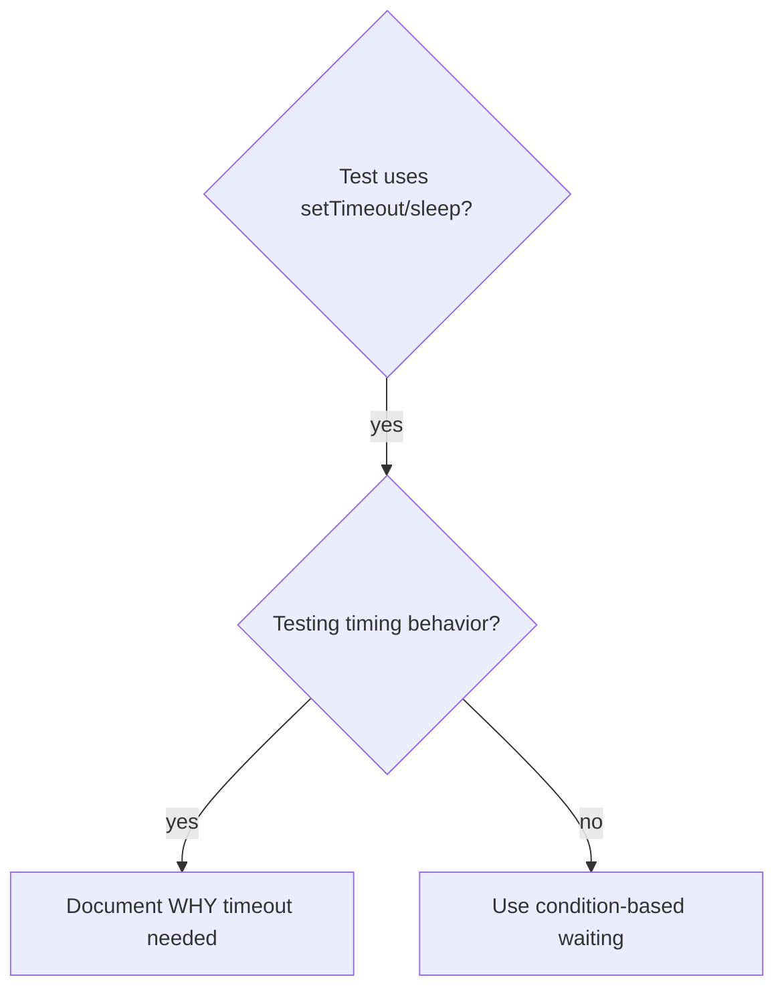

# 基于条件的等待（Condition-Based Waiting）

## 概述

不稳定的测试往往用任意延迟来猜测时机。这会创建竞态条件，导致测试在快速机器上通过但在高负载或 CI 中失败。

**核心原则：** 等待你真正关心的条件，而不是猜测它需要多长时间。

## 适用场景



**适用于：**
- 测试中有任意延迟（`setTimeout`、`sleep`、`time.sleep()`）
- 测试不稳定（有时通过，高负载时失败）
- 并行运行时测试超时
- 等待异步操作完成

**不适用于：**
- 测试实际的时序行为（debounce、throttle 间隔）
- 如果使用任意超时，务必记录原因

## 核心模式

```typescript
// ❌ 之前：猜测时机
await new Promise(r => setTimeout(r, 50));
const result = getResult();
expect(result).toBeDefined();

// ✅ 之后：等待条件
await waitFor(() => getResult() !== undefined);
const result = getResult();
expect(result).toBeDefined();
```

## 快速参考模式

| 场景 | 模式 |
|----------|---------|
| 等待事件 | `waitFor(() => events.find(e => e.type === 'DONE'))` |
| 等待状态 | `waitFor(() => machine.state === 'ready')` |
| 等待数量 | `waitFor(() => items.length >= 5)` |
| 等待文件 | `waitFor(() => fs.existsSync(path))` |
| 复杂条件 | `waitFor(() => obj.ready && obj.value > 10)` |

## 实现

通用轮询函数：

```typescript
async function waitFor<T>(
  condition: () => T | undefined | null | false,
  description: string,
  timeoutMs = 5000
): Promise<T> {
  const startTime = Date.now();

  while (true) {
    const result = condition();
    if (result) return result;

    if (Date.now() - startTime > timeoutMs) {
      throw new Error(`Timeout waiting for ${description} after ${timeoutMs}ms`);
    }

    await new Promise(r => setTimeout(r, 10)); // 每 10ms 轮询一次
  }
}
```

参见本目录中的 `condition-based-waiting-example.ts` 获取完整实现，包含来自实际调试过程、针对特定领域的辅助函数（`waitForEvent`、`waitForEventCount`、`waitForEventMatch`）。

## 常见错误

**❌ 轮询太快：** `setTimeout(check, 1)`——浪费 CPU
**✅ 修复：** 每 10ms 轮询一次

**❌ 没有超时：** 条件永远不满足时无限循环
**✅ 修复：** 始终包含带清晰错误信息的超时

**❌ 数据过期：** 在循环之前缓存状态
**✅ 修复：** 在循环内部调用 getter 获取最新数据

## 任意超时是有道理的情况

```typescript
// 工具每 100ms tick 一次——需要 2 个 tick 来验证部分输出
await waitForEvent(manager, 'TOOL_STARTED'); // 首先：等待条件
await new Promise(r => setTimeout(r, 200));   // 然后：等待时序行为
// 200ms = 每 100ms 间隔的 2 个 tick——已记录并说明理由
```

**要求：**
1. 先等待触发条件
2. 基于已知的时序（非猜测）
3. 用注释解释原因

## 实际效果

来自调试实践（2025-10-03）：
- 修复了 3 个文件中的 15 个不稳定测试
- 通过率：60% → 100%
- 执行时间：快了 40%
- 不再有竞态条件
