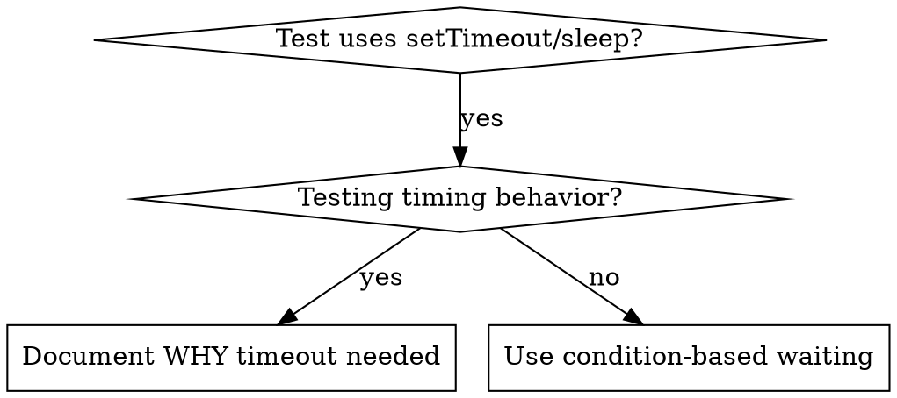

# Condition-Based Waiting（基于条件的等待）

## Overview（概述）

不稳定的测试经常用任意延迟猜测时间。这创建了竞态条件，测试在快速机器上通过但在负载下或 CI 中失败。

**核心原则：** 等待你真正关心的条件，而不是猜测它需要多长时间。

## When to Use（使用时机）



**使用时机：**
- 测试有任意延迟（`setTimeout`、`sleep`、`time.sleep()`）
- 测试不稳定（有时通过，负载下失败）
- 测试在并行运行时超时
- 等待异步操作完成

**不使用时机：**
- 测试实际的时间行为（防抖、节流间隔）
- 如果使用任意超时，总是记录原因

## Core Pattern（核心模式）

```typescript
// ❌ 之前：猜测时间
await new Promise(r => setTimeout(r, 50));
const result = getResult();
expect(result).toBeDefined();

// ✅ 之后：等待条件
await waitFor(() => getResult() !== undefined);
const result = getResult();
expect(result).toBeDefined();
```

## Quick Patterns（快速模式）

| 场景 | 模式 |
|----------|---------|
| 等待事件 | `waitFor(() => events.find(e => e.type === 'DONE'))` |
| 等待状态 | `waitFor(() => machine.state === 'ready')` |
| 等待计数 | `waitFor(() => items.length >= 5)` |
| 等待文件 | `waitFor(() => fs.existsSync(path))` |
| 复杂条件 | `waitFor(() => obj.ready && obj.value > 10)` |

## Implementation（实现）

通用轮询函数：
```typescript
async function waitFor<T>(
  condition: () => T | undefined | null | false,
  description: string,
  timeoutMs = 5000
): Promise<T> {
  const startTime = Date.now();

  while (true) {
    const result = condition();
    if (result) return result;

    if (Date.now() - startTime > timeoutMs) {
      throw new Error(`Timeout waiting for ${description} after ${timeoutMs}ms`);
    }

    await new Promise(r => setTimeout(r, 10)); // 每 10ms 轮询
  }
}
```

参见此目录中的 `condition-based-waiting-example.ts`，了解带有领域特定帮助器（`waitForEvent`、`waitForEventCount`、`waitForEventMatch`）的完整实现，来自实际调试会话。

## Common Mistakes（常见错误）

**❌ 轮询太快：** `setTimeout(check, 1)` - 浪费 CPU
**✅ 修复：** 每 10ms 轮询

**❌ 没有超时：** 如果条件永远不满足则无限循环
**✅ 修复：** 总是包含带清晰错误的超时

**❌ 过期数据：** 在循环之前缓存状态
**✅ 修复：** 在循环内调用 getter 以获取新鲜数据

## When Arbitrary Timeout IS Correct（何时任意超时是正确的）

```typescript
// 工具每 100ms 打一次 - 需要 2 次打以验证部分输出
await waitForEvent(manager, 'TOOL_STARTED'); // 首先：等待条件
await new Promise(r => setTimeout(r, 200));   // 然后：等待定时行为
// 200ms = 2 次打，间隔 100ms - 已记录并证明合理
```

**要求：**
1. 首先等待触发条件
2. 基于已知时间（不是猜测）
3. 注释说明原因

## Real-World Impact（实际影响）

来自调试会话（2025-10-03）：
- 修复了 3 个文件中的 15 个不稳定测试
- 通过率：60% → 100%
- 执行时间：快 40%
- 不再有竞态条件
