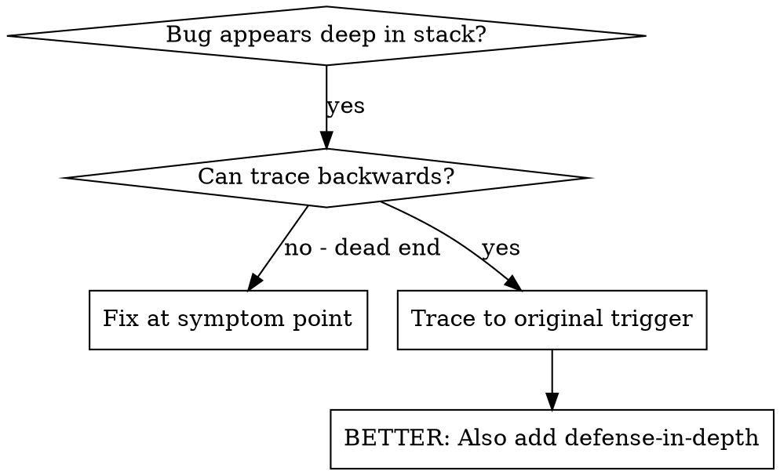
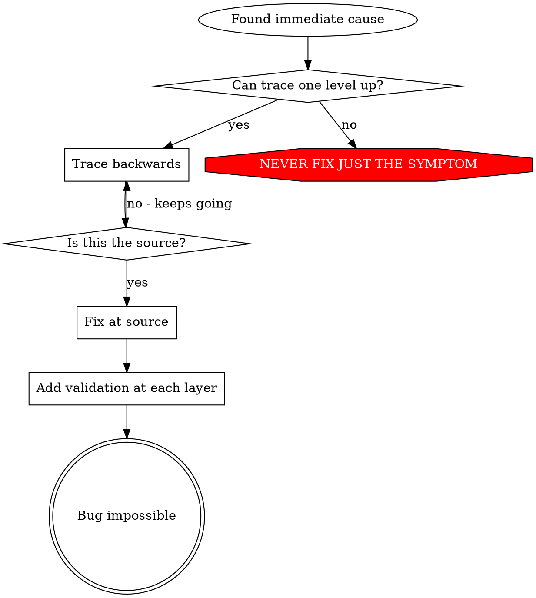

# Root Cause Tracing（根因追踪）

## Overview（概述）

错误经常在调用栈深处表现（git init 在错误目录、文件创建在错误位置、数据库以错误路径打开）。你的直觉是在错误出现的地方修复，但那只是在治疗症状。

**核心原则：** 向后追踪调用链，直到找到原始触发器，然后在源头修复。

## When to Use（使用时机）



**使用时机：**
- 错误发生在执行深处（不在入口点）
- 栈跟踪显示长调用链
- 不清楚无效数据源自哪里
- 需要找到哪个测试/代码触发问题

## The Tracing Process（追踪过程）

### 1. Observe the Symptom（观察症状）
```
Error: git init failed in /Users/jesse/project/packages/core
```

### 2. Find Immediate Cause（找到直接原因）
**什么代码直接导致这个？**
```typescript
await execFileAsync('git', ['init'], { cwd: projectDir });
```

### 3. Ask: What Called This?（问：谁调用了这个？）
```typescript
WorktreeManager.createSessionWorktree(projectDir, sessionId)
  → called by Session.initializeWorkspace()
  → called by Session.create()
  → called by test at Project.create()
```

### 4. Keep Tracing Up（继续向上追踪）
**传递了什么值？**
- `projectDir = ''`（空字符串！）
- 空字符串作为 `cwd` 解析为 `process.cwd()`
- 那就是源代码目录！

### 5. Find Original Trigger（找到原始触发器）
**空字符串来自哪里？**
```typescript
const context = setupCoreTest(); // Returns { tempDir: '' }
Project.create('name', context.tempDir); // Accessed before beforeEach!
```

## Adding Stack Traces（添加栈跟踪）

当你无法手动追踪时，添加工具：

```typescript
// 在问题操作之前
async function gitInit(directory: string) {
  const stack = new Error().stack;
  console.error('DEBUG git init:', {
    directory,
    cwd: process.cwd(),
    nodeEnv: process.env.NODE_ENV,
    stack,
  });

  await execFileAsync('git', ['init'], { cwd: directory });
}
```

**关键：** 在测试中使用 `console.error()`（不是 logger - 可能不显示）

**运行并捕获：**
```bash
npm test 2>&1 | grep 'DEBUG git init'
```

**分析栈跟踪：**
- 查找测试文件名
- 找到触发调用的行号
- 识别模式（相同测试？相同参数？）

## Finding Which Test Causes Pollution（找到哪个测试导致污染）

如果某些东西在测试期间出现但不知道哪个测试：

使用此目录中的二分脚本 `find-polluter.sh`：

```bash
./find-polluter.sh '.git' 'src/**/*.test.ts'
```

逐个运行测试，在第一个污染者处停止。参见脚本了解用法。

## Real Example: Empty projectDir（真实示例：空 projectDir）

**症状：** `.git` 创建在 `packages/core/`（源代码）

**追踪链：**
1. `git init` 在 `process.cwd()` 中运行 ← 空 cwd 参数
2. WorktreeManager 被调用时传入空 projectDir
3. Session.create() 传递空字符串
4. 测试在 beforeEach 之前访问 `context.tempDir`
5. setupCoreTest() 初始时返回 `{ tempDir: '' }`

**根因：** 顶层变量初始化访问空值

**修复：** 使 tempDir 成为在 beforeEach 之前访问时抛出的 getter

**还添加了纵深防御：**
- 层 1：Project.create() 验证目录
- 层 2：WorkspaceManager 验证非空
- 层 3：NODE_ENV 防护拒绝在 tmpdir 之外 git init
- 层 4：git init 之前的栈跟踪日志

## Key Principle（关键原则）



**永远不要只修复错误出现的地方。** 向后追踪找到原始触发器。

## Stack Trace Tips（栈跟踪提示）

**在测试中：** 使用 `console.error()` 而不是 logger - logger 可能被抑制
**在操作之前：** 在危险操作之前记录日志，而不是在失败之后
**包含上下文：** 目录、cwd、环境变量、时间戳
**捕获栈：** `new Error().stack` 显示完整的调用链

## Real-World Impact（实际影响）

来自调试会话（2025-10-03）：
- 通过 5 层追踪找到根因
- 在源头修复（getter 验证）
- 添加了 4 层防御
- 1847 个测试通过，零污染
