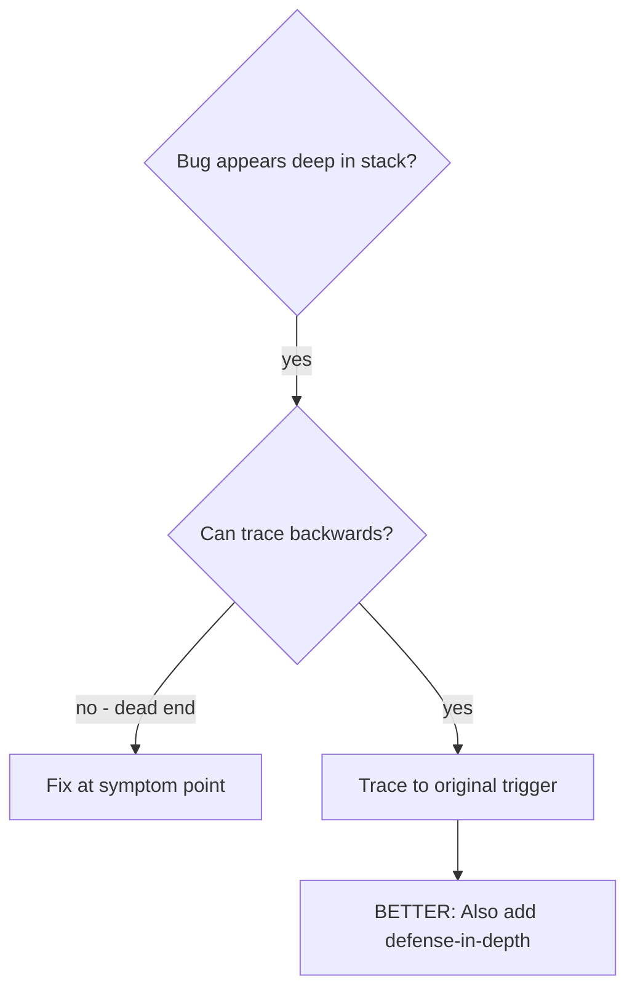
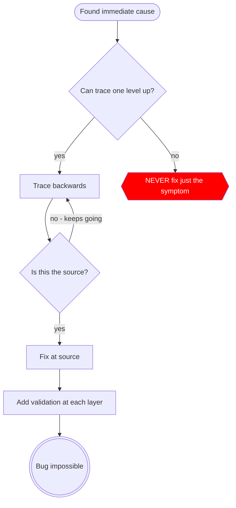

# 根本原因追溯（Root Cause Tracing）

## 概述

Bug 往往表现在调用栈深处（在错误目录中执行 git init、在错误位置创建文件、使用错误路径打开数据库）。你的直觉是在出错的位置进行修复，但这只是在处理表象。

**核心原则：** 通过调用链向后追溯，直到找到原始触发点，然后在源头修复。

## 适用场景



**适用于：**
- 错误发生在执行深处（非入口点）
- Stack trace 显示很长的调用链
- 不清楚无效数据的来源
- 需要找到哪个测试/代码触发了问题

## 追溯流程

### 1. 观察到表象
```
Error: git init failed in ~/project/packages/core
```

### 2. 找到直接原因
**什么代码直接导致了这个问题？**
```typescript
await execFileAsync('git', ['init'], { cwd: projectDir });
```

### 3. 追问：什么调用了这段代码？
```typescript
WorktreeManager.createSessionWorktree(projectDir, sessionId)
  → called by Session.initializeWorkspace()
  → called by Session.create()
  → called by test at Project.create()
```

### 4. 继续向上追溯
**传递了什么值？**
- `projectDir = ''`（空字符串！）
- 空字符串作为 `cwd` 被解析为 `process.cwd()`
- 那是源代码目录！

### 5. 找到原始触发点
**空字符串从哪里来的？**
```typescript
const context = setupCoreTest(); // Returns { tempDir: '' }
Project.create('name', context.tempDir); // Accessed before beforeEach!
```

## 添加 Stack Trace

当无法手动追溯时，添加 instrumentation：

```typescript
// 在出问题的操作之前
async function gitInit(directory: string) {
  const stack = new Error().stack;
  console.error('DEBUG git init:', {
    directory,
    cwd: process.cwd(),
    nodeEnv: process.env.NODE_ENV,
    stack,
  });

  await execFileAsync('git', ['init'], { cwd: directory });
}
```

**关键：** 在测试中使用 `console.error()`（不要用 logger——可能不会显示）

**运行并捕获：**
```bash
npm test 2>&1 | grep 'DEBUG git init'
```

**分析 stack traces：**
- 查找测试文件名
- 找到触发调用的行号
- 识别模式（同一个测试？同一个参数？）

## 找到哪个测试造成了污染

如果在测试过程中出现了某问题，但不知道是哪个测试引起的：

使用本目录中的二分查找脚本 `find-polluter.sh`：

```bash
./find-polluter.sh '.git' 'src/**/*.test.ts'
```

逐个运行测试，在第一个造成污染的测试处停止。详见脚本的使用说明。

## 真实案例：空 projectDir

**表象：** `.git` 在 `packages/core/`（源代码）中被创建

**追溯链：**
1. `git init` 在 `process.cwd()` 中执行 ← 空的 cwd 参数
2. WorktreeManager 被以空的 projectDir 调用
3. Session.create() 传递了空字符串
4. 测试在 beforeEach 之前访问了 `context.tempDir`
5. setupCoreTest() 初始返回 `{ tempDir: '' }`

**根本原因：** 顶层变量初始化访问了空值

**修复：** 将 tempDir 改为 getter，在 beforeEach 之前被访问时抛出错误

**同时添加了 defense-in-depth：**
- Layer 1: Project.create() 验证目录
- Layer 2: WorkspaceManager 验证不为空
- Layer 3: NODE_ENV 守卫拒绝在 tmpdir 之外执行 git init
- Layer 4: git init 前的 stack trace 日志

## 核心原则



**绝对不要在错误出现的位置进行修复。** 回溯找到原始触发点。

## Stack Trace 技巧

**在测试中：** 使用 `console.error()` 而非 logger——logger 可能被抑制
**在操作之前：** 在危险操作之前记录日志，而非失败之后
**包含上下文：** 目录、cwd、环境变量、时间戳
**捕获 stack：** `new Error().stack` 显示完整的调用链

## 实际效果

来自调试实践（2025-10-03）：
- 通过 5 层追溯找到根本原因
- 在源头修复（getter 验证）
- 添加了 4 层防御
- 1847 个测试通过，零污染
