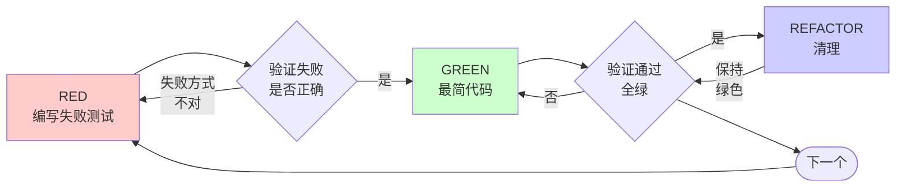

# 测试驱动开发（Test-Driven Development, TDD）

## 概述

先写测试。看到它失败。写最少的代码让它通过。

**核心原则：** 如果你没有看到测试失败，你就不知道它是否测试了正确的东西。

**违反规则的文字即违反规则的精神。**

## 何时使用

**始终使用：**
- 新功能
- Bug 修复
- 重构
- 行为变更

**例外（询问你的伙伴）：**
- 一次性原型
- 生成的代码
- 配置文件

想着"就跳过这一次 TDD"？停下来。那是合理化借口。

## 铁律

```
没有先写失败的测试，不得编写生产代码
```

在测试之前写了代码？删除它。从头开始。

**没有例外：**
- 不要作为"参考"保留
- 不要在写测试时"调整"它
- 不要看它
- 删除意味着删除

从测试重新实现。就这样。

## 红-绿-重构（Red-Green-Refactor）



### RED — 编写失败测试

编写一个展示应该发生什么的最小测试。

<Good>
```typescript
test('操作失败时重试 3 次', async () => {
  let attempts = 0;
  const operation = () => {
    attempts++;
    if (attempts < 3) throw new Error('fail');
    return 'success';
  };

  const result = await retryOperation(operation);

  expect(result).toBe('success');
  expect(attempts).toBe(3);
});
```
清晰的名称，测试真实行为，一件事
</Good>

<Bad>
```typescript
test('重试有效', async () => {
  const mock = jest.fn()
    .mockRejectedValueOnce(new Error())
    .mockRejectedValueOnce(new Error())
    .mockResolvedValueOnce('success');
  await retryOperation(mock);
  expect(mock).toHaveBeenCalledTimes(3);
});
```
模糊的名称，测试 mock 而非代码
</Bad>

**要求：**
- 一个行为
- 清晰的名称
- 真实代码（除非不可避免，否则不使用 mock）

### 验证 RED — 看着它失败

**强制。绝不要跳过。**

```bash
npm test path/to/test.test.ts
```

确认：
- 测试失败（而非 error）
- 失败消息符合预期
- 因为功能缺失而失败（而非拼写错误）

**测试通过了？** 你在测试已有行为。修正测试。

**测试报错了？** 修正 error，重新运行直到正确失败。

### GREEN — 最简代码

编写最简单的代码来通过测试。

<Good>
```typescript
async function retryOperation<T>(fn: () => Promise<T>): Promise<T> {
  for (let i = 0; i < 3; i++) {
    try {
      return await fn();
    } catch (e) {
      if (i === 2) throw e;
    }
  }
  throw new Error('unreachable');
}
```
刚好够通过测试
</Good>

<Bad>
```typescript
async function retryOperation<T>(
  fn: () => Promise<T>,
  options?: {
    maxRetries?: number;
    backoff?: 'linear' | 'exponential';
    onRetry?: (attempt: number) => void;
  }
): Promise<T> {
  // YAGNI
}
```
过度设计
</Bad>

不要添加功能、重构其他代码或"改进"超出测试范围的东西。

### 验证 GREEN — 看着它通过

**强制。**

```bash
npm test path/to/test.test.ts
```

确认：
- 测试通过
- 其他测试仍通过
- 输出干净（无 error、warning）

**测试失败？** 修正代码，而非测试。

**其他测试失败？** 立即修正。

### REFACTOR — 清理

仅在绿色之后：
- 消除重复
- 改进命名
- 提取辅助函数

保持测试绿色。不要添加行为。

### 重复

为下一个功能编写下一个失败的测试。

## 好测试的标准

| 质量 | 好 | 坏 |
|---------|------|-----|
| **最小** | 一件事。名称中有"和"？拆分它。 | `test('验证邮箱和域名和空白字符')` |
| **清晰** | 名称描述行为 | `test('test1')` |
| **展现意图** | 展示期望的 API | 掩盖了代码应该做什么 |

## 为什么顺序很重要

**"我会在之后写测试来验证它是否工作"**

之后写的测试立即通过。立即通过证明不了任何事：
- 可能测试了错误的东西
- 可能测试了实现而非行为
- 可能遗漏了你忘记的边界情况
- 你从未看到它捕获 bug

测试先行迫使你看到测试失败，证明它确实测试了某些东西。

**"我已经手动测试了所有边界情况"**

手动测试是临时的。你以为测试了所有东西，但是：
- 没有你测试了什么的记录
- 代码变更时无法重新运行
- 压力下容易忘记情况
- "我试的时候能用" ≠ 全面

自动化测试是系统性的。每次都按相同的方式运行。

**"删除 X 小时的工作是浪费"**

沉没成本谬误。时间已经没了。你现在面临的选择：
- 删除并用 TDD 重写（X 小时，高信心）
- 保留并事后加测试（30 分钟，低信心，可能有 bug）

"浪费"的是保留你无法信任的代码。没有真实测试的工作代码就是技术债务。

**"TDD 是教条的，务实意味着适应"**

TDD 就是务实的：
- 在提交前发现 bug（比事后调试更快）
- 防止回归（测试立即捕获破坏性变更）
- 文档化行为（测试展示了如何使用代码）
- 支持重构（自由修改，测试捕获破坏）

"务实"的捷径 = 在生产环境中调试 = 更慢。

**"事后测试能达到同样的目标 — 重要的是精神而非仪式"**

不对。事后测试回答"这做了什么？"。测试先行回答"这应该做什么？"

事后测试被你的实现所偏向。你测试的是你构建的，而非要求的。你验证的是你记住的边界情况，而非发现的。

测试先行强制在实现之前发现边界情况。事后测试验证你是否记住了所有情况（你没有）。

30 分钟的事后测试 ≠ TDD。你得到了覆盖率，却失去了测试有效的证明。

## 常见合理化借口

| 借口 | 现实 |
|--------|---------|
| "太简单了不用测试" | 简单代码也会出错。写个测试只要 30 秒。 |
| "我之后会测试" | 立即通过的测试证明不了什么。 |
| "事后测试能达到同样的目标" | 事后测试 = "这做了什么？"。测试先行 = "这应该做什么？" |
| "已经手动测试了" | 临时 ≠ 系统。没有记录，无法重新运行。 |
| "删除 X 小时是浪费" | 沉没成本谬误。保留未验证的代码是技术债务。 |
| "作为参考保留，先写测试" | 你会调整它。那是事后测试。删除意味着删除。 |
| "需要先探索一下" | 可以。丢弃探索代码，用 TDD 开始。 |
| "测试难写 = 设计不清晰" | 倾听测试。难测试 = 难使用。 |
| "TDD 会拖慢我" | TDD 比调试快。务实 = 测试先行。 |
| "手动测试更快" | 手动无法证明边界情况。每次改动你都要重新测试。 |
| "旧代码没有测试" | 你在改进它。为旧代码添加测试。 |

## 红色警报 — 停止并重新开始

- 代码在测试之前
- 实现之后才写测试
- 测试立即通过
- 无法解释测试为什么失败
- "稍后"添加测试
- 合理化"就这一次"
- "我已经手动测试过了"
- "事后测试能达到相同的目的"
- "重要的是精神而非仪式"
- "作为参考保留"或"调整已有代码"
- "已经花了 X 小时，删除是浪费"
- "TDD 是教条的，我是务实的"
- "这次不同是因为……"

**这些都意味着：删除代码。用 TDD 重新开始。**

## 示例：Bug 修复

**Bug：** 接受空邮箱

**RED**
```typescript
test('拒绝空邮箱', async () => {
  const result = await submitForm({ email: '' });
  expect(result.error).toBe('邮箱为必填项');
});
```

**验证 RED**
```bash
$ npm test
FAIL: 期望 '邮箱为必填项'，结果为 undefined
```

**GREEN**
```typescript
function submitForm(data: FormData) {
  if (!data.email?.trim()) {
    return { error: '邮箱为必填项' };
  }
  // ...
}
```

**验证 GREEN**
```bash
$ npm test
PASS
```

**REFACTOR**
如果有多个字段需要，提取验证逻辑。

## 验证检查清单

在标记工作完成之前：

- [ ] 每个新函数/方法都有测试
- [ ] 在每个测试实现前都看到了它失败
- [ ] 每个测试因预期原因失败（功能缺失，而非拼写错误）
- [ ] 为每个测试编写了最简代码让它通过
- [ ] 所有测试通过
- [ ] 输出干净（无 error、warning）
- [ ] 测试使用真实代码（仅在不可避免时使用 mock）
- [ ] 边界情况和错误已覆盖

不能勾选所有项？你跳过了 TDD。重新开始。

## 遇到困难时

| 问题 | 解决方案 |
|---------|----------|
| 不知道如何测试 | 写出期望的 API。先写断言。向你的伙伴寻求帮助。 |
| 测试太复杂 | 设计太复杂。简化接口。 |
| 必须 mock 所有东西 | 代码耦合太紧。使用依赖注入。 |
| 测试设置过于庞大 | 提取辅助函数。仍然复杂？简化设计。 |

## 调试集成

发现了 bug？编写复现它的失败测试。遵循 TDD 循环。测试证明了修复并防止回归。

绝不修复没有测试的 bug。

## 测试反模式

在添加 mock 或测试工具时，阅读 [testing-anti-patterns.md](testing-anti-patterns.md) 以避免常见陷阱：
- 测试 mock 行为而非真实行为
- 向生产类添加仅用于测试的方法
- 在不理解依赖关系的情况下使用 mock

## 最终规则

```
生产代码 → 测试存在且先失败过
否则 → 不是 TDD
```

未经你的伙伴允许，没有例外。
