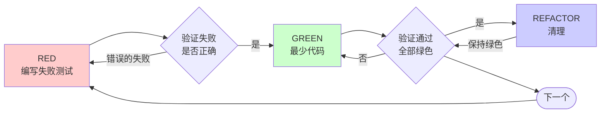

# 测试驱动开发（Test-Driven Development, TDD）

## 概述

先写测试。看着它失败。编写最少代码使其通过。

**核心原则：** 如果你没有亲眼看到测试失败，你就不知道它是否测试了正确的目标。

**违反规则的文字就是违反规则的精神。**

## 何时使用

**始终使用于：**
- 新功能
- Bug 修复
- 重构
- 行为变更

**例外（询问你的人工伙伴）：**
- 一次性原型
- 生成代码
- 配置文件

想着"就这一次跳过 TDD"？停下。那是在自我合理化。

## 铁律

```
NO PRODUCTION CODE WITHOUT A FAILING TEST FIRST
（没有先通过的失败测试，不得编写生产代码）
```

在测试之前写了代码？删掉它。重新开始。

**没有例外：**
- 不要保留它作为"参考"
- 不要在编写测试时"改编"它
- 不要看它
- 删除就是删除

从测试出发重新实现。就这样。

## 红-绿-重构



### RED - 编写失败测试

编写一个最小的测试，展示应该发生什么。

<Good>
```typescript
test('重试失败的操作 3 次', async () => {
  let attempts = 0;
  const operation = () => {
    attempts++;
    if (attempts < 3) throw new Error('fail');
    return 'success';
  };

  const result = await retryOperation(operation);

  expect(result).toBe('success');
  expect(attempts).toBe(3);
});
```
名称清晰，测试真实行为，一件事
</Good>

<Bad>
```typescript
test('重试可用', async () => {
  const mock = jest.fn()
    .mockRejectedValueOnce(new Error())
    .mockRejectedValueOnce(new Error())
    .mockResolvedValueOnce('success');
  await retryOperation(mock);
  expect(mock).toHaveBeenCalledTimes(3);
});
```
名称模糊，测试 mock 而非代码
</Bad>

**要求：**
- 一个行为
- 名称清晰
- 真实代码（除非不可避免，否则不使用 mock）

### 验证 RED - 看着它失败

**强制性。绝不可跳过。**

```bash
npm test path/to/test.test.ts
```

确认：
- 测试失败（不是错误）
- 失败消息符合预期
- 失败是因为功能缺失（不是拼写错误）

**测试通过了？** 你在测试已有行为。修复测试。

**测试报错了？** 修复错误，重新运行直至它正确失败。

### GREEN - 最少代码

编写最简单的代码使测试通过。

<Good>
```typescript
async function retryOperation<T>(fn: () => Promise<T>): Promise<T> {
  for (let i = 0; i < 3; i++) {
    try {
      return await fn();
    } catch (e) {
      if (i === 2) throw e;
    }
  }
  throw new Error('unreachable');
}
```
刚好足够通过
</Good>

<Bad>
```typescript
async function retryOperation<T>(
  fn: () => Promise<T>,
  options?: {
    maxRetries?: number;
    backoff?: 'linear' | 'exponential';
    onRetry?: (attempt: number) => void;
  }
): Promise<T> {
  // YAGNI
}
```
过度工程化
</Bad>

不要添加功能、重构其他代码、或测试范围之外"改进"任何东西。

### 验证 GREEN - 看着它通过

**强制性。**

```bash
npm test path/to/test.test.ts
```

确认：
- 测试通过
- 其他测试仍然通过
- 输出干净（无错误、警告）

**测试失败？** 修复代码，而非测试。

**其他测试失败？** 立即修复。

### REFACTOR - 清理

仅在绿灯之后：
- 消除重复
- 改进命名
- 提取辅助函数

保持测试绿色。不要添加行为。

### 重复

为下一个功能编写下一个失败测试。

## 好的测试

| 质量维度 | 好 | 坏 |
|---------|------|-----|
| **最小化** | 一件事。名称中有"and"？拆分。 | `test('验证邮箱和域名和空白字符')` |
| **清晰** | 名称描述行为 | `test('test1')` |
| **展示意图** | 展示期望的 API 用法 | 模糊代码应该做什么 |

## 为什么顺序很重要

**"我先写实现，之后再写测试验证它正确"**

事后编写的测试立即通过。立即通过什么也证明不了：
- 可能测试了错误的东西
- 可能测试的是实现而不是行为
- 可能遗漏了你忘记的边缘情况
- 你从未看到它捕获到 bug

测试先行迫使你看到测试失败，证明它确实测试了某些东西。

**"我已经手动测试了所有边缘情况"**

手动测试是 ad-hoc 的。你以为你测试了所有东西，但：
- 没有你测试了什么的记录
- 代码变更时无法重新运行
- 压力下容易遗忘测试用例
- "我试的时候它工作了" ≠ 全面

自动化测试是系统性的。它们每次都按相同方式运行。

**"删掉 X 小时的工作太浪费了"**

沉没成本谬误。时间已经过去了。你现在的选择是：
- 删除并用 TDD 重写（再花 X 小时，高信心）
- 保留并在之后加测试（30 分钟，低信心，可能有 bug）

"浪费"是保留你无法信任的代码。没有真正测试的工作代码是技术债务。

**"TDD 教条主义，务实意味着灵活调整"**

TDD 正是务实的：
- 在提交前发现 bug（比事后调试更快）
- 防止回归（测试立即捕获破坏）
- 文档化行为（测试展示了如何使用代码）
- 使重构成为可能（自由变更，测试捕获破坏）

"务实"的捷径 = 生产环境调试 = 更慢。

**"事后测试达到相同目标——是精神而非仪式"**

不。事后测试回答"这做了什么？"测试先行回答"这应该做什么？"

事后测试受你的实现偏见影响。你测试的是你构建的东西，而不是所需的东西。你验证的是你记住的边缘情况，而不是发现的。

测试先行迫使你在实现之前发现边缘情况。事后测试验证你记住了所有东西（你没有）。

事后 30 分钟的测试 ≠ TDD。你获得了覆盖率，但失去了测试确实在检验正确性的证明。

## 常见自我合理化

| 借口 | 现实 |
|--------|---------|
| "太简单了，不值得测试" | 简单代码也会出错。写个测试只需 30 秒。 |
| "我稍后再测" | 立刻通过的测试什么也证明不了。 |
| "事后测试达到相同目标" | 事后测试 = "这做了什么？" 先行测试 = "这应该做什么？" |
| "我已经手动测试了" | ad-hoc ≠ 系统性。没记录，无法重新运行。 |
| "删掉 X 小时太浪费了" | 沉没成本谬误。保留未验证代码是技术债务。 |
| "保留作为参考，先写测试" | 你会改编它。那就是事后测试。删除就是删除。 |
| "需要先探索一下" | 可以。扔掉探索成果，用 TDD 开始。 |
| "测试难 = 设计不清晰" | 倾听测试。难测试 = 难使用。 |
| "TDD 会拖慢我的速度" | TDD 比调试更快。务实 = 测试先行。 |
| "手动测试更快" | 手动不证明边缘情况。每次变更你都要重新手动测试。 |
| "现有代码没有测试" | 你正在改进它。为现有代码添加测试。 |

## 红线 - 停下并重新开始

- 在测试之前写代码
- 实现之后才测试
- 测试立即通过
- 无法解释测试为什么失败
- "之后"才添加的测试
- 自我合理化"就这一次"
- "我已经手动测试了"
- "事后测试达到相同目的"
- "是精神而非仪式"
- "保留作为参考"或"改编现有代码"
- "已经花了 X 小时，删了太浪费"
- "TDD 教条主义，我在务实操作"
- "这次不同是因为……"

**所有以上情况都意味着：删除代码。用 TDD 重新开始。**

## 示例：Bug 修复

**Bug：** 空邮箱被接受

**RED**
```typescript
test('拒绝空邮箱', async () => {
  const result = await submitForm({ email: '' });
  expect(result.error).toBe('Email required');
});
```

**验证 RED**
```bash
$ npm test
FAIL: expected 'Email required', got undefined
```

**GREEN**
```typescript
function submitForm(data: FormData) {
  if (!data.email?.trim()) {
    return { error: 'Email required' };
  }
  // ...
}
```

**验证 GREEN**
```bash
$ npm test
PASS
```

**REFACTOR**
如有需要，为多个字段提取验证逻辑。

## 验证清单

在将工作标记为完成之前：

- [ ] 每个新函数/方法都有测试
- [ ] 在实现之前看到每个测试都失败了
- [ ] 每个测试都因为期望的原因失败（功能缺失，而非拼写错误）
- [ ] 为通过每个测试编写了最少代码
- [ ] 所有测试通过
- [ ] 输出干净（无错误、警告）
- [ ] 测试使用真实代码（仅在不可避免时使用 mock）
- [ ] 边缘情况和错误已覆盖

无法勾选所有项？你跳过了 TDD。重新开始。

## 遇到卡住时

| 问题 | 解决方案 |
|----------|--------|
| 不知道如何测试 | 编写期望的 API。先写断言。询问你的人工伙伴。 |
| 测试过于复杂 | 设计过于复杂。简化接口。 |
| 必须 mock 所有东西 | 代码耦合过紧。使用依赖注入。 |
| 测试设置巨大 | 提取辅助函数。仍然复杂？简化设计。 |

## 调试集成

发现了 bug？编写重现它的失败测试。遵循 TDD 循环。测试证明修复有效并防止回归。

绝不在没有测试的情况下修复 bug。

## 测试反模式

在添加 mock 或测试工具时，阅读 [testing-anti-patterns.md](testing-anti-patterns.md) 以避免常见陷阱：
- 测试 mock 行为而非真实行为
- 向生产类添加仅供测试的方法
- 在不了解依赖关系的情况下进行 mock

## 最终规则

```
生产代码 → 测试存在且先失败了
否则 → 不是 TDD
```

没有你的人工伙伴的许可，不得例外。
