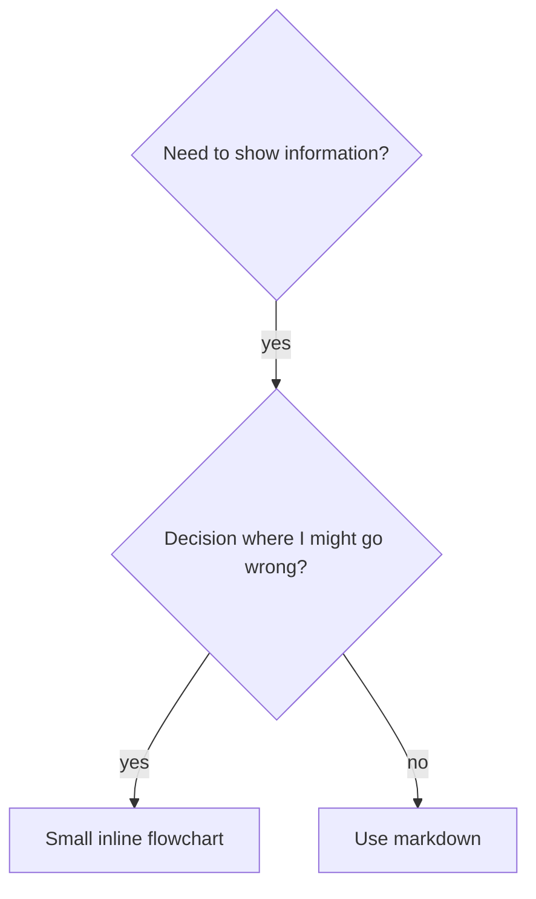
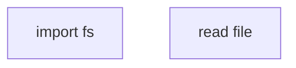

# 编写技能

## 概述

**编写技能就是将 TDD（测试驱动开发）应用于流程文档。**

**个人技能存放在运行时的技能目录中**

你编写测试用例（使用子代理的压力场景），观察它们失败（基线行为），编写技能（文档），观察测试通过（代理遵守规范），然后重构（封堵漏洞）。

**核心原则：** 如果你没有观察到一个代理在没有技能的情况下失败，你就不知道技能是否教会了正确的东西。

**必需的背景：** 在使用此技能之前，你必须理解 superpowers:test-driven-development。该技能定义了基本的 RED-GREEN-REFACTOR 循环。此技能将 TDD 适配到文档编写。

**官方指南：** 关于 Anthropic 官方的技能编写最佳实践，请参见 anthropic-best-practices.md。该文档提供了补充此技能中 TDD 聚焦方法的额外模式和指南。

## 什么是技能？

**技能**是经过验证的技术、模式或工具的参考指南。技能帮助未来的代理找到并应用有效的方法。

**技能是：** 可重用的技术、模式、工具、参考指南

**技能不是：** 关于你如何解决一次问题的叙述

## 技能的 TDD 映射

| TDD 概念 | 技能创建 |
|-------------|----------------|
| **测试用例** | 使用子代理的压力场景 |
| **生产代码** | 技能文档（SKILL.md） |
| **测试失败（RED）** | 代理在没有技能的情况下违反规则（基线） |
| **测试通过（GREEN）** | 代理在有技能的情况下遵守规范 |
| **重构** | 在保持合规的同时封堵漏洞 |
| **先写测试** | 在编写技能之前运行基线场景 |
| **观察它失败** | 记录代理使用的确切合理化理由 |
| **最小化代码** | 编写针对这些具体违规行为的技能 |
| **观察它通过** | 验证代理现在遵守规范 |
| **重构循环** | 发现新合理化理由 → 封堵 → 重新验证 |

整个技能创建过程遵循 RED-GREEN-REFACTOR。

## 何时创建技能

**在以下情况创建：**
- 技术对你来说不是直观明显的
- 你会在跨项目中再次参考它
- 模式广泛适用（非项目特定）
- 其他人会受益

**不要为以下情况创建：**
- 一次性解决方案
- 在其他地方已经完善记录的标准实践
- 项目特定的约定（放在你的 instructions 文件中）
- 机械约束（如果可以用正则表达式/验证强制执行，自动化它——将文档留给判断性决策）

## 技能类型

### 技术
有步骤可循的具体方法（condition-based-waiting、root-cause-tracing）

### 模式
思考问题的方式（flatten-with-flags、test-invariants）

### 参考
API 文档、语法指南、工具文档（office docs）

## 目录结构

```
skills/
  skill-name/
    SKILL.md              # 主参考（必需）
    supporting-file.*     # 仅在需要时
```

**扁平命名空间** - 所有技能在一个可搜索的命名空间中

**分离文件用于：**
1. **重量级参考**（100+ 行）- API 文档、综合语法
2. **可重用工具** - 脚本、工具、模板

**保持内联：**
- 原则和概念
- 代码模式（< 50 行）
- 其他一切

## SKILL.md 结构

**Frontmatter（YAML）：**
- 两个必需字段：`name` 和 `description`（所有支持的字段见 [agentskills.io/specification](https://agentskills.io/specification)）
- 最多 1024 个字符
- `name`：只使用字母、数字和连字符（不要使用括号、特殊字符）
- `description`：第三人称，仅描述何时使用（不是它做什么）
  - 以 "Use when..." 开头，专注于触发条件
  - 包含具体症状、情况和上下文
  - **永远不要总结技能的过程或工作流**（原因见下方 SDO 部分）
  - 尽可能保持在 500 个字符以下

```markdown
---
name: Skill-Name-With-Hyphens
description: Use when [具体触发条件和症状]
---

# 技能名称

## 概述
这是什么？用 1-2 句话说明核心原则。

## 何时使用
[如果决策不明显，使用小内联流程图]

带有症状和使用场景的子弹列表
何时不使用

## 核心模式（用于技术/模式）
前后代码对比

## 快速参考
用于扫描常见操作的表或子弹列表

## 实现
简单模式的内联代码
重量级参考或可重用工具链接到文件

## 常见错误
出错内容 + 修复

## 实际影响（可选）
具体结果
```

## 技能发现优化（SDO）

**对发现至关重要：** 未来的代理需要能够找到你的技能

### 1. 丰富的描述字段

**目的：** 你的代理解读描述来决定为给定任务加载哪些技能。让它回答："我现在应该阅读这个技能吗？"

**格式：** 以 "Use when..." 开头，专注于触发条件

**关键：描述 = 何时使用，而非技能做什么**

描述应该只描述触发条件。不要在描述中总结技能的过程或工作流。

**为什么这很重要：** 测试揭示，当描述总结了技能的工作流时，代理可能会遵循描述而不是阅读完整的技能内容。一个说"任务之间的代码审查"的描述导致代理只做一次审查，即使技能的流程图明确显示两次审查（规范合规然后是代码质量）。

当描述被改为仅仅是 "Use when executing implementation plans with independent tasks"（没有工作流摘要）时，代理正确地阅读了流程图并遵循了两阶段审查过程。

**陷阱：** 总结工作流的描述创建了代理会利用的捷径。技能正文变成了代理跳过的文档。

```yaml
# ❌ 错误：总结了工作流 - 代理可能遵循此而不是阅读技能
description: Use when executing plans - dispatches subagent per task with code review between tasks

# ❌ 错误：太多过程细节
description: Use for TDD - write test first, watch it fail, write minimal code, refactor

# ✅ 正确：只有触发条件，没有工作流摘要
description: Use when executing implementation plans with independent tasks in the current session

# ✅ 正确：仅有触发条件
description: Use when implementing any feature or bugfix, before writing implementation code
```

**内容：**
- 使用具体的触发器、症状和表明此技能适用的情况
- 描述*问题*（race conditions, inconsistent behavior）而不是*语言特定的症状*（setTimeout, sleep）
- 保持触发器技术无关，除非技能本身是技术特定的
- 如果技能是技术特定的，在触发器中明确说明
- 用第三人称写（注入到系统提示词中）
- **永远不要总结技能的过程或工作流**

```yaml
# ❌ 错误：太抽象、模糊、不包含何时使用
description: For async testing

# ❌ 错误：第一人称
description: I can help you with async tests when they're flaky

# ❌ 错误：提及技术但技能不属于该技术特定
description: Use when tests use setTimeout/sleep and are flaky

# ✅ 正确：以 "Use when" 开头，描述问题，没有工作流
description: Use when tests have race conditions, timing dependencies, or pass/fail inconsistently

# ✅ 正确：技术特定技能，带明确触发器
description: Use when using React Router and handling authentication redirects
```

### 2. 关键词覆盖

使用代理会搜索的词：
- 错误消息："Hook timed out"、"ENOTEMPTY"、"race condition"
- 症状："flaky"、"hanging"、"zombie"、"pollution"
- 同义词："timeout/hang/freeze"、"cleanup/teardown/afterEach"
- 工具：实际命令、库名称、文件类型

### 3. 描述性命名

**使用主动语态，动词优先：**
- ✅ `creating-skills` 而不是 `skill-creation`
- ✅ `condition-based-waiting` 而不是 `async-test-helpers`

### 4. Token 效率（关键）

**问题：** getting-started 和频繁引用的技能会加载到每次对话中。每个 token 都很重要。

**目标字数：**
- getting-started 工作流：每个 <150 词
- 频繁加载的技能：总共 <200 词
- 其他技能：<500 词（仍然要简洁）

**技巧：**

**将细节移到工具帮助：**
```bash
# ❌ 错误：在 SKILL.md 中记录所有标志
search-conversations supports --text, --both, --after DATE, --before DATE, --limit N

# ✅ 正确：引用 --help
search-conversations 支持多种模式和过滤器。运行 --help 获取详情。
```

**使用交叉引用：**
```markdown
# ❌ 错误：重复工作流详细信息
搜索时，使用模板调度子代理...
[20 行重复的指令]

# ✅ 正确：引用其他技能
始终使用子代理（50-100x 上下文节省）。必需：使用 [other-skill-name] 获取工作流。
```

**压缩示例：**
```markdown
# ❌ 错误：冗长示例（42 词）
your human partner: "我们之前是如何在 React Router 中处理认证错误的？"
You: 我将搜索过去的对话中关于 React Router 认证模式的内容。
[Dispatch subagent with search query: "React Router authentication error handling 401"]

# ✅ 正确：最简示例（20 词）
Partner: "我们如何用 React Router 处理认证错误？"
You: 搜索中...
[调度子代理 → 合成]
```

**消除冗余：**
- 不要重复交叉引用技能中的内容
- 不要解释从命令中显而易见的内容
- 不要包含同一模式的多个示例

**验证：**
```bash
wc -w skills/path/SKILL.md
# getting-started 工作流：目标每个 <150
# 其他频繁加载：目标总共 <200
```

**以你做什么或核心洞察命名：**
- ✅ `condition-based-waiting` > `async-test-helpers`
- ✅ `using-skills` 而不是 `skill-usage`
- ✅ `flatten-with-flags` > `data-structure-refactoring`
- ✅ `root-cause-tracing` > `debugging-techniques`

**动名词（-ing）对过程很有效：**
- `creating-skills`、`testing-skills`、`debugging-with-logs`
- 主动，描述你正在做的动作

### 5. 交叉引用其他技能

**当编写引用其他技能的文档时：**

仅使用技能名称，带有明确的要求标记：
- ✅ 正确：`**必需的子技能：** 使用 superpowers:test-driven-development`
- ✅ 正确：`**必需的背景：** 你必须理解 superpowers:systematic-debugging`
- ❌ 错误：`See skills/testing/test-driven-development`（不清楚是否必需）
- ❌ 错误：`@skills/testing/test-driven-development/SKILL.md`（强制加载，消耗上下文）

**为什么不使用 @ 链接：** `@` 语法立即强制加载文件，在你需要之前消耗 200k+ 上下文。

## 流程图使用



**仅在以下情况使用流程图：**
- 不明显的决策点
- 你可能过早停止的过程循环
- "何时使用 A vs B" 的决策

**永远不要将流程图用于：**
- 参考材料 → 表格、列表
- 代码示例 → Markdown 块
- 线性指令 → 编号列表
- 没有语义含义的标签（step1、helper2）

参见此目录中的 `graphviz-conventions.dot` 了解 graphviz 样式规则。

**为你的伙伴可视化：** 使用此目录中的 `render-graphs.js` 将技能的流程图渲染为 SVG：
```bash
./render-graphs.js ../some-skill           # 每个图分别渲染
./render-graphs.js ../some-skill --combine # 所有图合并在一个 SVG 中
```

## 代码示例

**一个优秀的示例胜过许多平庸的示例**

选择最相关的语言：
- 测试技术 → TypeScript/JavaScript
- 系统调试 → Shell/Python
- 数据处理 → Python

**好的示例：**
- 完整且可运行
- 注释良好，解释为什么
- 来自真实场景
- 清晰展示模式
- 准备好改编（不是通用模板）

**不要：**
- 用 5+ 种语言实现
- 创建填空模板
- 编写人为构造的示例

你很擅长移植——一个优秀的示例就足够了。

## 文件组织

### 自包含技能
```
defense-in-depth/
  SKILL.md    # 所有内容内联
```
当：所有内容适合，不需要重量级参考

### 带可重用工具的技能
```
condition-based-waiting/
  SKILL.md    # 概述 + 模式
  example.ts  # 可改编的工作助手
```
当：工具是可重用的代码，不仅仅是叙述

### 带重量级参考的技能
```
pptx/
  SKILL.md       # 概述 + 工作流
  pptxgenjs.md   # 600 行 API 参考
  ooxml.md       # 500 行 XML 结构
  scripts/       # 可执行工具
```
当：参考材料太大无法内联

## 铁律（与 TDD 相同）

```
没有先失败的测试就没有技能
```

这适用于新技能和对现有技能的编辑。

在测试之前编写技能？删除它。重新开始。
在不测试的情况下编辑技能？同样的违规。

**没有例外：**
- 没有"简单的添加"
- 没有"只是添加一个部分"
- 没有"文档更新"
- 不要将未测试的更改保留为"参考"
- 不要在运行测试时"改编"
- 删除意味着删除

**必需的背景：** superpowers:test-driven-development 技能解释了为什么这很重要。相同的原则适用于文档。

## 测试所有技能类型

不同的技能类型需要不同的测试方法：

### 纪律强制执行技能（规则/要求）

**示例：** TDD、verification-before-completion、designing-before-coding

**测试方法：**
- 学术问题：他们理解规则吗？
- 压力场景：他们在压力下遵守吗？
- 多种压力组合：时间 + 沉没成本 + 疲惫
- 识别合理化理由并添加显式反驳

**成功标准：** 代理在最大压力下遵循规则

### 技术技能（操作指南）

**示例：** condition-based-waiting、root-cause-tracing、defensive-programming

**测试方法：**
- 应用场景：他们能正确应用技术吗？
- 变体场景：他们处理边缘情况吗？
- 缺失信息测试：指令有缺口吗？

**成功标准：** 代理成功将技术应用于新场景

### 模式技能（心智模型）

**示例：** reducing-complexity、information-hiding 概念

**测试方法：**
- 识别场景：他们能识别模式何时适用吗？
- 应用场景：他们能使用心智模型吗？
- 反例：他们知道何时不应用吗？

**成功标准：** 代理正确识别何时/如何应用模式

### 参考技能（文档/API）

**示例：** API 文档、命令参考、库指南

**测试方法：**
- 检索场景：他们能找到正确的信息吗？
- 应用场景：他们能正确使用找到的信息吗？
- 缺口测试：常见用例被覆盖了吗？

**成功标准：** 代理找到并正确应用参考信息

## 跳过测试的常见合理化理由

| 借口 | 现实 |
|--------|---------|
| "技能明显很清楚" | 对你清楚 ≠ 对其他代理清楚。测试它。 |
| "这只是一个参考" | 参考可以有缺口、不清晰的部分。测试检索。 |
| "测试过度了" | 未测试的技能总是有问题。15 分钟测试节省数小时。 |
| "出问题我再测试" | 问题 = 代理无法使用技能。在部署之前测试。 |
| "测试太繁琐了" | 测试比在生产中调试糟糕技能更不繁琐。 |
| "我自信它很好" | 过度自信保证问题。无论如何测试。 |
| "学术审查就够了" | 阅读 ≠ 使用。测试应用场景。 |
| "没时间测试" | 部署未测试的技能浪费更多时间在后面修复它。 |

**所有这些意味着：在部署之前测试。没有例外。**

## 将形式与失败匹配

在编写指导之前，对基线失败进行分类。使一种失败类型无懈可击的形式对另一种类型会产生可衡量的反效果。

| 基线失败 | 正确形式 | 错误形式 |
|---|---|---|
| 在压力下跳过/违反规则（知道更好，还是这样做） | 禁止 + 合理化表格 + 红旗标志（见下方防弹处理） | 柔和的指导（"prefer..."、"consider..."） |
| 遵守，但输出形状错误（臃肿的提示词、被掩埋的判断、重述规范） | 正向配方或契约：陈述输出是什么——它的部分，按顺序 | 禁止列表（"不要重述"、"永远不要叙述"） |
| 从他们已产生的内容中遗漏了必需的元素 | 结构性：在他们填充的模板中必需的字段或插槽 | 模板附近的散文提醒 |
| 行为应取决于条件 | 基于可观察谓词的条件（"if the brief exists, reference it"） | 无条件规则 + 豁免条款 |

**为什么禁止对塑造问题有反效果：** 在竞争激励下（"使提示词自包含"），代理与"不要 X"谈判。在调度提示词指导的面对面措辞测试中，禁止组的输出比配方组明显包含更多不想要的内容（完全分离的分布），并且趋势比甚至无指导的对照组更糟糕——在你自己的情况下进行微型测试而不是假设，但永远不要默认使用禁止。配方没有可谈判的内容：输出匹配所述的形状，否则不匹配。

**无论选择哪种形式的规则：**
- **不要有细微差别条款。** "不要 X 除非它很重要"重新开启了谈判——在相同的措辞测试中，向一个成功的配方附加单个细微差别条款使其从一致降级为噪音。将真正的异常表达为其自身的基于可观察谓词的条件。
- **豁免条款不限定范围。** "此限制不适用于代码块"仍然会抑制代码块。如果部分输出必须被豁免，重构以使规则无法触及它。

## 使技能抵御合理化理由

强制执行纪律的技能（如 TDD）需要抵抗合理化。代理很聪明，在压力下会找到漏洞。

**范围：** 此工具包用于纪律失败——代理知道规则但在压力下跳过它的情况。对于形状错误的输出或遗漏的元素，基于禁止的防弹处理有反效果；改用"将形式与失败匹配"中的形式。

**心理学说明：** 理解说服技巧为什么有效有助于你系统地应用它们。关于权威、承诺、稀缺性、社会认同和统一原则的研究基础，请参见 persuasion-principles.md（Cialdini, 2021; Meincke et al., 2025）。

### 明确封堵每一个漏洞

不要只陈述规则——禁止特定的变通方法：

<Bad>
```markdown
在测试之前写代码？删除它。
```
</Bad>

<Good>
```markdown
在测试之前写代码？删除它。重新开始。

**没有例外：**
- 不要保留为"参考"
- 不要在编写测试时"改编"它
- 不要看它
- 删除意味着删除
```
</Good>

### 处理"精神 vs 字面"的争论

在早期添加基础原则：

```markdown
**违反规则的字面意思就是违反规则的精神。**
```

这截断了整类"我在遵循精神"的合理化理由。

### 构建合理化表格

从基线测试中捕获合理化理由（见下方测试部分）。代理提出的每个借口都放入表格：

```markdown
| 借口 | 现实 |
|--------|---------|
| "太简单不需要测试" | 简单代码也会出错。测试只需 30 秒。 |
| "我之后再测试" | 之后通过的测试什么都证明不了。 |
| "测试后达到相同目标" | 先写测试后写代码 = "应该做什么？" vs 先写代码后写测试 = "这做了什么？" |
```

### 创建红旗标志列表

使代理在合理化时容易自我检查：

```markdown
## 红旗标志 - 停下来重新开始

- 代码在测试之前
- "我已经手动测试过了"
- "测试后达到相同目的"
- "这是关于精神不是仪式"
- "这次不同是因为..."

**所有这些意味着：删除代码。用 TDD 重新开始。**
```

### 为违规症状更新 SDO

添加到描述中：你即将违反规则时的症状：

```yaml
description: use when implementing any feature or bugfix, before writing implementation code
```

## 技能的 RED-GREEN-REFACTOR

遵循 TDD 循环：

### RED：编写失败测试（基线）

在没有技能的情况下用子代理运行压力场景。记录确切行为：
- 他们做了什么选择？
- 他们使用了什么合理化理由（逐字记录）？
- 哪些压力触发了违规？

这是"观察测试失败"——你必须看到代理在没有技能的情况下自然做什么，然后再编写技能。

### GREEN：编写最小技能

编写针对这些具体合理化理由的技能。不要为假想情况添加额外内容。

在有技能的情况下运行相同场景。代理现在应该遵守。

### REFACTOR：封堵漏洞

代理发现了新的合理化理由？添加显式反驳。重新测试直到无懈可击。

### 在全场景之前微测试措辞

全压力场景运行是最终关卡，但它们每次迭代都又慢又贵。首先用微测试验证措辞本身：

1. **每次调用一个全新上下文样本** — 原始 API 调用，或者如果你没有 API 访问权限，使用单次子代理。系统提示词 = 指导将生存的实际上下文（完整的技能或提示词模板，不是孤立的指导）；用户消息 = 一个诱使失败的任务。
2. **始终包含无指导对照组。** 如果对照组没有表现出失败，则没有需要修复的问题——停止，不要编写指导。
3. **每个变体 5+ 次重复。** 单次样本会说谎。
4. **手动阅读每个标记的匹配。** 如果你想可以用编程方式评分，但模板回显和引用的反例会伪装成命中；自动化计数单独会夸大失败和成功。
5. **方差是一个指标。** 当指导落地时，重复会收敛到相同的形状。五次重复中五次不同的解释意味着措辞不够有约束力——在添加词之前收紧形式。

微测试验证措辞；它们不能替代纪律技能的完整压力场景测试。

**测试方法论：** 完整测试方法论见 [testing-skills-with-subagents.md](testing-skills-with-subagents.md)：
- 如何编写压力场景
- 压力类型（时间、沉没成本、权威、疲惫）
- 系统地封堵漏洞
- 元测试技术

## 反模式

### ❌ 叙述性示例
"在 2025-10-03 的会话中，我们发现空的 projectDir 导致..."
**为什么不好：** 太具体，不可重用

### ❌ 多语言稀释
example-js.js、example-py.py、example-go.go
**为什么不好：** 质量平庸，维护负担

### ❌ 流程图中的代码

**为什么不好：** 无法复制粘贴，难以阅读

### ❌ 通用标签
helper1、helper2、step3、pattern4
**为什么不好：** 标签应该有语义含义

## 停止：在转到下一个技能之前

**编写任何技能后，你必须停止并完成部署过程。**

**不要：**
- 批量创建多个技能而不测试每个
- 在当前技能验证之前转到下一个技能
- 跳过测试因为"批量处理更高效"

**下面的部署检查清单对每个技能都是强制性的。**

部署未测试的技能 = 部署未测试的代码。这违反了质量标准。

## 技能创建检查清单（TDD 适配版）

**重要：为下面的每个检查清单项创建一个 todo。**

**RED 阶段 - 编写失败测试：**
- [ ] 创建压力场景（纪律技能需要 3+ 种组合压力）
- [ ] 在没有技能的情况下运行场景 - 逐字记录基线行为
- [ ] 识别合理化理由/失败的模式

**GREEN 阶段 - 编写最小技能：**
- [ ] 名称只使用字母、数字、连字符（不要用括号/特殊字符）
- [ ] YAML frontmatter 带有必需的 `name` 和 `description` 字段（最多 1024 个字符；见 [规范](https://agentskills.io/specification)）
- [ ] 描述以 "Use when..." 开头，包含具体触发器/症状
- [ ] 描述用第三人称写
- [ ] 全文中用于搜索的关键词（错误、症状、工具）
- [ ] 清晰的概述，带核心原则
- [ ] 处理 RED 中识别出的具体基线失败
- [ ] 指导形式匹配失败类型（见"将形式与失败匹配"）
- [ ] 对于行为塑造指导：措辞在无指导对照组上进行微测试（5+ 次重复，每个标记的匹配手动阅读）——纯参考技能不适用
- [ ] 代码内联或链接到单独文件
- [ ] 一个优秀示例（不是多语言）
- [ ] 在有技能的情况下运行场景 - 验证代理现在遵守

**REFACTOR 阶段 - 封堵漏洞：**
- [ ] 识别测试中的新合理化理由
- [ ] 添加显式反驳（如果是纪律技能）
- [ ] 从所有测试迭代构建合理化表格
- [ ] 创建红旗标志列表
- [ ] 重新测试直到无懈可击

**质量检查：**
- [ ] 小流程图仅在决策不明显时使用
- [ ] 快速参考表
- [ ] 常见错误部分
- [ ] 没有叙述性故事
- [ ] 支持文件仅用于工具或重量级参考

**部署：**
- [ ] 将技能提交到 git 并推送到你的 fork（如果已配置）
- [ ] 考虑通过 PR 贡献回来（如果有广泛用途）

## 发现工作流

未来代理如何找到你的技能：

1. **遇到问题**（"测试不稳定"）
2. **搜索技能**（grep 描述，浏览类别）
3. **找到技能**（描述匹配）
4. **扫描概述**（这相关吗？）
5. **阅读模式**（快速参考表）
6. **加载示例**（仅在实现时）

**为此流程优化** - 尽早并经常放置可搜索的术语。

## 底线

**创建技能就是针对流程文档的 TDD。**

相同的铁律：没有先失败的测试就没有技能。
相同的循环：RED（基线）→ GREEN（编写技能）→ REFACTOR（封堵漏洞）。
相同的收益：更好的质量、更少的意外、无懈可击的结果。

如果你对代码遵循 TDD，也对技能遵循它。这是应用于文档的相同纪律。
