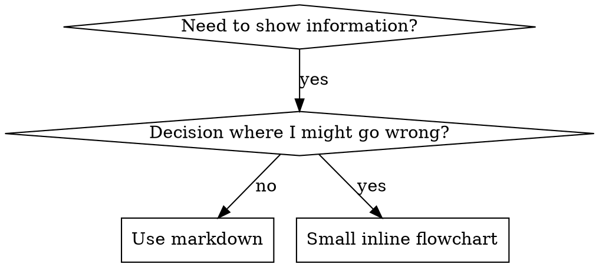

# Writing Skills（编写技能）

## 概述

**编写技能就是将 TDD 应用于流程文档。**

**个人技能存放在代理专属目录中（Claude Code 为 `~/.claude/skills`，Codex 为 `~/.agents/skills/`）**

你编写测试用例（用子代理执行压力场景），观察它们失败（基线行为），编写技能（文档），观察测试通过（代理遵守），然后重构（堵住漏洞）。

**核心原则：** 如果你没有观察到代理在没有技能时的失败行为，你就不知道技能是否教对了东西。

**前置要求：** 在使用本技能之前，你必须理解 superpowers:test-driven-development。该技能定义了基本的 RED-GREEN-REFACTOR 循环。本技能将 TDD 适配到文档领域。

**官方指南：** 关于 Anthropic 官方的技能编写最佳实践，请参阅 anthropic-best-practices.md。该文档提供了补充本技能 TDD 方法的额外模式和指南。

## 什么是技能？

**技能**是经过验证的技术、模式或工具的参考指南。技能帮助未来的 Claude 实例找到并应用有效的方法。

**技能是：**可复用的技术、模式、工具、参考指南

**技能不是：**你曾经如何解决某个问题的叙述

## 技能的 TDD 映射

| TDD 概念 | 技能创建 |
|----------|---------|
| **测试用例** | 用子代理执行压力场景 |
| **生产代码** | 技能文档（SKILL.md） |
| **测试失败（RED）** | 代理在没有技能时违反规则（基线） |
| **测试通过（GREEN）** | 代理在有技能时遵守规则 |
| **重构** | 在保持合规的同时堵住漏洞 |
| **先写测试** | 在编写技能之前运行基线场景 |
| **观察失败** | 记录代理使用的确切合理化说辞 |
| **最小代码** | 编写针对那些特定违反行为的技能 |
| **观察通过** | 验证代理现在遵守了规则 |
| **重构循环** | 发现新的合理化说辞 → 堵住 → 重新验证 |

整个技能创建过程遵循 RED-GREEN-REFACTOR。

## 何时创建技能

**应该创建：**
- 该技术对你来说并非直觉上显而易见
- 你会在多个项目中再次参考此内容
- 模式广泛适用（非项目特定）
- 其他人会受益

**不应创建：**
- 一次性解决方案
- 其他地方已有充分文档记录的标准实践
- 项目特定的约定（放在 CLAUDE.md 中）
- 机械性约束（如果可以用正则/验证自动化，就自动化——把文档留给需要判断力的场景）

## 技能类型

### 技术（Technique）
有具体步骤可遵循的方法（condition-based-waiting、root-cause-tracing）

### 模式（Pattern）
思考问题的方式（flatten-with-flags、test-invariants）

### 参考（Reference）
API 文档、语法指南、工具文档（office docs）

## 目录结构


```
skills/
  skill-name/
    SKILL.md              # 主参考文档（必需）
    supporting-file.*     # 仅在需要时
```

**扁平命名空间** - 所有技能在一个可搜索的命名空间中

**单独文件用于：**
1. **大量参考内容**（100+ 行）- API 文档、全面的语法
2. **可复用工具** - 脚本、实用工具、模板

**保持在文件内：**
- 原则和概念
- 代码模式（< 50 行）
- 其他所有内容

## SKILL.md 结构

**前置元数据（YAML）：**
- 仅支持两个字段：`name` 和 `description`
- 总计最多 1024 个字符
- `name`：仅使用字母、数字和连字符（不使用括号、特殊字符）
- `description`：第三人称，仅描述何时使用（而非做什么）
  - 以"Use when..."开头，聚焦于触发条件
  - 包含具体的症状、情境和上下文
  - **绝不在描述中总结技能的流程或工作流**（原因见 CSO 部分）
  - 尽量保持在 500 字符以内

```markdown
---
name: Skill-Name-With-Hyphens
description: Use when [specific triggering conditions and symptoms]
---

# Skill Name

## Overview
What is this? Core principle in 1-2 sentences.

## When to Use
[Small inline flowchart IF decision non-obvious]

Bullet list with SYMPTOMS and use cases
When NOT to use

## Core Pattern (for techniques/patterns)
Before/after code comparison

## Quick Reference
Table or bullets for scanning common operations

## Implementation
Inline code for simple patterns
Link to file for heavy reference or reusable tools

## Common Mistakes
What goes wrong + fixes

## Real-World Impact (optional)
Concrete results
```


## Claude 搜索优化（CSO）

**对发现至关重要：** 未来的 Claude 需要能找到你的技能

### 1. 丰富的描述字段

**目的：** Claude 阅读描述来决定为给定任务加载哪些技能。让它回答："我现在应该读这个技能吗？"

**格式：** 以"Use when..."开头，聚焦于触发条件

**关键：描述 = 何时使用，而非技能做什么**

描述应仅描述触发条件。不要在描述中总结技能的流程或工作流。

**为什么重要：** 测试发现，当描述总结了技能的工作流时，Claude 可能会按照描述行事而不阅读完整的技能内容。一个写着"code review between tasks"的描述导致 Claude 只做了**一次**评审，即使技能的流程图清楚地显示了**两次**评审（先规格合规，再代码质量）。

当描述改为仅"Use when executing implementation plans with independent tasks"（不包含工作流总结）时，Claude 正确地阅读了流程图并遵循了两阶段评审流程。

**陷阱：** 总结工作流的描述会创建一个 Claude 会走的捷径。技能正文变成了 Claude 跳过的文档。

```yaml
# ❌ 不好：总结了工作流 - Claude 可能按此执行而不阅读技能
description: Use when executing plans - dispatches subagent per task with code review between tasks

# ❌ 不好：过多的流程细节
description: Use for TDD - write test first, watch it fail, write minimal code, refactor

# ✅ 好：仅触发条件，不总结工作流
description: Use when executing implementation plans with independent tasks in the current session

# ✅ 好：仅触发条件
description: Use when implementing any feature or bugfix, before writing implementation code
```

**内容：**
- 使用具体的触发器、症状和情境来表明此技能适用
- 描述*问题*（竞态条件、不一致行为）而非*语言特定的症状*（setTimeout、sleep）
- 除非技能本身是技术特定的，否则触发器应保持技术无关
- 如果技能是技术特定的，在触发器中明确说明
- 使用第三人称编写（会被注入系统提示）
- **绝不在描述中总结技能的流程或工作流**

```yaml
# ❌ 不好：太抽象、模糊、不包含使用时机
description: For async testing

# ❌ 不好：第一人称
description: I can help you with async tests when they're flaky

# ❌ 不好：提到了技术但技能并非特定于该技术
description: Use when tests use setTimeout/sleep and are flaky

# ✅ 好：以"Use when"开头，描述问题，不包含工作流
description: Use when tests have race conditions, timing dependencies, or pass/fail inconsistently

# ✅ 好：技术特定技能，触发器明确
description: Use when using React Router and handling authentication redirects
```

### 2. 关键词覆盖

使用 Claude 会搜索的词语：
- 错误消息："Hook timed out"、"ENOTEMPTY"、"race condition"
- 症状："flaky"、"hanging"、"zombie"、"pollution"
- 同义词："timeout/hang/freeze"、"cleanup/teardown/afterEach"
- 工具：实际命令、库名称、文件类型

### 3. 描述性命名

**使用主动语态，动词优先：**
- ✅ `creating-skills` 而非 `skill-creation`
- ✅ `condition-based-waiting` 而非 `async-test-helpers`

### 4. Token 效率（关键）

**问题：** getting-started 和频繁引用的技能会加载到每个对话中。每个 token 都很重要。

**目标字数：**
- getting-started 工作流：每个 <150 词
- 频繁加载的技能：总共 <200 词
- 其他技能：<500 词（仍然要简洁）

**技巧：**

**将细节移至工具帮助：**
```bash
# ❌ 不好：在 SKILL.md 中记录所有标志
search-conversations supports --text, --both, --after DATE, --before DATE, --limit N

# ✅ 好：引用 --help
search-conversations supports multiple modes and filters. Run --help for details.
```

**使用交叉引用：**
```markdown
# ❌ 不好：重复工作流细节
When searching, dispatch subagent with template...
[20 lines of repeated instructions]

# ✅ 好：引用其他技能
Always use subagents (50-100x context savings). REQUIRED: Use [other-skill-name] for workflow.
```

**压缩示例：**
```markdown
# ❌ 不好：冗长的示例（42 词）
your human partner: "How did we handle authentication errors in React Router before?"
You: I'll search past conversations for React Router authentication patterns.
[Dispatch subagent with search query: "React Router authentication error handling 401"]

# ✅ 好：最简示例（20 词）
Partner: "How did we handle auth errors in React Router?"
You: Searching...
[Dispatch subagent → synthesis]
```

**消除冗余：**
- 不要重复交叉引用技能中已有的内容
- 不要解释从命令中显而易见的内容
- 不要包含同一模式的多个示例

**验证：**
```bash
wc -w skills/path/SKILL.md
# getting-started 工作流：目标每个 <150
# 其他频繁加载的：目标总共 <200
```

**以你做的事或核心洞察命名：**
- ✅ `condition-based-waiting` > `async-test-helpers`
- ✅ `using-skills` 而非 `skill-usage`
- ✅ `flatten-with-flags` > `data-structure-refactoring`
- ✅ `root-cause-tracing` > `debugging-techniques`

**动名词（-ing）适用于流程：**
- `creating-skills`、`testing-skills`、`debugging-with-logs`
- 主动的，描述你正在执行的动作

### 4. 交叉引用其他技能

**在引用其他技能的文档中：**

仅使用技能名称，带有明确的必需标记：
- ✅ 好：`**REQUIRED SUB-SKILL:** Use superpowers:test-driven-development`
- ✅ 好：`**REQUIRED BACKGROUND:** You MUST understand superpowers:systematic-debugging`
- ❌ 不好：`See skills/testing/test-driven-development`（不清楚是否必需）
- ❌ 不好：`@skills/testing/test-driven-development/SKILL.md`（强制加载，消耗上下文）

**为什么不用 @ 链接：** `@` 语法会立即强制加载文件，在你需要之前就消耗 200k+ 上下文。

## 流程图使用



**仅在以下情况使用流程图：**
- 非显而易见的决策点
- 你可能会过早停止的流程循环
- "何时使用 A 而非 B"的决策

**绝不在以下情况使用流程图：**
- 参考材料 → 使用表格、列表
- 代码示例 → 使用 Markdown 代码块
- 线性指令 → 使用编号列表
- 无语义含义的标签（step1、helper2）

参见 @graphviz-conventions.dot 了解 graphviz 样式规则。

**为你的人类搭档可视化：** 使用此目录中的 `render-graphs.js` 将技能的流程图渲染为 SVG：
```bash
./render-graphs.js ../some-skill           # 每个图表单独渲染
./render-graphs.js ../some-skill --combine # 所有图表渲染到一个 SVG 中
```

## 代码示例

**一个优秀的示例胜过许多平庸的示例**

选择最相关的语言：
- 测试技术 → TypeScript/JavaScript
- 系统调试 → Shell/Python
- 数据处理 → Python

**好的示例：**
- 完整且可运行
- 有良好注释解释为什么
- 来自真实场景
- 清晰地展示模式
- 可直接适配（不是通用模板）

**不要：**
- 用 5+ 种语言实现
- 创建填空模板
- 编写刻意的示例

你擅长移植 - 一个伟大的示例就够了。

## 文件组织

### 自包含技能
```
defense-in-depth/
  SKILL.md    # 所有内容内联
```
适用时机：所有内容都能放下，不需要大量参考

### 带可复用工具的技能
```
condition-based-waiting/
  SKILL.md    # 概述 + 模式
  example.ts  # 可适配的工作助手代码
```
适用时机：工具是可复用代码，而不仅仅是叙述

### 带大量参考内容的技能
```
pptx/
  SKILL.md       # 概述 + 工作流
  pptxgenjs.md   # 600 行 API 参考
  ooxml.md       # 500 行 XML 结构
  scripts/       # 可执行工具
```
适用时机：参考材料太大，无法内联

## 铁律（与 TDD 相同）

```
NO SKILL WITHOUT A FAILING TEST FIRST
```

这适用于新技能和对现有技能的编辑。

在测试之前编写技能？删除它。从头开始。
不经测试就编辑技能？同样的违规。

**没有例外：**
- 不是为"简单的添加"
- 不是为"只是加一个章节"
- 不是为"文档更新"
- 不要将未测试的更改保留为"参考"
- 不要在运行测试时"适配"
- 删除就是删除

**前置要求：** superpowers:test-driven-development 技能解释了为什么这很重要。相同的原则适用于文档。

## 测试所有技能类型

不同技能类型需要不同的测试方法：

### 纪律执行类技能（规则/要求）

**示例：** TDD、verification-before-completion、designing-before-coding

**测试方法：**
- 学术问题：他们理解规则吗？
- 压力场景：他们在压力下是否遵守？
- 多重压力组合：时间 + 沉没成本 + 疲惫
- 识别合理化说辞并添加明确的反驳

**成功标准：** 代理在最大压力下仍遵守规则

### 技术类技能（操作指南）

**示例：** condition-based-waiting、root-cause-tracing、defensive-programming

**测试方法：**
- 应用场景：他们能正确应用技术吗？
- 变化场景：他们能处理边界情况吗？
- 信息缺失测试：指令是否有缺口？

**成功标准：** 代理成功将技术应用于新场景

### 模式类技能（心智模型）

**示例：** reducing-complexity、information-hiding 概念

**测试方法：**
- 识别场景：他们能识别模式何时适用吗？
- 应用场景：他们能使用心智模型吗？
- 反例：他们知道何时不应使用吗？

**成功标准：** 代理正确识别何时/如何应用模式

### 参考类技能（文档/API）

**示例：** API 文档、命令参考、库指南

**测试方法：**
- 检索场景：他们能找到正确的信息吗？
- 应用场景：他们能正确使用找到的信息吗？
- 缺口测试：常见用例是否已覆盖？

**成功标准：** 代理找到并正确应用参考信息

## 跳过测试的常见合理化说辞

| 借口 | 现实 |
|------|------|
| "技能显然很清晰" | 对你清晰 ≠ 对其他代理清晰。测试它。 |
| "这只是参考" | 参考也可能有缺口和不清晰的部分。测试检索。 |
| "测试过度了" | 未测试的技能总有问题。总是如此。15 分钟测试节省数小时。 |
| "出问题再测试" | 问题 = 代理无法使用技能。在部署前测试。 |
| "测试太烦了" | 测试比在生产中调试糟糕的技能更不烦。 |
| "我很有信心" | 过度自信保证会出问题。无论如何测试。 |
| "学术审查就够了" | 阅读 ≠ 使用。测试应用场景。 |
| "没时间测试" | 部署未测试的技能在后续修复上浪费更多时间。 |

**所有这些意味着：部署前测试。没有例外。**

## 让技能抵御合理化

执行纪律的技能（如 TDD）需要抵御合理化。代理很聪明，在压力下会找到漏洞。

**心理学注释：** 理解说服技术为什么有效有助于你系统地应用它们。参见 persuasion-principles.md 了解研究基础（Cialdini, 2021; Meincke et al., 2025），关于权威、承诺、稀缺性、社会认同和统一原则。

### 明确堵住每个漏洞

不要只是陈述规则 - 要禁止特定的变通方法：

<Bad>
```markdown
Write code before test? Delete it.
```
</Bad>

<Good>
```markdown
Write code before test? Delete it. Start over.

**No exceptions:**
- Don't keep it as "reference"
- Don't "adapt" it while writing tests
- Don't look at it
- Delete means delete
```
</Good>

### 处理"精神 vs 字面"的争论

尽早添加基本原则：

```markdown
**Violating the letter of the rules is violating the spirit of the rules.**
```

这切断了整类"我在遵循精神"的合理化说辞。

### 构建合理化说辞表

从基线测试中捕获合理化说辞（见下方测试部分）。代理提出的每个借口都放入表中：

```markdown
| Excuse | Reality |
|--------|---------|
| "Too simple to test" | Simple code breaks. Test takes 30 seconds. |
| "I'll test after" | Tests passing immediately prove nothing. |
| "Tests after achieve same goals" | Tests-after = "what does this do?" Tests-first = "what should this do?" |
```

### 创建危险信号列表

让代理在合理化时容易自我检查：

```markdown
## Red Flags - STOP and Start Over

- Code before test
- "I already manually tested it"
- "Tests after achieve the same purpose"
- "It's about spirit not ritual"
- "This is different because..."

**All of these mean: Delete code. Start over with TDD.**
```

### 为违反症状更新 CSO

添加到描述中：即将违反规则时的症状：

```yaml
description: use when implementing any feature or bugfix, before writing implementation code
```

## 技能的 RED-GREEN-REFACTOR

遵循 TDD 循环：

### RED：编写失败测试（基线）

在没有技能的情况下用子代理运行压力场景。记录确切行为：
- 他们做了什么选择？
- 他们使用了什么合理化说辞（逐字记录）？
- 哪些压力触发了违反行为？

这就是"观察测试失败" - 在编写技能之前你必须看到代理的自然行为。

### GREEN：编写最小技能

编写针对那些特定合理化说辞的技能。不要为假设情况添加额外内容。

在有技能的情况下运行相同场景。代理现在应该遵守了。

### REFACTOR：堵住漏洞

代理发现了新的合理化说辞？添加明确的反驳。重新测试直到无懈可击。

**测试方法论：** 参见 @testing-skills-with-subagents.md 了解完整的测试方法论：
- 如何编写压力场景
- 压力类型（时间、沉没成本、权威、疲惫）
- 系统地堵住漏洞
- 元测试技术

## 反模式

### ❌ 叙述性示例
"In session 2025-10-03, we found empty projectDir caused..."
**为什么不好：** 太具体，不可复用

### ❌ 多语言稀释
example-js.js, example-py.py, example-go.go
**为什么不好：** 质量平庸，维护负担

### ❌ 流程图中放代码
```dot
step1 [label="import fs"];
step2 [label="read file"];
```
**为什么不好：** 无法复制粘贴，难以阅读

### ❌ 通用标签
helper1, helper2, step3, pattern4
**为什么不好：** 标签应有语义含义

## 停止：在进入下一个技能之前

**在编写任何技能后，你必须停止并完成部署流程。**

**不要：**
- 批量创建多个技能而不逐个测试
- 在当前技能验证之前进入下一个
- 以"批量更高效"为由跳过测试

**下方的部署检查清单对每个技能都是强制性的。**

部署未测试的技能 = 部署未测试的代码。这是对质量标准的违反。

## 技能创建检查清单（TDD 适配）

**重要：使用 TodoWrite 为下方每个检查清单项创建待办事项。**

**RED 阶段 - 编写失败测试：**
- [ ] 创建压力场景（纪律类技能需要 3+ 个组合压力）
- [ ] 在没有技能的情况下运行场景 - 逐字记录基线行为
- [ ] 识别合理化说辞/失败中的模式

**GREEN 阶段 - 编写最小技能：**
- [ ] 名称仅使用字母、数字、连字符（不使用括号/特殊字符）
- [ ] YAML 前置元数据仅包含 name 和 description（最多 1024 字符）
- [ ] 描述以"Use when..."开头并包含具体触发器/症状
- [ ] 描述使用第三人称编写
- [ ] 全文包含搜索关键词（错误、症状、工具）
- [ ] 清晰的概述和核心原则
- [ ] 解决 RED 阶段识别的具体基线失败
- [ ] 代码内联或链接到单独文件
- [ ] 一个优秀的示例（不是多语言）
- [ ] 在有技能的情况下运行场景 - 验证代理现在遵守了

**REFACTOR 阶段 - 堵住漏洞：**
- [ ] 识别测试中出现的新合理化说辞
- [ ] 添加明确的反驳（如果是纪律类技能）
- [ ] 从所有测试迭代中构建合理化说辞表
- [ ] 创建危险信号列表
- [ ] 重新测试直到无懈可击

**质量检查：**
- [ ] 仅在决策非显而易见时使用小流程图
- [ ] 快速参考表
- [ ] 常见错误部分
- [ ] 没有叙述性故事
- [ ] 辅助文件仅用于工具或大量参考

**部署：**
- [ ] 将技能提交到 git 并推送到你的 fork（如果已配置）
- [ ] 考虑通过 PR 贡献回来（如果广泛有用）

## 发现工作流

未来的 Claude 如何找到你的技能：

1. **遇到问题**（"tests are flaky"）
3. **找到技能**（描述匹配）
4. **扫描概述**（这相关吗？）
5. **阅读模式**（快速参考表）
6. **加载示例**（仅在实现时）

**为此流程优化** - 将可搜索的术语放在前面并频繁出现。

## 底线

**创建技能就是对流程文档的 TDD。**

同样的铁律：没有失败的测试就没有技能。
同样的循环：RED（基线）→ GREEN（编写技能）→ REFACTOR（堵住漏洞）。
同样的好处：更好的质量、更少的意外、无懈可击的结果。

如果你对代码遵循 TDD，对技能也遵循它。这是同样的纪律应用于文档。