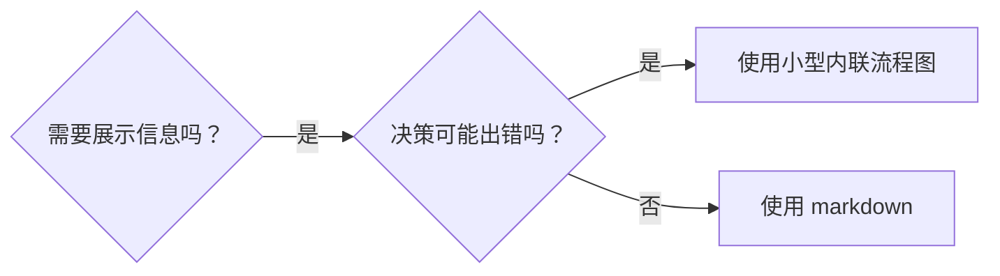
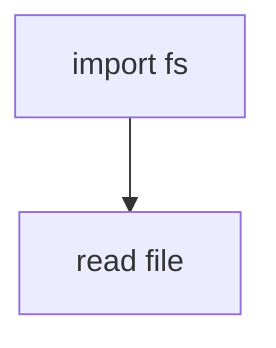

# 编写 Skills

## 概述

**编写 skills 就是应用于流程文档的测试驱动开发。**

**个人 skills 存放在你的运行时的 skills 目录中**

你编写测试用例（使用 subagents 的压力场景），观察它们失败（基线行为），编写 skill（文档），观察测试通过（agents 遵守规则），然后重构（堵上漏洞）。

**核心原则：** 如果你没有观察到 agent 在没有 skill 时的失败行为，你就不知道 skill 是否教了正确的东西。

**前置要求：** 在使用本 skill 之前，你必须理解 superpowers:test-driven-development。该 skill 定义了基本的 RED-GREEN-REFACTOR 循环。本 skill 将 TDD 适配到文档编写中。

**官方指南：** 关于 Anthropic 的官方 skill 编写最佳实践，请参阅 anthropic-best-practices.md。该文档提供了补充本 skill 中 TDD 方法的额外模式和指南。

## 什么是 Skill？

**skill** 是一份关于经过验证的技术、模式或工具的参考指南。Skills 帮助未来的 agents 找到并应用有效的方法。

**Skills 是：** 可复用的技术、模式、工具、参考指南

**Skills 不是：** 关于你曾经如何解决某个问题的叙事

## Skills 的 TDD 映射

| TDD 概念 | Skill 创建 |
|-------------|----------------|
| **测试用例** | 使用 subagent 的压力场景 |
| **生产代码** | Skill 文档（SKILL.md） |
| **测试失败（RED）** | Agent 在没有 skill 时违反规则（基线） |
| **测试通过（GREEN）** | Agent 在有 skill 时遵守规则 |
| **重构** | 在保持合规的同时堵上漏洞 |
| **先写测试** | 在编写 skill 之前运行基线场景 |
| **观察失败** | 记录 agent 使用的确切合理化说辞 |
| **最少代码** | 编写针对这些特定违规的 skill |
| **观察通过** | 验证 agent 现在遵守规则 |
| **重构循环** | 发现新的合理化说辞 → 堵上 → 重新验证 |

整个 skill 创建过程遵循 RED-GREEN-REFACTOR。

## 何时创建 Skill

**适合创建的情况：**
- 该技术对你来说并非直觉上显而易见
- 你会在多个项目中再次参考它
- 模式广泛适用（非项目特定）
- 其他人会从中受益

**不适合创建的情况：**
- 一次性解决方案
- 在其他地方已有充分文档记录的标准实践
- 项目特定的约定（放在你的指令文件中）
- 机械性约束（如果可以用正则表达式/验证来强制执行，就自动化它——把文档留给需要判断力的决策）

## Skill 类型

### 技术（Technique）
有具体步骤可遵循的方法（条件等待、根因追踪）

### 模式（Pattern）
思考问题的方式（标志位扁平化、测试不变量）

### 参考（Reference）
API 文档、语法指南、工具文档（办公文档）

## 目录结构


```
skills/
  skill-name/
    SKILL.md              # 主参考文档（必需）
    supporting-file.*     # 仅在需要时添加
```

**扁平命名空间** - 所有 skills 在一个可搜索的命名空间中

**单独文件用于：**
1. **大量参考资料**（100+ 行）- API 文档、全面的语法
2. **可复用工具** - 脚本、实用工具、模板

**保持内联：**
- 原则和概念
- 代码模式（< 50 行）
- 其他所有内容

## SKILL.md 结构

**Frontmatter（YAML）：**
- 两个必需字段：`name` 和 `description`（所有支持的字段参见 [agentskills.io/specification](https://agentskills.io/specification)）
- 总计最多 1024 个字符
- `name`：仅使用字母、数字和连字符（不使用括号、特殊字符）
- `description`：第三人称，仅描述何时使用（不是它做什么）
  - 以 "Use when..." 开头，聚焦于触发条件
  - 包含具体的症状、情境和上下文
  - **绝不在 description 中总结 skill 的流程或工作流**（原因见 SDO 章节）
  - 尽量保持在 500 个字符以内

```markdown
---
name: Skill-Name-With-Hyphens
description: Use when [specific triggering conditions and symptoms]
---

# Skill Name

## Overview
这是什么？用 1-2 句话说明核心原则。

## When to Use
[如果决策不明显，可附一个小型内联流程图]

包含症状和使用场景的列表
何时不使用

## Core Pattern（适用于技术/模式）
前后代码对比

## Quick Reference
用于快速浏览常见操作的表格或列表

## Implementation
简单模式的内联代码
大量参考或可复用工具链接到单独文件

## Common Mistakes
常见问题及修复方法

## Real-World Impact（可选）
具体成果
```


## Skill 发现优化（SDO）

**发现至关重要：** 未来的 agents 需要找到你的 skill

### 1. 丰富的 Description 字段

**目的：** 你的 agent 读取 description 来决定为给定任务加载哪些 skills。让它回答："我现在应该读取这个 skill 吗？"

**格式：** 以 "Use when..." 开头，聚焦于触发条件

**关键：Description = 何时使用，而不是 Skill 做什么**

description 应该只描述触发条件。不要在 description 中总结 skill 的流程或工作流。

**为什么这很重要：** 测试发现，当 description 总结了 skill 的工作流时，agent 可能会遵循 description 而不是阅读完整的 skill 内容。一个写着 "code review between tasks" 的 description 导致 agent 只做了一次审查，即使 skill 的流程图清楚地显示了两次审查（规格合规性然后代码质量）。

当 description 改为仅 "Use when executing implementation plans with independent tasks"（无工作流总结）时，agent 正确地阅读了流程图并遵循了两阶段审查流程。

**陷阱：** 总结工作流的 description 会创造 agent 会走的捷径。skill 正文变成了 agent 会跳过的文档。

```yaml
# ❌ 错误：总结了工作流 - agent 可能会遵循这个而不阅读 skill
description: Use when executing plans - dispatches subagent per task with code review between tasks

# ❌ 错误：太多流程细节
description: Use for TDD - write test first, watch it fail, write minimal code, refactor

# ✅ 正确：仅触发条件，无工作流总结
description: Use when executing implementation plans with independent tasks in the current session

# ✅ 正确：仅触发条件
description: Use when implementing any feature or bugfix, before writing implementation code
```

**内容：**
- 使用具体的触发器、症状和情境来表明此 skill 适用
- 描述*问题*（竞态条件、不一致的行为）而非*特定于语言的症状*（setTimeout、sleep）
- 除非 skill 本身是特定于技术的，否则保持触发器与技术无关
- 如果 skill 是特定于技术的，在触发器中明确说明
- 使用第三人称编写（注入到系统提示中）
- **绝不在 description 中总结 skill 的流程或工作流**

```yaml
# ❌ 错误：太抽象、模糊，没有包含使用时机
description: For async testing

# ❌ 错误：第一人称
description: I can help you with async tests when they're flaky

# ❌ 错误：提到了技术但 skill 并非特定于该技术
description: Use when tests use setTimeout/sleep and are flaky

# ✅ 正确：以 "Use when" 开头，描述问题，无工作流
description: Use when tests have race conditions, timing dependencies, or pass/fail inconsistently

# ✅ 正确：特定于技术的 skill，带有明确的触发器
description: Use when using React Router and handling authentication redirects
```

### 2. 关键词覆盖

使用 agent 会搜索的词语：
- 错误信息："Hook timed out"、"ENOTEMPTY"、"race condition"
- 症状："flaky"、"hanging"、"zombie"、"pollution"
- 同义词："timeout/hang/freeze"、"cleanup/teardown/afterEach"
- 工具：实际命令、库名称、文件类型

### 3. 描述性命名

**使用主动语态，动词优先：**
- ✅ `creating-skills` 而非 `skill-creation`
- ✅ `condition-based-waiting` 而非 `async-test-helpers`

### 4. Token 效率（关键）

**问题：** getting-started 和频繁引用的 skills 会加载到每个对话中。每个 token 都很重要。

**目标字数：**
- getting-started 工作流：每个 <150 词
- 频繁加载的 skills：总计 <200 词
- 其他 skills：<500 词（仍然要简洁）

**技巧：**

**将细节移至工具帮助中：**
```bash
# ❌ 错误：在 SKILL.md 中记录所有标志
search-conversations supports --text, --both, --after DATE, --before DATE, --limit N

# ✅ 正确：引用 --help
search-conversations supports multiple modes and filters. Run --help for details.
```

**使用交叉引用：**
```markdown
# ❌ 错误：重复工作流细节
When searching, dispatch subagent with template...
[20 lines of repeated instructions]

# ✅ 正确：引用其他 skill
Always use subagents (50-100x context savings). REQUIRED: Use [other-skill-name] for workflow.
```

**压缩示例：**
```markdown
# ❌ 错误：冗长的示例（42 词）
your human partner: "How did we handle authentication errors in React Router before?"
You: I'll search past conversations for React Router authentication patterns.
[Dispatch subagent with search query: "React Router authentication error handling 401"]

# ✅ 正确：最简示例（20 词）
Partner: "How did we handle auth errors in React Router?"
You: Searching...
[Dispatch subagent → synthesis]
```

**消除冗余：**
- 不要重复交叉引用的 skills 中的内容
- 不要解释从命令中就能看出的内容
- 不要为同一模式提供多个示例

**验证：**
```bash
wc -w skills/path/SKILL.md
# getting-started 工作流：目标每个 <150
# 其他频繁加载的：目标总计 <200
```

**以你做什么或核心洞察来命名：**
- ✅ `condition-based-waiting` > `async-test-helpers`
- ✅ `using-skills` 而非 `skill-usage`
- ✅ `flatten-with-flags` > `data-structure-refactoring`
- ✅ `root-cause-tracing` > `debugging-techniques`

**动名词（-ing）适合用于流程：**
- `creating-skills`、`testing-skills`、`debugging-with-logs`
- 主动的，描述你正在采取的行动

### 5. 交叉引用其他 Skills

**在引用其他 skill 的文档中：**

仅使用 skill 名称，带有明确的必需标记：
- ✅ 好：`**REQUIRED SUB-SKILL:** Use superpowers:test-driven-development`
- ✅ 好：`**REQUIRED BACKGROUND:** You MUST understand superpowers:systematic-debugging`
- ❌ 差：`See skills/testing/test-driven-development`（不清楚是否必需）
- ❌ 差：`@skills/testing/test-driven-development/SKILL.md`（强制加载，消耗上下文）

**为什么不用 @ 链接：** `@` 语法会立即强制加载文件，在你需要它们之前就消耗了 200k+ 的上下文。

## 流程图使用



**仅在以下情况使用流程图：**
- 不明显的决策点
- 你可能过早停止的流程循环
- "何时使用 A 而非 B" 的决策

**永远不要在以下情况使用流程图：**
- 参考资料 → 表格、列表
- 代码示例 → Markdown 代码块
- 线性指令 → 编号列表
- 没有语义含义的标签（step1、helper2）

参见本目录中的 `graphviz-conventions.dot` 了解 graphviz 样式规则。

**为你的搭档可视化：** 使用本目录中的 `render-graphs.js` 将 skill 的流程图渲染为 SVG：
```bash
./render-graphs.js ../some-skill           # 每个图表单独渲染
./render-graphs.js ../some-skill --combine # 所有图表合并在一个 SVG 中
```

## 代码示例

**一个优秀的示例胜过许多平庸的示例**

选择最相关的语言：
- 测试技术 → TypeScript/JavaScript
- 系统调试 → Shell/Python
- 数据处理 → Python

**好的示例：**
- 完整且可运行
- 有良好的注释解释为什么
- 来自真实场景
- 清晰地展示模式
- 可以直接适配（不是通用模板）

**不要：**
- 用 5+ 种语言实现
- 创建填空模板
- 编写人为的示例

你擅长移植 - 一个很棒的示例就够了。

## 文件组织

### 自包含 Skill
```
defense-in-depth/
  SKILL.md    # 所有内容内联
```
适用场景：所有内容都能放下，不需要大量参考

### 带有可复用工具的 Skill
```
condition-based-waiting/
  SKILL.md    # 概述 + 模式
  example.ts  # 可适配的工作示例
```
适用场景：工具是可复用的代码，而不仅仅是叙述

### 带有大量参考资料的 Skill
```
pptx/
  SKILL.md       # 概述 + 工作流
  pptxgenjs.md   # 600 行 API 参考
  ooxml.md       # 500 行 XML 结构
  scripts/       # 可执行工具
```
适用场景：参考资料太大，无法内联

## 铁律（与 TDD 相同）

```
没有先失败的测试，就不能写 SKILL
```

这适用于新 skills 和对现有 skills 的编辑。

在测试之前写了 skill？删除它。从头开始。
在没有测试的情况下编辑了 skill？同样的违规。

**没有例外：**
- 不适用于"简单的补充"
- 不适用于"只是添加一个章节"
- 不适用于"文档更新"
- 不要保留未经测试的更改作为"参考"
- 不要在运行测试时"适配"
- 删除就是删除

**前置要求：** superpowers:test-driven-development skill 解释了为什么这很重要。相同的原则适用于文档。

## 测试所有 Skill 类型

不同的 skill 类型需要不同的测试方法：

### 纪律执行类 Skills（规则/要求）

**示例：** TDD、verification-before-completion、designing-before-coding

**测试方式：**
- 学术问题：他们理解规则吗？
- 压力场景：他们在压力下是否遵守？
- 多重压力组合：时间 + 沉没成本 + 疲惫
- 识别合理化说辞并添加明确的反驳

**成功标准：** Agent 在最大压力下仍遵守规则

### 技术类 Skills（操作指南）

**示例：** condition-based-waiting、root-cause-tracing、defensive-programming

**测试方式：**
- 应用场景：他们能正确应用技术吗？
- 变化场景：他们能处理边界情况吗？
- 缺失信息测试：指令是否有空白？

**成功标准：** Agent 能成功将技术应用于新场景

### 模式类 Skills（心智模型）

**示例：** reducing-complexity、information-hiding 概念

**测试方式：**
- 识别场景：他们能识别模式何时适用吗？
- 应用场景：他们能使用心智模型吗？
- 反例：他们知道何时不应该应用吗？

**成功标准：** Agent 能正确识别何时/如何应用模式

### 参考类 Skills（文档/API）

**示例：** API 文档、命令参考、库指南

**测试方式：**
- 检索场景：他们能找到正确的信息吗？
- 应用场景：他们能正确使用找到的信息吗？
- 空白测试：常见用例是否都涵盖了？

**成功标准：** Agent 能找到并正确应用参考信息

## 跳过测试的常见合理化说辞

| 借口 | 现实 |
|--------|---------|
| "Skill 显然很清楚" | 你清楚 ≠ 其他 agents 清楚。测试它。 |
| "只是参考资料" | 参考资料也可能有空白、不清楚的部分。测试检索。 |
| "测试是多余的" | 未经测试的 skills 都有问题。总是如此。15 分钟测试节省数小时。 |
| "出问题了我再测试" | 问题 = agents 无法使用 skill。在部署之前测试。 |
| "测试太繁琐" | 测试比在生产环境中调试糟糕的 skill 更轻松。 |
| "我很有信心它很好" | 过度自信保证会出问题。无论如何都要测试。 |
| "学术审查就够了" | 阅读 ≠ 使用。测试应用场景。 |
| "没时间测试" | 部署未经测试的 skill 会在后续修复上浪费更多时间。 |

**所有这些意味着：部署前测试。没有例外。**

## 形式匹配失败类型

在编写指南之前，对基线失败进行分类。对一种失败类型有效的形式，在另一种上会适得其反。

| 基线失败 | 正确的形式 | 错误的形式 |
|---|---|---|
| 在压力下跳过/违反规则（知道该怎么做但还是做了） | 禁止 + 合理化说辞表 + 危险信号（参见下面的 Bulletproofing） | 软性指导（"prefer..."、"consider..."） |
| 遵守了，但输出形状不对（臃肿的 prompt、被掩盖的判断、重述规格） | 正面配方或契约：说明输出是什么——它的组成部分，按顺序 | 禁止列表（"don't restate"、"never narrate"） |
| 从他们已经产出的内容中遗漏了必需元素 | 结构性：模板中他们填写的 REQUIRED 字段或槽位 | 模板附近的散文提醒 |
| 行为应该取决于条件 | 基于可观察谓词的条件（"if the brief exists, reference it"） | 无条件规则 + 豁免条款 |

**为什么禁止在塑造问题上会适得其反：** 在竞争性的激励下（"让 prompt 自包含"），agents 会与 "don't X" 进行协商。在关于分发 prompt 指导的正面措辞测试中，禁止组产生的不需要的内容明显多于配方组（分布完全分离），甚至趋势比无指导对照组还差——微测试你自己的情况而不是假设，但永远不要默认选择禁止。配方没有留下协商空间：输出匹配声明的形状，或者不匹配。

**无论你选择哪种形式的规则：**
- **不要有细微差别条款。** "Don't X unless it matters" 重新开启了协商——在同一个措辞测试中，在获胜的配方上附加一个细微差别条款就使其从一致变为嘈杂。将真正的例外表达为基于可观察谓词的独立条件。
- **豁免条款不起限定作用。** "This limit doesn't apply to code blocks" 仍然会抑制代码块。如果输出的某部分必须豁免，重新组织使规则无法触及它。

## 防止合理化说辞的 Skill 加固

执行纪律的 skills（如 TDD）需要抵抗合理化说辞。Agents 很聪明，会在压力下找到漏洞。

**适用范围：** 这个工具包用于纪律失败——agent 知道规则但在压力下跳过它。对于形状不对的输出或遗漏的元素，基于禁止的加固会适得其反；改用"形式匹配失败类型"中的形式。

**心理学注释：** 理解为什么说服技巧有效有助于你系统地应用它们。参见 persuasion-principles.md 了解研究基础（Cialdini, 2021; Meincke et al., 2025），关于权威、承诺、稀缺性、社会证明和统一性原则。

### 明确堵上每个漏洞

不要只陈述规则——禁止特定的变通方法：

<Bad>
```markdown
在测试之前写了代码？删除它。
```
</Bad>

<Good>
```markdown
在测试之前写了代码？删除它。从头开始。

**没有例外：**
- 不要保留它作为"参考"
- 不要在编写测试时"适配"它
- 不要看它
- 删除就是删除
```
</Good>

### 处理"精神 vs 条文"的争论

尽早添加基本原则：

```markdown
**违反规则的条文就是违反规则的精神。**
```

这切断了整类"我在遵循精神"的合理化说辞。

### 构建合理化说辞表

从基线测试中捕获合理化说辞（参见下面的测试章节）。agents 找的每个借口都放入表中：

```markdown
| 借口 | 现实 |
|--------|---------|
| "太简单不需要测试" | 简单的代码也会出错。测试只需 30 秒。 |
| "我之后再测试" | 立即通过的测试什么也证明不了。 |
| "事后测试能达到相同目标" | 事后测试 = "这代码做了什么？" 事前测试 = "这代码应该做什么？" |
```

### 创建危险信号列表

让 agents 在合理化说辞时容易自我检查：

```markdown
## 危险信号 - 停下来，从头开始

- 在测试之前写代码
- "我已经手动测试过了"
- "事后测试能达到相同目的"
- "这是关于精神而不是仪式"
- "这次不一样，因为..."

**以上所有都意味着：删除代码。用 TDD 从头开始。**
```

### 为违规症状更新 SDO

添加到 description：即将违反规则时的症状：

```yaml
description: use when implementing any feature or bugfix, before writing implementation code
```

## Skills 的 RED-GREEN-REFACTOR

遵循 TDD 循环：

### RED：编写失败的测试（基线）

在没有 skill 的情况下运行压力场景。记录确切行为：
- 他们做了什么选择？
- 他们使用了什么合理化说辞（逐字记录）？
- 哪些压力触发了违规？

这就是"观察测试失败"——在编写 skill 之前你必须看到 agents 的自然行为。

### GREEN：编写最少的 Skill

编写针对那些特定合理化说辞的 skill。不要为假设情况添加额外内容。

在有 skill 的情况下运行相同场景。Agent 现在应该遵守。

### REFACTOR：堵上漏洞

Agent 发现了新的合理化说辞？添加明确的反驳。重新测试直到牢不可破。

### 在完整场景之前进行措辞微测试

完整的压力场景运行是最终关卡，但每次迭代都很慢且昂贵。先用微测试验证措辞本身：

1. **每次调用一个新鲜上下文样本** — 一个原始 API 调用，或者如果你没有 API 访问权限，使用单次 subagent。系统提示 = 指导将存在的真实上下文（完整的 skill 或 prompt 模板，而非孤立的指导）；用户消息 = 一个引诱失败的任务。
2. **始终包含无指导对照组。** 如果对照组没有表现出失败，就没有什么需要修复的——停下来，不要编写指导。
3. **每个变体 5+ 次重复。** 单次样本会说谎。
4. **手动阅读每个标记的匹配。** 你可以用程序评分，但模板回声和引用的反例会伪装成命中；仅靠自动计数会高估失败和成功。
5. **方差是一个指标。** 当指导生效时，重复会收敛到相同的形状。五次重复出现五种不同的解释意味着措辞没有约束力——在添加文字之前先收紧形式。

微测试验证措辞；它们不能替代纪律类 skills 的压力场景。

**测试方法论：** 参见 [testing-skills-with-subagents.md](testing-skills-with-subagents.md) 了解完整的测试方法论：
- 如何编写压力场景
- 压力类型（时间、沉没成本、权威、疲惫）
- 系统地堵上漏洞
- 元测试技术

## 反模式

### ❌ 叙事示例
"在 2025-10-03 的会话中，我们发现空的 projectDir 导致了..."
**为什么不好：** 太具体，不可复用

### ❌ 多语言稀释
example-js.js, example-py.py, example-go.go
**为什么不好：** 质量平庸，维护负担

### ❌ 流程图中放代码

**为什么不好：** 无法复制粘贴，难以阅读

### ❌ 通用标签
helper1, helper2, step3, pattern4
**为什么不好：** 标签应该有语义含义

## 停止：在转到下一个 Skill 之前

**在编写任何 skill 之后，你必须停止并完成部署流程。**

**不要：**
- 批量创建多个 skills 而不逐个测试
- 在当前 skill 验证之前转到下一个
- 因为"批量更高效"而跳过测试

**下面的部署检查清单对每个 skill 都是强制性的。**

部署未经测试的 skills = 部署未经测试的代码。这是对质量标准的违反。

## Skill 创建检查清单（TDD 适配）

**重要：为下面的每个检查清单项创建一个 todo。**

**RED 阶段 - 编写失败的测试：**
- [ ] 创建压力场景（纪律类 skills 需要 3+ 个组合压力）
- [ ] 在没有 skill 的情况下运行场景 - 逐字记录基线行为
- [ ] 识别合理化说辞/失败中的模式

**GREEN 阶段 - 编写最少的 Skill：**
- [ ] 名称仅使用字母、数字、连字符（不使用括号/特殊字符）
- [ ] YAML frontmatter 包含必需的 `name` 和 `description` 字段（最多 1024 字符；参见[规范](https://agentskills.io/specification)）
- [ ] Description 以 "Use when..." 开头，包含具体的触发器/症状
- [ ] Description 使用第三人称编写
- [ ] 整个文档中包含用于搜索的关键词（错误、症状、工具）
- [ ] 清晰的概述，包含核心原则
- [ ] 解决在 RED 中识别的特定基线失败
- [ ] 指导形式匹配失败类型（参见"形式匹配失败类型"）
- [ ] 对于行为塑造指导：措辞已通过微测试与无指导对照组验证（5+ 次重复，每个标记匹配手动阅读）——纯参考类 skills 不适用
- [ ] 代码内联或链接到单独文件
- [ ] 一个优秀的示例（不是多语言）
- [ ] 在有 skill 的情况下运行场景 - 验证 agents 现在遵守

**REFACTOR 阶段 - 堵上漏洞：**
- [ ] 从测试中识别新的合理化说辞
- [ ] 添加明确的反驳（如果是纪律类 skill）
- [ ] 从所有测试迭代中构建合理化说辞表
- [ ] 创建危险信号列表
- [ ] 重新测试直到牢不可破

**质量检查：**
- [ ] 仅在决策不明显时使用小型流程图
- [ ] 快速参考表
- [ ] 常见错误章节
- [ ] 没有叙事性故事
- [ ] 辅助文件仅用于工具或大量参考

**部署：**
- [ ] 将 skill 提交到 git 并推送到你的 fork（如果已配置）
- [ ] 考虑通过 PR 贡献回来（如果广泛有用）

## 发现工作流

未来的 agents 如何找到你的 skill：

1. **遇到问题**（"tests are flaky"）
2. **搜索 skills**（grep descriptions，浏览分类）
3. **找到 SKILL**（description 匹配）
4. **扫描概述**（这相关吗？）
5. **阅读模式**（快速参考表）
6. **加载示例**（仅在实现时）

**为这个流程优化** - 把可搜索的术语放在前面并经常出现。

## 底线

**创建 skills 就是为流程文档做 TDD。**

同样的铁律：没有先失败的测试就没有 skill。
同样的循环：RED（基线）→ GREEN（编写 skill）→ REFACTOR（堵上漏洞）。
同样的好处：更好的质量、更少的意外、牢不可破的结果。

如果你对代码遵循 TDD，对 skills 也遵循它。这是应用于文档的同样纪律。
